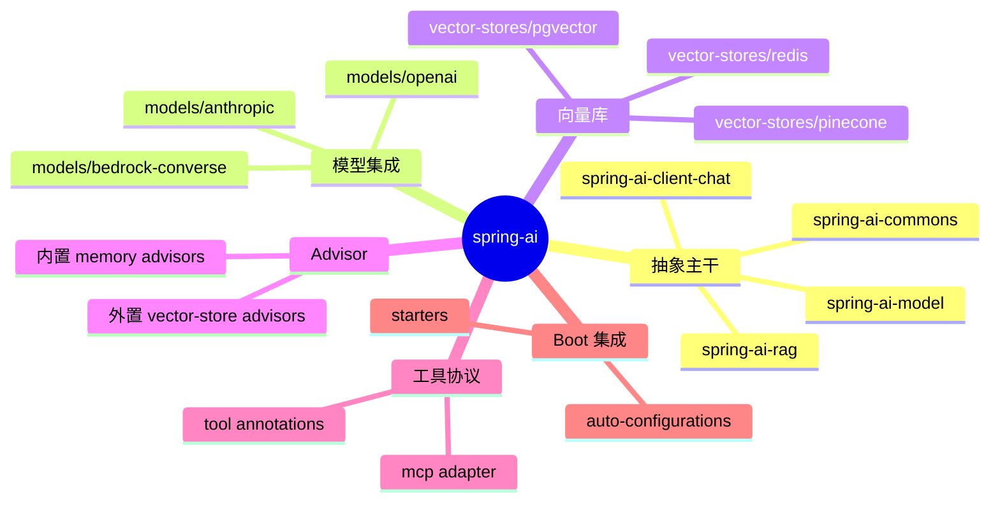
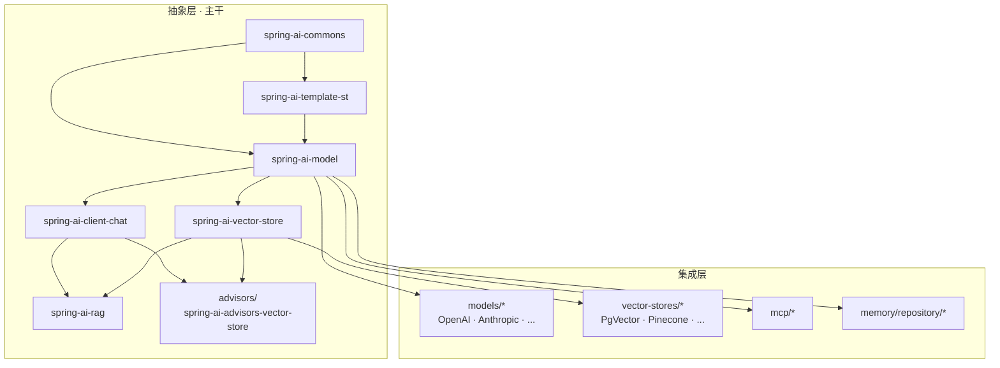
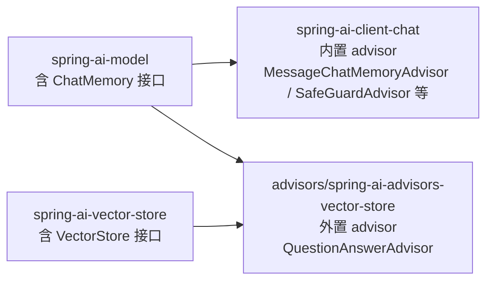
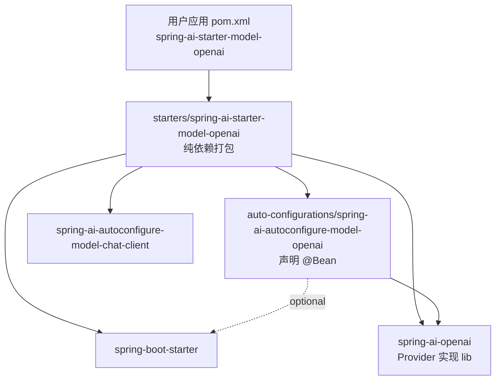

# 模块地图：Spring AI 是怎么切的

打开 `spring-ai/pom.xml`，第一眼是一长串 `<module>` —— 截至这次解读，主 pom 里挂了 **170+ 个子模块**。光看名字会觉得这个仓库切得碎，但只要把它们按依赖方向重新画一遍，你会看到一条明显的主干。本篇要回答的就是：这 170 多个模块是按什么逻辑切的、哪些是真正的核心、剩下的怎么围绕核心生长。读完后再去翻任何一个子目录，你都能立刻判断"这块属于哪一层"。

正式开拆之前，先看一眼整张地图，把后面的细节挂上去：



## 一、抽象层和集成层是两套坐标系

Spring AI 的模块切分不是"按功能切"——你找不到一个叫 `chat-feature` 或 `rag-feature` 的大目录，里面塞着该功能所有相关代码。它是按**依赖方向**切的：先有一组只声明接口、不绑实现的"抽象层"模块，再让所有具体实现（OpenAI、Anthropic、PgVector、Pinecone……）作为"集成层"模块单独存在，依赖抽象层但反过来不被依赖。

抽象层主干由四个模块构成，可以从根 `pom.xml:32-42` 找到它们：

```xml
<module>spring-ai-commons</module>
<module>spring-ai-template-st</module>
<module>spring-ai-client-chat</module>
<module>spring-ai-model</module>
<module>spring-ai-vector-store</module>
<module>spring-ai-rag</module>
<module>advisors/spring-ai-advisors-vector-store</module>
```

如果只看依赖关系，这几个模块其实是分层叠的。把每个模块的 `pom.xml` 翻一遍，依赖图大致是这样：



`spring-ai-commons/pom.xml:39-90` 只引了 spring-context、Jackson、Micrometer、SLF4J、jtokkit；它不知道"模型"或"消息"是什么，提供的是**任何 AI 模块都会用到的横向工具**。

到了 `spring-ai-model/pom.xml:43-83`，依赖列表里出现了 reactor-core、micrometer-observation、antlr4-runtime、jsonschema-generator：

```xml
<dependency>
    <groupId>org.springframework.ai</groupId>
    <artifactId>spring-ai-commons</artifactId>
</dependency>
<dependency>
    <groupId>io.projectreactor</groupId>
    <artifactId>reactor-core</artifactId>
</dependency>
<dependency>
    <groupId>org.antlr</groupId>
    <artifactId>antlr4-runtime</artifactId>
</dependency>
<dependency>
    <groupId>com.github.victools</groupId>
    <artifactId>jsonschema-generator</artifactId>
</dependency>
```

这几个依赖的位置很关键。reactor-core 在 `spring-ai-model` 出现，意味着流式（`Flux<ChatResponse>`）属于"模型层就要解决"的概念；ANTLR 出现，是因为 metadata filter 表达式的运行时 IR 需要它（具体在 `spring-ai-model` 的 `org.springframework.ai.vectorstore.filter.antlr4` 包里）；jsonschema-generator 出现，是因为 `@Tool` 方法转 JSON Schema 在模型层完成，不依赖任何 Provider。一旦你接受"流式、过滤 IR、tool schema 这三件事都属于模型层"，后面读源码会顺很多。

`spring-ai-client-chat/pom.xml:39-67` 依赖列表只多了 `spring-ai-model` 和 reactor、jsonschema-validator：

```xml
<dependency>
    <groupId>org.springframework.ai</groupId>
    <artifactId>spring-ai-model</artifactId>
</dependency>
<dependency>
    <groupId>com.networknt</groupId>
    <artifactId>json-schema-validator</artifactId>
</dependency>
<dependency>
    <groupId>io.projectreactor</groupId>
    <artifactId>reactor-core</artifactId>
</dependency>
```

注意它**没有**依赖任何 vector-store。这是一个有意识的取舍：ChatClient 抽象上不知道"向量库"的存在，它只知道 advisor 链。

`spring-ai-vector-store/pom.xml:43-48` 同样只依赖 `spring-ai-model`：

```xml
<dependency>
    <groupId>org.springframework.ai</groupId>
    <artifactId>spring-ai-model</artifactId>
</dependency>
```

注意它和 `spring-ai-client-chat` **互不依赖**。这两条线是平行的。

到了 `spring-ai-rag/pom.xml:43-55`，第一次出现"既要 chat 又要 vector-store"的模块：

```xml
<dependency>
    <groupId>org.springframework.ai</groupId>
    <artifactId>spring-ai-client-chat</artifactId>
</dependency>
<dependency>
    <groupId>org.springframework.ai</groupId>
    <artifactId>spring-ai-vector-store</artifactId>
</dependency>
```

RAG 在抽象上是"对话 + 检索"的合流点——它必然要同时见到这两条主线。把 RAG 单独成模块，恰恰是为了让"只想做对话"或"只做向量检索"的人都不必引入对方的依赖。

集成层的模块全部在主干模块的下游。打开 `models/spring-ai-openai/pom.xml:43-53`：

```xml
<dependency>
    <groupId>org.springframework.ai</groupId>
    <artifactId>spring-ai-model</artifactId>
</dependency>
<dependency>
    <groupId>com.openai</groupId>
    <artifactId>openai-java</artifactId>
    <version>${openai-sdk.version}</version>
</dependency>
```

`spring-ai-openai` 只依赖 `spring-ai-model`，不依赖 `spring-ai-client-chat`。这意味着 ChatModel 这层抽象足够干净，Provider 只要实现它，不用知道有 ChatClient 这个东西。同样 `models/spring-ai-anthropic/pom.xml:41-51` 也只依赖 `spring-ai-model`。

把这些事实拼起来，整体规则就清楚了：

- `commons → template-st → model → {client-chat, vector-store} → {rag, advisors/spring-ai-advisors-vector-store}` 是**抽象主干**
- `models/* / vector-stores/* / mcp/* / memory/repository/* / document-readers/*` 是**集成层**，依赖抽象层但反过来不被依赖
- `auto-configurations/* / starters/*` 是**装配层**，把抽象层和集成层用 Spring Boot 串起来

仓库根 `pom.xml` 里出现的"按功能命名"目录（比如 `mcp/`、`memory/`、`document-readers/`）都不是新增了一层抽象，而是属于集成层——它们要么对接外部协议，要么对接外部存储。这个判断在第二节会反复用到。

## 二、为什么 QuestionAnswerAdvisor 不放在 client-chat 里

`spring-ai-client-chat` 自带十来个 advisor，但有一类 advisor 偏偏不放在这里，而是单独挂在 `advisors/spring-ai-advisors-vector-store/`。要看懂这个边界，可以拿两个 advisor 对比。

第一个例子，`MessageChatMemoryAdvisor` 和 `PromptChatMemoryAdvisor`，放在 client-chat 内部：

```text
spring-ai-client-chat/src/main/java/org/springframework/ai/chat/client/advisor/
├── AdvisorUtils.java
├── ChatModelCallAdvisor.java
├── ChatModelStreamAdvisor.java
├── DefaultAroundAdvisorChain.java
├── LastMaxTokenSizeContentPurger.java
├── MessageChatMemoryAdvisor.java
├── PromptChatMemoryAdvisor.java
├── SafeGuardAdvisor.java
├── SimpleLoggerAdvisor.java
├── StructuredOutputValidationAdvisor.java
├── ToolCallAdvisor.java
├── api/
└── observation/
```

它们用到的 `ChatMemory` 接口在 `spring-ai-model` 里。client-chat 已经依赖 spring-ai-model，所以这一类 advisor 是"零成本"的——挂在 client-chat 里，不需要给所有 ChatClient 用户额外引依赖。

第二个例子，`QuestionAnswerAdvisor`，外置在独立模块。打开 `advisors/spring-ai-advisors-vector-store/pom.xml:44-56`：

```xml
<dependency>
    <groupId>org.springframework.ai</groupId>
    <artifactId>spring-ai-client-chat</artifactId>
</dependency>
<dependency>
    <groupId>org.springframework.ai</groupId>
    <artifactId>spring-ai-vector-store</artifactId>
</dependency>
```

这个模块同时依赖 `spring-ai-client-chat` 和 `spring-ai-vector-store`。把它包含的两个类列出来：

```text
advisors/spring-ai-advisors-vector-store/src/main/java/org/springframework/ai/chat/client/advisor/vectorstore/
├── QuestionAnswerAdvisor.java
└── VectorStoreChatMemoryAdvisor.java
```

两个 advisor 的共同点：**都要拿到一个 `VectorStore` 实例**才能工作。如果把它们放进 client-chat，那么 client-chat 就必须依赖 spring-ai-vector-store——所有用 ChatClient 的工程都会被动引入向量库相关的代码。这不是循环依赖（vector-store 这边没有反向引用 client-chat），而是**一次性把 vector-store 的依赖压到了所有 ChatClient 用户身上**。Spring AI 的取舍是：宁愿多一个模块，也要保留"我只用 ChatClient 但不用向量库"的能力。

对照 `models/spring-ai-openai/pom.xml` 在第一节的样子可以看出同一种思路：Provider 不依赖 client-chat，client-chat 不依赖 Provider，advisor 模块只在需要交叉依赖的时候才单独成包。

把内置 / 外置 advisor 的依赖关系并排画出来，"为什么必须分两个模块"几乎是一目了然：



只有 external 那个节点同时被两条主干指向，其它 advisor 都只依赖 spring-ai-model 一条线——这正是"放进 client-chat 会被动拉 vector-store"那段话的几何形态。

这种切法的副作用之一是模块数量爆炸——每个"两条线交叉"的功能都要一个独立模块。但从用户视角看是干净的：你写 `pom.xml` 时，引哪个模块决定你拿到哪些能力，不会因为引了一个模块而被动拉进一堆你用不上的依赖。

## 三、autoconfig 和 starter 的两层皮

主 `pom.xml` 在 89-223 行排列了一大块 `auto-configurations/*` 和 `starters/*`。两者乍看像同一类东西——都和 Spring Boot 集成有关——但功能严格分开：**autoconfig 模块只声明 Bean，starter 模块只搭依赖图**。

拿 OpenAI 这条线作为样本。`auto-configurations/models/spring-ai-autoconfigure-model-openai/pom.xml:25-103`：

```xml
<dependency>
    <groupId>org.springframework.ai</groupId>
    <artifactId>spring-ai-openai</artifactId>
</dependency>
<dependency>
    <groupId>org.springframework.ai</groupId>
    <artifactId>spring-ai-autoconfigure-model-tool</artifactId>
</dependency>
<dependency>
    <groupId>org.springframework.ai</groupId>
    <artifactId>spring-ai-autoconfigure-retry</artifactId>
</dependency>
<dependency>
    <groupId>org.springframework.ai</groupId>
    <artifactId>spring-ai-autoconfigure-model-chat-observation</artifactId>
</dependency>
<dependency>
    <groupId>org.springframework.boot</groupId>
    <artifactId>spring-boot-starter</artifactId>
    <optional>true</optional>
</dependency>
<dependency>
    <groupId>org.springframework.boot</groupId>
    <artifactId>spring-boot-starter-webclient</artifactId>
    <optional>true</optional>
</dependency>
```

注意 `spring-boot-starter` 写成了 `optional=true`。这是关键：**autoconfig 模块不强制把 Boot 拉进来**。你可以单独依赖 autoconfig，把它作为"声明了 `@AutoConfiguration` 的普通库"用。这给了一类用户出口——他们可能在非 Boot 环境（比如纯 Spring Framework 项目）想复用这套 bean 装配代码。

那真正"加 Boot"的责任在哪？在 starter。打开 `starters/spring-ai-starter-model-openai/pom.xml:38-67`：

```xml
<dependency>
    <groupId>org.springframework.boot</groupId>
    <artifactId>spring-boot-starter</artifactId>
</dependency>
<dependency>
    <groupId>org.springframework.ai</groupId>
    <artifactId>spring-ai-autoconfigure-model-openai</artifactId>
</dependency>
<dependency>
    <groupId>org.springframework.ai</groupId>
    <artifactId>spring-ai-openai</artifactId>
</dependency>
<dependency>
    <groupId>org.springframework.ai</groupId>
    <artifactId>spring-ai-autoconfigure-model-chat-client</artifactId>
</dependency>
<dependency>
    <groupId>org.springframework.ai</groupId>
    <artifactId>spring-ai-autoconfigure-model-chat-memory</artifactId>
</dependency>
```

整个 `pom.xml` 没有一行 Java 代码——starter 是个**纯依赖列表**。它做的事是把"用 OpenAI 写一个 Spring Boot 应用最常用的几块"打包：boot starter、OpenAI lib、OpenAI 的 autoconfig、ChatClient 的 autoconfig、ChatMemory 的 autoconfig。用户写一行 `spring-ai-starter-model-openai`，背后被自动拉进来的是这一整套依赖图。



实线是强依赖，虚线是 `<optional>true</optional>`。autoconfig 跟 Boot 之间走虚线，是这套设计的关键——它让"我不用 Boot"的用户能绕过 starter 直接引 autoconfig，而不会被动把整个 spring-boot 拉进 classpath。

这种"autoconfig 只声明 bean、starter 只搭依赖图"的二分，让两类人各得其所：

- 想"零配置启动"的人引 starter，剩下的事 Boot 自动配置帮你做
- 想"细粒度装配"或者根本不想用 Boot 的人引 autoconfig 或直接引 lib，逐个声明自己要的 Bean

这种姿势 Spring 自家也用——它和 `spring-boot-starter-data-jpa` vs `spring-boot-autoconfigure` 的关系如出一辙。Spring AI 把它推到了每一个 Provider 都对应一个 starter + 一个 autoconfig 的程度，这就是为什么仓库里能数出二十多对几乎同名的目录。

最后把这层装配关系连回前两节：starter 在依赖图最末端，把抽象层（client-chat、model）+ 集成层（OpenAI lib）+ Spring Boot 三方拼到一起。这也是为什么 `spring-ai-bom/pom.xml`（出口清单）在最末端把所有 starter 都列了一遍——bom 给的是用户视角的 artifact 命名空间，不是 Spring AI 内部的依赖结构。

至此，仓库三层结构就清楚了。后面文章里我们会顺着 `chatClient.prompt("hi").call().content()` 这一行从 starter 一路走到 Provider，每经过一个模块，回过头看本篇的依赖图就能定位到自己在哪一层。

## 关键代码索引

模块入口 pom：

- `pom.xml:32-231` 主 pom 模块清单
- `spring-ai-commons/pom.xml:39-90` 基础工具层依赖
- `spring-ai-model/pom.xml:43-83` 模型抽象层依赖（含 reactor、ANTLR、jsonschema-generator）
- `spring-ai-client-chat/pom.xml:39-67` ChatClient + advisor 依赖
- `spring-ai-vector-store/pom.xml:43-48` 向量存储抽象依赖
- `spring-ai-rag/pom.xml:43-55` RAG 同时依赖 client-chat 与 vector-store
- `advisors/spring-ai-advisors-vector-store/pom.xml:44-56` 外置 advisor 模块依赖
- `models/spring-ai-openai/pom.xml:43-53` Provider 集成层依赖（仅依赖 model）
- `models/spring-ai-anthropic/pom.xml:41-51` 同上模式确认
- `mcp/common/pom.xml:24-73` MCP 集成层（仅依赖 model + mcp SDK）
- `memory/repository/spring-ai-model-chat-memory-repository-jdbc/pom.xml:41-55` Memory 集成层（仅依赖 model + spring-jdbc）
- `vector-stores/spring-ai-pgvector-store/pom.xml:44-75` 向量库集成层（依赖 vector-store + 各家 SDK）
- `auto-configurations/models/spring-ai-autoconfigure-model-openai/pom.xml:25-103` autoconfig：声明 Bean，Boot 依赖标 optional
- `starters/spring-ai-starter-model-openai/pom.xml:38-67` starter：纯依赖打包
- `spring-ai-bom/pom.xml` 出口清单（所有可发布 artifact）

外置 advisor 类位置：

- `advisors/spring-ai-advisors-vector-store/src/main/java/org/springframework/ai/chat/client/advisor/vectorstore/QuestionAnswerAdvisor.java`
- `advisors/spring-ai-advisors-vector-store/src/main/java/org/springframework/ai/chat/client/advisor/vectorstore/VectorStoreChatMemoryAdvisor.java`

内置 advisor 类位置：

- `spring-ai-client-chat/src/main/java/org/springframework/ai/chat/client/advisor/` 共 11 个 advisor 类

## 思考题

1. `spring-ai-rag` 和 `advisors/spring-ai-advisors-vector-store` 都同时依赖 `spring-ai-client-chat` + `spring-ai-vector-store`，它们能不能合成一个模块？如果不能，从源码里找出至少一个理由。
2. 假设 Spring AI 想引入一个"Document → 数据库结构化抽取"的新功能，它要既调用 ChatModel 又写入 JDBC。按本篇的切分原则，这个功能应该挂在哪一层？放在 `models/`、`document-readers/`、还是新建一个交叉模块？
3. starter 里那行 `spring-boot-starter`（非 optional）和 autoconfig 里那行 `spring-boot-starter`（optional）只差一个属性，但用户体验差距不小——这种"非对称依赖"是 Spring 生态的通用做法。如果你在自己项目里想抄这一招，最关键的判断标准是什么？

## 延伸阅读

- 第 2 篇《一次 ChatClient 调用的完整旅程》会顺着本篇的依赖图，把 starter → autoconfig → ChatClient → Advisor 链 → ChatModel → Provider HTTP 调用一路串完。
- 第 4 篇《Advisor 链》会回到本篇第二节，讲清楚为什么内置 advisor 能放在 client-chat 里、外置 advisor 必须独立。
- 第 9 篇《Spring Boot 整合 + 可观测性》会展开本篇第三节，对 `spring-ai-autoconfigure-model-chat-client` 这种"跨 Provider 的横切 autoconfig"做剖析。
- Spring 官方关于 starter / autoconfig 拆分的设计依据见 `spring-boot` 仓库 `META-INF/spring/org.springframework.boot.autoconfigure.AutoConfiguration.imports` 文件机制。本篇没有展开 Spring AI 自己的 imports 文件，留待第 9 篇。

> 基于 spring-ai commit 9cde97c1
