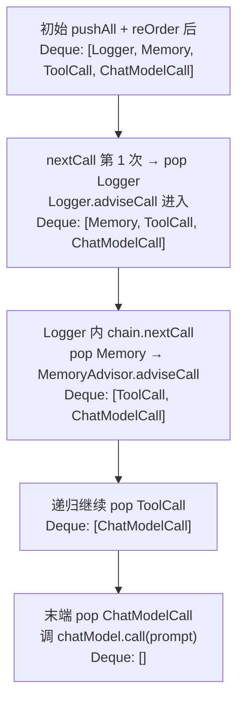
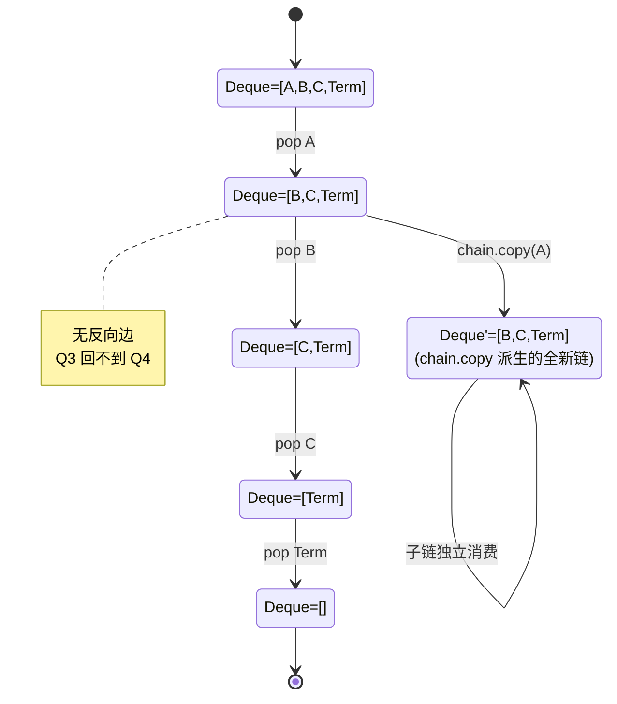
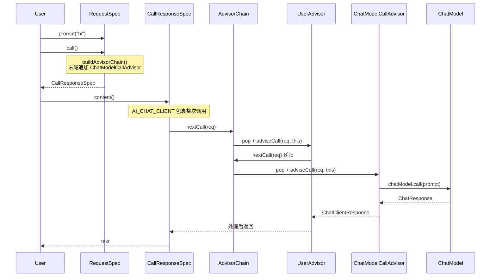
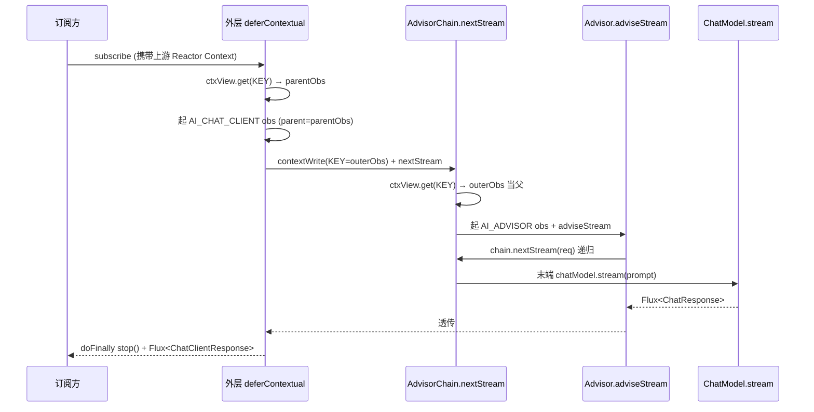

# 一次 ChatClient 调用的完整旅程

`chatClient.prompt("hi").call().content()`——这一行平平无奇的 fluent 调用，背后究竟跑了多少代码？这一篇沿着这条调用链从 `prompt()` 一路走到 `ChatModel.call()`，把每一段重要的设计单独拎出来讲清楚。读完之后，后面所有"Advisor 怎么织进来"、"工具循环为什么要重入子链"、"流式怎么传 Observation"的篇章，都能挂在这张地图上。

## 一、入口：`prompt()` → `ChatClientRequestSpec` → `call()`

调用第一步落在 `ChatClient` 接口的 `prompt()` 上，它返回的不是结果，而是一个**请求规格** `ChatClientRequestSpec`：

```java
// spring-ai-client-chat/.../ChatClient.java:91-95
ChatClientRequestSpec prompt();
ChatClientRequestSpec prompt(String content);
ChatClientRequestSpec prompt(Prompt prompt);
```

实际类型是 `DefaultChatClient.DefaultChatClientRequestSpec`（`DefaultChatClient.java:618`），它收集 user/system 文本、媒体、advisor、工具、options 等所有能在 builder 阶段配置的东西。fluent API 上链式 `.user(...)`、`.system(...)`、`.advisors(...)`、`.tools(...)` 全部都在往这个 spec 里塞字段，调用还没真正发生。

真正"按下扳机"的是 `.call()`：

```java
// spring-ai-client-chat/.../client/DefaultChatClient.java:1012-1017
@Override
public CallResponseSpec call() {
    BaseAdvisorChain advisorChain = buildAdvisorChain();
    return new DefaultCallResponseSpec(DefaultChatClientUtils.toChatClientRequest(this), advisorChain,
            this.observationRegistry, this.chatClientObservationConvention);
}
```

注意 `.call()` 仍然只是返回了一个 `CallResponseSpec`——还是规格，不是结果。结果要等到调用方继续 `.content()` / `.entity(...)` / `.chatResponse()` 时才会真正发起。这种"配置 → 终止操作"的两段式有点像 Java Stream 的 `intermediate vs terminal`：让用户可以挑结果格式而不必为每种格式配一份 builder。

`.call()` 的两件事：

1. `buildAdvisorChain()` 把所有 advisor（用户加的 + 框架自己塞的）打包成一条链
2. `DefaultChatClientUtils.toChatClientRequest(this)` 把 spec 里收集到的状态冻结成不可变的 `ChatClientRequest`

这里的"冻结"很关键。`ChatClientRequest` 是一个 record：

```java
// spring-ai-client-chat/.../ChatClient/ChatClientRequest.java:36-42
public record ChatClientRequest(Prompt prompt, Map<String, @Nullable Object> context) {
    public ChatClientRequest {
        Assert.notNull(prompt, "prompt cannot be null");
        Assert.notNull(context, "context cannot be null");
        Assert.noNullElements(context.keySet(), "context keys cannot be null");
    }
    public ChatClientRequest copy() {
        return new ChatClientRequest(this.prompt.copy(), new HashMap<>(this.context));
    }
    public Builder mutate() {
        return new Builder().prompt(this.prompt.copy()).context(new HashMap<>(this.context));
    }
```

`ChatClientRequest` 没有 setter，只能通过 `mutate()` 拿到一个 Builder 改完后产出新实例。这意味着：advisor 链上每一站要改请求，都得显式 copy-on-write。链不会因为某个 advisor 偷偷改了上游传下来的 prompt 而互相污染。这一条几乎是 Spring AI advisor 设计的隐形宪法。

## 二、`buildAdvisorChain()`：把"调模型"也变成 advisor

链是怎么搭起来的？看 `buildAdvisorChain`：

```java
// spring-ai-client-chat/.../client/DefaultChatClient.java:1026-1036
private BaseAdvisorChain buildAdvisorChain() {
    // At the stack bottom add the model call advisors.
    // They play the role of the last advisors in the advisor chain.
    this.advisors.add(ChatModelCallAdvisor.builder().chatModel(this.chatModel).build());
    this.advisors.add(ChatModelStreamAdvisor.builder().chatModel(this.chatModel).build());

    return DefaultAroundAdvisorChain.builder(this.observationRegistry)
        .observationConvention(this.advisorObservationConvention)
        .pushAll(this.advisors)
        .build();
}
```

关键是这两行 add：在用户 advisor 列表末尾追加了 `ChatModelCallAdvisor`（call 路径的终结）和 `ChatModelStreamAdvisor`（stream 路径的终结）。这是 Spring AI 最值得借鉴的一处结构设计——**真正调用模型的环节也被实现成了一个 advisor**。

为什么这么做？看 `ChatModelCallAdvisor`：

```java
// spring-ai-client-chat/.../advisor/ChatModelCallAdvisor.java:52-64
@Override
public ChatClientResponse adviseCall(ChatClientRequest chatClientRequest, CallAdvisorChain callAdvisorChain) {
    Assert.notNull(chatClientRequest, "the chatClientRequest cannot be null");
    ChatClientRequest formattedChatClientRequest = augmentWithFormatInstructions(chatClientRequest);
    ChatResponse chatResponse = this.chatModel.call(formattedChatClientRequest.prompt());
    return ChatClientResponse.builder()
        .chatResponse(chatResponse)
        .context(Map.copyOf(formattedChatClientRequest.context()))
        .build();
}

@Override public int getOrder() { return Ordered.LOWEST_PRECEDENCE; }
```

`ChatModelCallAdvisor.adviseCall` 不调用 `callAdvisorChain.nextCall(...)`——它就是链的尽头：拿到请求，调 `chatModel.call(prompt)`，包装成 `ChatClientResponse` 返回。它的 `getOrder()` 是 `LOWEST_PRECEDENCE`，配合后面会讲到的 `OrderComparator.sort(...)`，保证它永远跑在最末尾。

把"调模型"做成普通 advisor，换来三件事：

1. **链的同构性**：从最外层用户 advisor 一路到模型调用，所有参与者都实现 `CallAdvisor`/`StreamAdvisor` 接口，没有"调用者—被调者"的特殊关系，每一步都能被 Observation 单独包一层
2. **结构化输出能在终点注入 schema**：注意 `augmentWithFormatInstructions(chatClientRequest)` 这一步，它从 `request.context()` 里取 `OUTPUT_FORMAT` / `STRUCTURED_OUTPUT_SCHEMA`，要么把 format prompt 追加到 user message 末尾，要么写到 `StructuredOutputChatOptions.outputSchema`——这事必须放在链的最末尾，否则在它前面的 advisor 还能改 prompt，schema 就可能错位
3. **流式终结跟它同形**：`ChatModelStreamAdvisor` 是它的 Flux 镜像，构造期一并塞，运行期 `nextCall` / `nextStream` 各取所需

如果让"调模型"留在 ResponseSpec 自己里调（比如 `chatModel.call(this.prompt)`），整条链就要硬编码一个"在最后一个 advisor 之后调 model"的拼接逻辑——丑，且失去了 Observation 链上的对称性。

## 三、`DefaultAroundAdvisorChain`：deque + pop 的"消费式"链

链的真正实现住在 `DefaultAroundAdvisorChain`。看它的核心字段：

```java
// spring-ai-client-chat/.../advisor/DefaultAroundAdvisorChain.java:63-69
private final List<CallAdvisor> originalCallAdvisors;
private final List<StreamAdvisor> originalStreamAdvisors;
private final Deque<CallAdvisor> callAdvisors;
private final Deque<StreamAdvisor> streamAdvisors;
```

每条链有两份数据：一份**不可变快照** `originalCallAdvisors`（用于 `getCallAdvisors()` 让外部观察整条链有谁），一份**可消费 deque** `callAdvisors`（运行期 pop 用）。链不是用 `int idx` 在数组里前进的，而是**真正消耗** deque：

```java
// spring-ai-client-chat/.../advisor/DefaultAroundAdvisorChain.java:95-119
@Override
public ChatClientResponse nextCall(ChatClientRequest chatClientRequest) {
    Assert.notNull(chatClientRequest, "the chatClientRequest cannot be null");
    if (this.callAdvisors.isEmpty()) {
        throw new IllegalStateException("No CallAdvisors available to execute");
    }
    var advisor = this.callAdvisors.pop();
    var observationContext = AdvisorObservationContext.builder()
        .advisorName(advisor.getName())
        .chatClientRequest(chatClientRequest)
        .order(advisor.getOrder())
        .build();
    return AdvisorObservationDocumentation.AI_ADVISOR
        .observation(this.observationConvention, DEFAULT_OBSERVATION_CONVENTION, () -> observationContext,
                this.observationRegistry)
        .observe(() -> {
            var chatClientResponse = advisor.adviseCall(chatClientRequest, this);
            observationContext.setChatClientResponse(chatClientResponse);
            return chatClientResponse;
        });
}
```

这里有几处值得认真看：

**`pop()` 而不是 `peek(idx++)`**。每次 `nextCall` 都把队头 advisor 取出（注意是 `pop`，不是只看一眼），意味着这个链实例**只能正向消费一遍**。一旦 advisor 跑完了，再调 `nextCall` 不会重新走它。

**为什么不让 advisor 自己持游标？** 如果用 `chain[idx++]` 风格，advisor 内部就需要拿到游标才能继续。Spring AI 选择把游标隐藏成 deque 状态，再把 chain 实例本身作为参数传进 `adviseCall(req, this)`——这样 advisor 想"重入子链"的时候只要再调一次 `chain.nextCall(req)` 就行，链自己知道下一站是谁。

用一张图看 deque 状态如何被一步步消费掉：



换一个角度看同一件事：把 deque 当成状态机，每次 pop 是一次单向状态迁移。下面这张图突出"不可 rewind"和"`chain.copy` 派生子状态"两个性质：



**为什么 chain 必须能被 advisor 重入？** 因为有些场景需要 advisor "拿着同样的剩余链跑多次"。最典型的就是 Tool Calling：模型返回 tool call 请求 → 执行工具 → 把工具结果塞回去再调一次模型。这正是 `ToolCallAdvisor` 的玩法（第 5 篇展开）。`CallAdvisorChain.copy(after)` 提供了"复制从某个 advisor 之后的剩余链"的能力（见 154-180 行的 `copyAdvisorsAfter`），让 advisor 能拿到一条新鲜的、可以再消费一遍的链：

```java
// spring-ai-client-chat/.../advisor/DefaultAroundAdvisorChain.java:154-180
@Override
public CallAdvisorChain copy(CallAdvisor after) {
    return this.copyAdvisorsAfter(this.getCallAdvisors(), after);
}

private DefaultAroundAdvisorChain copyAdvisorsAfter(List<? extends Advisor> advisors, Advisor after) {
    int afterAdvisorIndex = advisors.indexOf(after);
    if (afterAdvisorIndex < 0) {
        throw new IllegalArgumentException("The specified advisor is not part of the chain: " + after.getName());
    }
    var remainingStreamAdvisors = advisors.subList(afterAdvisorIndex + 1, advisors.size());
    return DefaultAroundAdvisorChain.builder(this.getObservationRegistry())
        .pushAll(remainingStreamAdvisors)
        .build();
}
```

注意它从 `originalCallAdvisors`（不可变快照）切片，然后构建一条**全新的链**——这是 deque 消费式设计的代价：rewind 这件事链自己做不了，要靠快照重建。

**每个 advisor 自动包一层 Observation**。`AI_ADVISOR.observation(...).observe(...)` 把 `adviseCall` 的执行包进 Micrometer Observation。这意味着用户随手写一个自定义 advisor，立刻就有了"这一步耗时多少 / 出错了么"的埋点，Tracing 上能看到一段独立的 span。这是"链同构 + 终结也是 advisor"换来的红利。

## 四、构建期：`pushAll` + `reOrder` 把顺序定下来

链构建走的是 `DefaultAroundAdvisorChain.Builder`。关键在 `pushAll` 之后立刻 `reOrder`：

```java
// spring-ai-client-chat/.../advisor/DefaultAroundAdvisorChain.java:223-263
public Builder pushAll(List<? extends Advisor> advisors) {
    if (!CollectionUtils.isEmpty(advisors)) {
        List<CallAdvisor> callAroundAdvisorList = advisors.stream()
            .filter(a -> a instanceof CallAdvisor)
            .map(a -> (CallAdvisor) a)
            .toList();
        if (!CollectionUtils.isEmpty(callAroundAdvisorList)) {
            callAroundAdvisorList.forEach(this.callAdvisors::push);
        }
        // ... stream 同理
        this.reOrder();
    }
    return this;
}

private void reOrder() {
    ArrayList<CallAdvisor> callAdvisors = new ArrayList<>(this.callAdvisors);
    OrderComparator.sort(callAdvisors);
    this.callAdvisors.clear();
    callAdvisors.forEach(this.callAdvisors::addLast);
    // stream 同样
}
```

`reOrder` 用的是 Spring 的 `OrderComparator`：低 order 排前面，高 order 排后面。`Ordered.LOWEST_PRECEDENCE = Integer.MAX_VALUE` 让 `ChatModelCallAdvisor` 永远落在末尾。这给框架内部和用户分了一片可控的"order 空间"——配合后面会讲到的 `MessageChatMemoryAdvisor` 默认 order `HIGHEST_PRECEDENCE + 1000`，框架预留了 1000 个 slot 给用户在内置 advisor 之前插队。

`Deque` 实例用的是 `ConcurrentLinkedDeque<>()`（209 行），允许在并发场景下安全地操作（虽然 chain 实例本身一般不跨线程共享）。

## 五、完整泳道图

把上面拼到一起，一次 `chatClient.prompt("hi").call().content()` 的运行轨迹用时序图先画一遍：



再展开成带 Observation 嵌套的层级版本（缩进越深、嵌套越深）：

```
用户线程
 │
 ├─[1] ChatClient.prompt("hi")
 │      └─ new DefaultChatClientRequestSpec(...)   // 还没"按按钮"
 │
 ├─[2] spec.call()
 │      ├─ buildAdvisorChain()
 │      │   ├─ this.advisors.add(ChatModelCallAdvisor)
 │      │   ├─ this.advisors.add(ChatModelStreamAdvisor)
 │      │   └─ DefaultAroundAdvisorChain.Builder.pushAll(...).reOrder()
 │      └─ new DefaultCallResponseSpec(req, chain, observationRegistry, convention)
 │
 ├─[3] callResponseSpec.content()
 │      └─ doGetObservableChatClientResponse(this.request)
 │          ├─ ChatClientObservationContext.builder().request(req).advisors(chain.getCallAdvisors())...
 │          ├─ AI_CHAT_CLIENT.observation(...).observe(() -> {
 │          │      var response = chain.nextCall(req);
 │          │      observationContext.setResponse(response);
 │          │      return response;
 │          │  })
 │          │
 │          │  // 进入 chain.nextCall(req)：
 │          │  ├─ advisor = callAdvisors.pop();   // 比如 SimpleLoggerAdvisor
 │          │  └─ AI_ADVISOR.observation(...).observe(() ->
 │          │         advisor.adviseCall(req, this)
 │          │     )
 │          │      └─ SimpleLoggerAdvisor.adviseCall:
 │          │          ├─ logRequest(req)
 │          │          ├─ chain.nextCall(req)  // 递归回到 chain，pop 下一个
 │          │          │   └─ ... // 继续 pop，直到 ChatModelCallAdvisor
 │          │          │       └─ ChatModelCallAdvisor.adviseCall:
 │          │          │           ├─ augmentWithFormatInstructions(req)
 │          │          │           └─ chatModel.call(prompt)  // 真正访问 LLM
 │          │          └─ logResponse(resp)
 │          │
 │          └─ ← chatClientResponse
 │
 └─[4] return chatResponse.getResult().getOutput().getText()
```

可以看到三层嵌套的 Observation：

1. 最外层 `AI_CHAT_CLIENT` 包整次调用（用于看"这次请求总耗时"）
2. 每个 advisor 进入时 `AI_ADVISOR` 包它自己（用于看"每一步多久"）
3. 最末端 `ChatModelCallAdvisor` 内部 `chatModel.call` 还会触发 `AI_CHAT_MODEL` Observation（在 ChatModel 实现里，第 3 篇展开）

链的"递归 + pop"性质决定了一件事：**advisor 是真正的 around 拦截器**。`SimpleLoggerAdvisor.adviseCall` 在 `chain.nextCall(req)` 之前可以处理请求（log），之后可以处理响应。before / after / around 三种语义都能写。框架还专门提供了 `BaseAdvisor` 把"只想写 before / after 的"场景模板化：

```java
// spring-ai-client-chat/.../advisor/api/BaseAdvisor.java:46-54
@Override
default ChatClientResponse adviseCall(ChatClientRequest chatClientRequest, CallAdvisorChain callAdvisorChain) {
    ChatClientRequest processedChatClientRequest = before(chatClientRequest, callAdvisorChain);
    ChatClientResponse chatClientResponse = callAdvisorChain.nextCall(processedChatClientRequest);
    return after(chatClientResponse, callAdvisorChain);
}
```

写 `BaseAdvisor` 的 advisor 只关心 `before` / `after` 两个钩子，链的递归调用框架替你写好。这是接口分层的好处之一（第 4 篇会专门讲）。

## 六、流式分支：`Flux.deferContextual` + Reactor Context

非流式好理解，流式才是真正费心的地方。看 `DefaultStreamResponseSpec.doGetObservableFluxChatResponse`：

```java
// spring-ai-client-chat/.../client/DefaultChatClient.java:565-591
private Flux<ChatClientResponse> doGetObservableFluxChatResponse(ChatClientRequest chatClientRequest) {
    return Flux.deferContextual(contextView -> {

        ChatClientObservationContext observationContext = ChatClientObservationContext.builder()
            .request(chatClientRequest)
            .advisors(this.advisorChain.getStreamAdvisors())
            .stream(true)
            .build();

        Observation observation = ChatClientObservationDocumentation.AI_CHAT_CLIENT.observation(
                this.observationConvention, DEFAULT_CHAT_CLIENT_OBSERVATION_CONVENTION,
                () -> observationContext, this.observationRegistry);

        observation.parentObservation(contextView.getOrDefault(ObservationThreadLocalAccessor.KEY, null))
            .start();

        Flux<ChatClientResponse> chatClientResponse = this.advisorChain.nextStream(chatClientRequest)
                .doOnError(observation::error)
                .doFinally(s -> observation.stop())
                .contextWrite(ctx -> ctx.put(ObservationThreadLocalAccessor.KEY, observation));

        return CHAT_CLIENT_MESSAGE_AGGREGATOR.aggregateChatClientResponse(chatClientResponse,
            observationContext::setResponse);
    });
}
```

这里有三件事是阻塞版本里没有的：

**1. `Flux.deferContextual`**：流式调用最终会订阅到一个 Reactor 调度器上，订阅时机不一定是构造 Flux 时。`deferContextual` 把"创建 Observation"的动作推迟到订阅时，并允许从 `contextView` 拿到上游 Reactor Context。这一点很要紧——如果有调用方在外层用 `Flux.contextWrite(...)` 注入了 parent observation，这里能接住。

**2. `observation.parentObservation(contextView.getOrDefault(ObservationThreadLocalAccessor.KEY, null))`**：从 Reactor Context 里取 `ObservationThreadLocalAccessor.KEY` 对应的 Observation 当父亲。Micrometer 的 `ObservationThreadLocalAccessor` 是 Reactor 的 `ContextRegistry` 注册的一个桥——它让"当前 Observation"既能存在 ThreadLocal，又能通过 Reactor Context 跨线程传递。

**3. `.contextWrite(ctx -> ctx.put(ObservationThreadLocalAccessor.KEY, observation))`**：往下游 Flux 的 Reactor Context 里塞当前 Observation。这就是"把 Observation 一路传到所有 advisor 子流"的关键。`DefaultAroundAdvisorChain.nextStream` 内部也用 `Flux.deferContextual` 取这把 key，相当于同一个 Observation 在整条链里横向流动：

```java
// spring-ai-client-chat/.../advisor/DefaultAroundAdvisorChain.java:121-152
@Override
public Flux<ChatClientResponse> nextStream(ChatClientRequest chatClientRequest) {
    return Flux.deferContextual(contextView -> {
        if (this.streamAdvisors.isEmpty()) {
            return Flux.error(new IllegalStateException("No StreamAdvisors available to execute"));
        }
        var advisor = this.streamAdvisors.pop();
        AdvisorObservationContext observationContext = ...;
        var observation = AdvisorObservationDocumentation.AI_ADVISOR.observation(...);
        observation.parentObservation(contextView.getOrDefault(ObservationThreadLocalAccessor.KEY, null)).start();
        Flux<ChatClientResponse> chatClientResponse = Flux.defer(() -> advisor.adviseStream(chatClientRequest, this)
                    .doOnError(observation::error)
                    .doFinally(s -> observation.stop())
                    .contextWrite(ctx -> ctx.put(ObservationThreadLocalAccessor.KEY, observation)));
        return CHAT_CLIENT_MESSAGE_AGGREGATOR.aggregateChatClientResponse(chatClientResponse,
            observationContext::setChatClientResponse);
    });
}
```

每一站都做同一件事：拿父 observation、起子 observation、往下游 Reactor Context 写自己。一站接一站，Tracing 视角看到的就是一棵正确嵌套的 span 树。

把流式的 Observation 透传画成时序图：



**为什么不直接用 ThreadLocal？** 因为 Reactor 默认是异步的——Flux 操作链可能跨 `boundedElastic` / `parallel` 调度器，ThreadLocal 在这种语义下就丢了。Reactor Context 是显式跟着 Flux 流的不可变 map，唯一能跨线程稳定传递信息的载体。Micrometer 的 `ObservationThreadLocalAccessor` 把这两边接起来：写 Reactor Context 时同时影响 ThreadLocal，读 ThreadLocal 时也会回看 Reactor Context。

**`ChatModelStreamAdvisor` 终结流并 `publishOn(boundedElastic)`**：

```java
// spring-ai-client-chat/.../advisor/ChatModelStreamAdvisor.java:48-59
@Override
public Flux<ChatClientResponse> adviseStream(ChatClientRequest chatClientRequest,
        StreamAdvisorChain streamAdvisorChain) {
    return this.chatModel.stream(chatClientRequest.prompt())
        .map(chatResponse -> ChatClientResponse.builder()
            .chatResponse(chatResponse)
            .context(Map.copyOf(chatClientRequest.context()))
            .build())
        .publishOn(Schedulers.boundedElastic()); // TODO add option to disable
}
```

末端 `publishOn(boundedElastic)` 让上游模型 SDK（比如 OkHttp / Reactor Netty）回调线程不被下游消费阻塞。注释里那个 TODO 暗示设计上仍有讨论：用户的下游 advisor 可能本身就在响应式调度里，再切一次反而帮倒忙——后续版本可能会让它可关掉。

## 七、链是消费式的，重试要靠 advisor 自己 hook

`Deque.pop()` 决定了链不能 rewind。如果你想做"模型超时自动重试一次"，把它写在 `chatModel.call` 内部（Provider 实现里通常有 Spring Retry）是一种思路；但 ChatClient 这一层重试只能靠 advisor 自己拿到 chain 重新构造一条来跑，或者用 `chain.copy(this)` 拿剩余链反复执行。这是消费式链的取舍——简单、易于推理、Observation 嵌套对得上号；代价是不能"原地回到上一站"。

这个特性也解释了为什么 `ToolCallAdvisor` 拿到一次模型响应、判断要走 tool call 时，必须自己重新拼一个 prompt 再调 chain.copy(this).nextCall(...)——不是设计花哨，是 deque 链的天然约束。

---

到这里，你已经握住了 Spring AI 整套调用机制的脊柱：fluent spec 收集状态 → `call()` 冻结请求并搭链 → `nextCall` pop 出下一站 → 每站包一层 Observation → 链的尽头是个被装扮成 advisor 的 ChatModel 调用 → 流式版本沿着 Reactor Context 把 Observation 透传到底。后面所有篇章都会回到这条主线上：第 3 篇拆开 `chatModel.call(prompt)` 内部到底发生了什么；第 4 篇深入 advisor 接口家族；第 5 篇解释 `ToolCallAdvisor` 为什么要 `chain.copy`；第 6 篇展开 `augmentWithFormatInstructions` 的双路径。

## 关键代码索引

- `ChatClient.prompt() / call() / stream()`：`spring-ai-client-chat/src/main/java/org/springframework/ai/chat/client/ChatClient.java:91-95`
- `DefaultChatClient.DefaultChatClientRequestSpec.call()`：`spring-ai-client-chat/src/main/java/org/springframework/ai/chat/client/DefaultChatClient.java:1012-1017`
- `DefaultChatClient.DefaultChatClientRequestSpec.buildAdvisorChain()`：`...DefaultChatClient.java:1026-1036`
- `DefaultCallResponseSpec.doGetObservableChatClientResponse(...)`：`...DefaultChatClient.java:506-530`
- `DefaultStreamResponseSpec.doGetObservableFluxChatResponse(...)`：`...DefaultChatClient.java:565-591`
- `DefaultAroundAdvisorChain.nextCall(...)`：`spring-ai-client-chat/.../advisor/DefaultAroundAdvisorChain.java:95-119`
- `DefaultAroundAdvisorChain.nextStream(...)`：`...DefaultAroundAdvisorChain.java:121-152`
- `DefaultAroundAdvisorChain.copy(...)` / `copyAdvisorsAfter(...)`：`...DefaultAroundAdvisorChain.java:154-180`
- `DefaultAroundAdvisorChain.Builder.pushAll(...)` / `reOrder()`：`...DefaultAroundAdvisorChain.java:223-263`
- `ChatModelCallAdvisor.adviseCall(...)` / `getOrder()`：`spring-ai-client-chat/.../advisor/ChatModelCallAdvisor.java:52-105`
- `ChatModelStreamAdvisor.adviseStream(...)`：`spring-ai-client-chat/.../advisor/ChatModelStreamAdvisor.java:48-59`
- `ChatClientRequest`（不可变 record + `mutate()`）：`spring-ai-client-chat/.../ChatClient/ChatClientRequest.java:36-90`
- `BaseAdvisor.adviseCall/adviseStream`（before/after 模板）：`spring-ai-client-chat/.../advisor/api/BaseAdvisor.java:46-74`
- `ChatClientObservationDocumentation.AI_CHAT_CLIENT`：`spring-ai-client-chat/.../observation/ChatClientObservationDocumentation.java:30-51`

## 思考题

1. `ChatModelCallAdvisor.getOrder()` 返回 `LOWEST_PRECEDENCE`。如果某个用户写的 advisor 也声明 `LOWEST_PRECEDENCE`，`OrderComparator` 在排序结果中谁前谁后？这种"顺序冲突"有没有可能让 `ChatModelCallAdvisor` 不在末尾？翻一翻 `OrderComparator` 的稳定性约定，并思考为什么框架不主动给 `ChatModelCallAdvisor` 一个独占的"模型槽位"。

2. 流式 `nextStream` 内的 `Flux.defer(() -> advisor.adviseStream(...))` 套了一层 `defer`。为什么不能直接 `advisor.adviseStream(...).contextWrite(...)`？提示：考虑订阅时机和 `observation.start()` 的副作用。

3. `Deque.pop()` 让 chain 实例只能正向消费一次。假如你要写一个 `RetryAdvisor`，第一次模型调用失败后需要重新让"剩余链"再跑一遍，应该用 `chain.copy(this)` 还是直接再 `chain.nextCall(req)`？两者的 Observation 嵌套树形态会有什么差异？

## 延伸阅读

- 第 1 篇《模块地图》介绍了 `spring-ai-client-chat` 与 `spring-ai-model` 的依赖关系，本篇所有类都属于前者
- 第 3 篇会拆开 `chatModel.call(prompt)`，看 `OpenAiChatModel.internalCall` 是怎么把 `Prompt` 翻译成 HTTP 请求并解析回 `ChatResponse` 的
- 第 4 篇会回到 advisor 接口家族，详细解释 `Advisor` / `CallAdvisor` / `StreamAdvisor` / `BaseAdvisor` 的分层动机
- 第 5 篇用 `ToolCallAdvisor` 作为案例，展示"重入子链 + Reactor 多播"的复杂玩法
- Reactor `ContextView` 与 Micrometer `ObservationThreadLocalAccessor` 的协作可参考 Micrometer 官方文档 "Context Propagation" 一节

> 基于 spring-ai commit 9cde97c1
