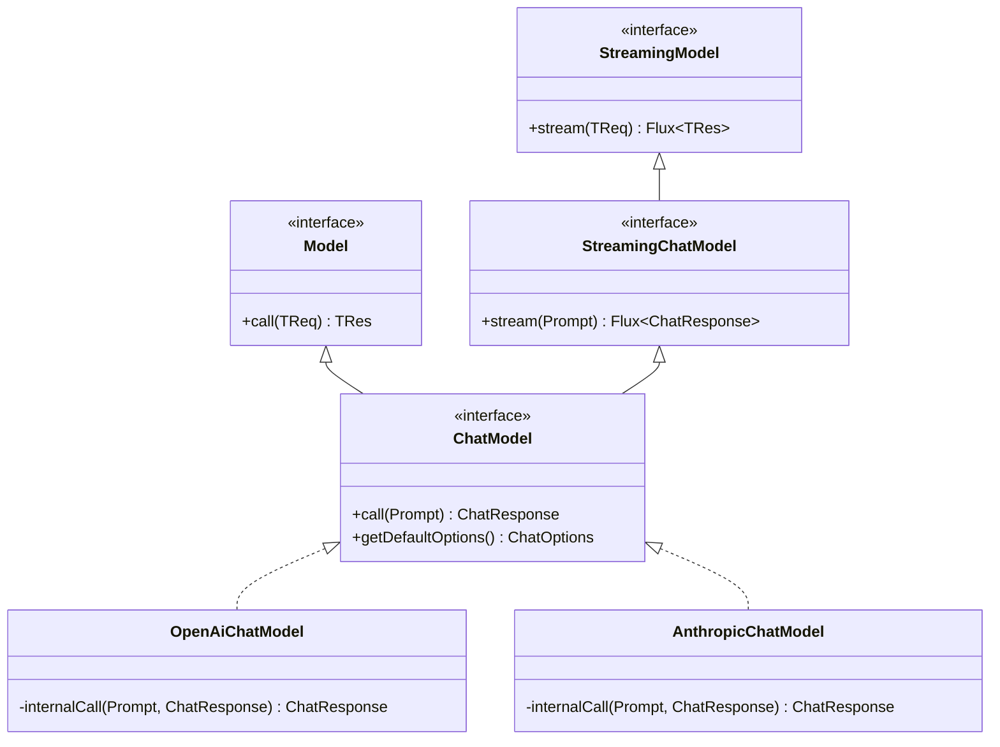
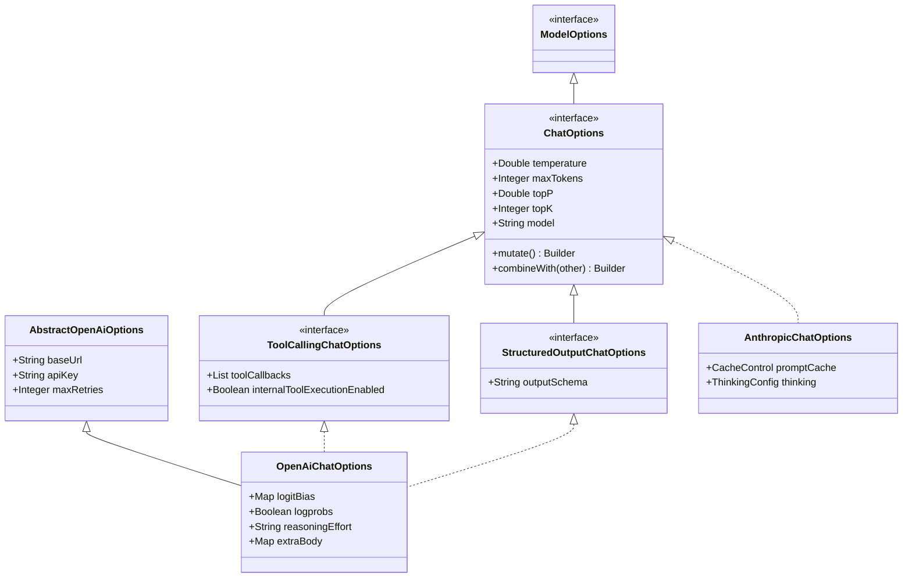
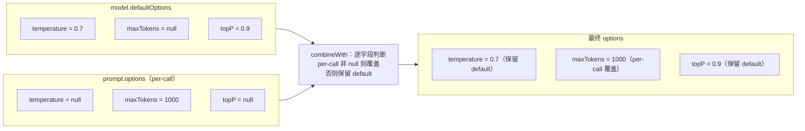

# 第 3 篇：ChatModel 与 ChatOptions——跨 Provider 的最小契约

LLM 厂商每隔几个月推新模型、新参数、新协议。框架要不要每来一家就改一遍抽象？Spring AI 的回答是：把"必须共享的"压到极薄一层（`ChatModel` + `ChatOptions`），把"差异部分"留给各家自己用继承去补，再用一套朴素的合并语义把"默认值"和"调用值"黏起来。

这一篇拆三件事：契约薄到了什么程度、为什么能薄、薄掉的复杂性最后去了哪里。

## 一、`ChatModel`：一个 `call`、一个 `stream`、一个默认 options

打开 `spring-ai-model/src/main/java/org/springframework/ai/chat/model/ChatModel.java`，整个接口短到可以贴下来：

```java
public interface ChatModel extends Model<Prompt, ChatResponse>, StreamingChatModel {

    default @Nullable String call(String message) { ... }   // 便利方法
    default @Nullable String call(Message... messages) { ... } // 便利方法

    @Override
    ChatResponse call(Prompt prompt);                       // 同步主调用

    default ChatOptions getDefaultOptions() {               // 默认选项
        return ChatOptions.builder().build();
    }

    default Flux<ChatResponse> stream(Prompt prompt) {      // 流式主调用
        throw new UnsupportedOperationException("streaming is not supported");
    }
}
```
（`spring-ai-model/.../chat/model/ChatModel.java:30-55`）

去掉文档注释，真正必须由 Provider 实现的东西只有一行：`ChatResponse call(Prompt prompt)`。`getDefaultOptions()` 给了空实现，`stream()` 给了"抛异常"实现。一个 Provider 哪怕只支持同步调用也能实现 `ChatModel`。

把它再往上看一层，`Model` 是个泛型壳：

```java
public interface Model<TReq extends ModelRequest<?>, TRes extends ModelResponse<?>> {
    TRes call(TReq request);
}
```
（`spring-ai-model/.../model/Model.java:31-40`）

`StreamingChatModel` 也只有一个方法：

```java
@FunctionalInterface
public interface StreamingChatModel extends StreamingModel<Prompt, ChatResponse> {
    @Override
    Flux<ChatResponse> stream(Prompt prompt);
    // 其余都是 default 便利方法
}
```
（`spring-ai-model/.../chat/model/StreamingChatModel.java:29-49`）

也就是说，整个跨 Provider 契约，去重后只有三件事：**用 `Prompt` 进、用 `ChatResponse` 出**、**同步走 `call`**、**流式走 `stream`**。

把这几个接口的继承关系画出来：



实线是接口继承，虚线是 Provider 实现。`ChatModel` 同时继承 `Model<Prompt, ChatResponse>` 与 `StreamingChatModel<Prompt, ChatResponse>`——一个接口背两条泛型实例化路径，这是它能"既同步又流式"的契约根源。

### 为什么能薄成这样？因为把循环留给了上层

LLM 调用的复杂部分从来不是"发一次请求拿一次响应"——是 tool calling 的多轮循环、是 retry、是流式与工具混在一起、是观测埋点。一个想要"通用 ChatModel 接口"的框架最容易犯的错，是把这些塞进接口签名里，比如让 `ChatModel` 返回某种"可继续的会话句柄"。

Spring AI 没这么做。它把 `call(Prompt)` 定义成"一次模型调用"，**一次就是一次，不要管循环**。循环要么被 Provider 自己包在内部（`OpenAiChatModel.internalCall` 看到 `tool_calls` 就递归调自己），要么被 advisor 链在外面包一层接管（`ToolCallAdvisor` 把 `internalToolExecutionEnabled` 翻成 `false` 把循环夺过来——后面会展开）。

这件事最直观的证据是 `OpenAiChatModel.call`：

```java
@Override
public ChatResponse call(Prompt prompt) {
    Prompt requestPrompt = buildRequestPrompt(prompt);
    return this.internalCall(requestPrompt, null);
}

private ChatResponse internalCall(Prompt prompt, @Nullable ChatResponse previousChatResponse) {
    ChatCompletionCreateParams request = createRequest(prompt, false);
    // ... observation 包一层 ...
    ChatResponse response = ... 调 OpenAI SDK ... ;

    if (this.toolExecutionEligibilityPredicate.isToolExecutionRequired(prompt.getOptions(), response)) {
        var toolExecutionResult = this.toolCallingManager.executeToolCalls(prompt, response);
        if (toolExecutionResult.returnDirect()) {
            return ChatResponse.builder().from(response)
                .generations(ToolExecutionResult.buildGenerations(toolExecutionResult)).build();
        }
        // Send the tool execution result back to the model.
        return this.internalCall(
            new Prompt(toolExecutionResult.conversationHistory(), prompt.getOptions()), response);
    }
    return response;
}
```
（`models/spring-ai-openai/.../OpenAiChatModel.java:182-261`）

`call` 只露一行——"装好 prompt，调 internalCall"；循环被藏进 `internalCall` 私有方法里，一切以**递归**的形式自洽。这个递归是不是非要在 ChatModel 内部做？不是。它是 Provider 的"自留实现"，需要的话上层 advisor 可以接管。两条路径并存的设计，第 5 篇会专门展开。

`AnthropicChatModel` 几乎是同一份骨架：

```java
@Override
public ChatResponse call(Prompt prompt) {
    Prompt requestPrompt = buildRequestPrompt(prompt);
    return this.internalCall(requestPrompt, null);
}
```
（`models/spring-ai-anthropic/.../AnthropicChatModel.java:226-230`）

两家都遵守"`call(Prompt)` 只暴露一次完整结果"的约定，循环逻辑各管各的。这就是契约能薄下来的代价：**复杂性没消失，只是从签名移到了实现里**。

## 二、`Prompt` 与 `ChatOptions`：两条独立的载荷线

`call(Prompt)` 只有一个入参——但是这个入参里其实塞了两件不相关的东西：

```java
public class Prompt implements ModelRequest<List<Message>> {
    private final List<Message> messages;
    private @Nullable ChatOptions chatOptions;
    // ...
    @Override public @Nullable ChatOptions getOptions() { return this.chatOptions; }
    @Override public List<Message> getInstructions() { return this.messages; }
}
```
（`spring-ai-model/.../chat/prompt/Prompt.java:45-93`）

`messages` 是"对话内容"——`SystemMessage` / `UserMessage` / `AssistantMessage` / `ToolResponseMessage` 四种 `Message` 的子类型（见 `spring-ai-model/.../chat/messages/`）。`chatOptions` 是"调用参数"——温度、max tokens、tool list 这些。两者对 Provider 来说要走完全不同的处理路径：消息要被翻译成 OpenAI/Anthropic 各自的 message schema，options 要被翻译成 SDK 的各种参数对象。

把它们捏在一个 `Prompt` 里有两个好处：

**第一**，签名干净。如果让 `call` 同时收 `Prompt + ChatOptions`，每个 advisor 改 options 都要重传一遍，request 的"完整状态"分散在两处，容易漏。Spring AI 把它捏在一起后，`ChatClientRequest`（advisor 链上的请求对象）也只持一个 `Prompt` 字段，每次 advisor 想改 options，就用 `prompt.mutate().chatOptions(...).build()` 整个重建。

**第二**，options 是可空的。`new Prompt("hello")` 不带 options 也合法——这正好对应"我对默认值满意"的最常见场景。Provider 内部用一个 `buildRequestPrompt` 把"prompt 带的 options（可能 null）"和"model 自己 default options"合并出最终 options，再放回 prompt。下面就是这一步。

## 三、`ChatOptions`：通用层只放真正能跨 Provider 的字段

`ChatOptions` 接口的字段表如下：

```java
public interface ChatOptions extends ModelOptions {
    @Nullable String getModel();
    @Nullable Double getFrequencyPenalty();
    @Nullable Integer getMaxTokens();
    @Nullable Double getPresencePenalty();
    @Nullable List<String> getStopSequences();
    @Nullable Double getTemperature();
    @Nullable Integer getTopK();
    @Nullable Double getTopP();
    // ...
}
```
（`spring-ai-model/.../chat/prompt/ChatOptions.java:29-77`）

8 个字段，没了。注意所有字段都是 `@Nullable` 的——意思是"用户没显式设过"，留给合并步骤决定用谁的。

这 8 个字段是"通用 LLM 参数表"的并集（temperature/topP 是 sampling，maxTokens 是预算，stop 是终止条件，topK 是大多数 chat completion 都接受的截断参数）。**真正能跨 Provider 的字段不多**——这是一条值得留意的工程经验：与其想象"一个完整的通用层"，不如先承认"只有这 8 个能通用"。

那 OpenAI 那些花花绿绿的字段——`logitBias`、`logprobs`、`seed`、`reasoningEffort`、`verbosity`、`serviceTier`、`extraBody`、`parallelToolCalls`、`responseFormat`——去哪了？看 `OpenAiChatOptions`：

```java
public class OpenAiChatOptions extends AbstractOpenAiOptions
        implements ToolCallingChatOptions, StructuredOutputChatOptions {

    public static final String DEFAULT_CHAT_MODEL = ChatModel.GPT_5_MINI.asString();

    private @Nullable Double frequencyPenalty;     // ChatOptions
    private @Nullable Map<String, Integer> logitBias;   // OpenAI 特有
    private @Nullable Boolean logprobs;            // OpenAI 特有
    private @Nullable Integer topLogprobs;
    private @Nullable Integer maxTokens;
    private @Nullable Integer maxCompletionTokens; // OpenAI 特有（取代 maxTokens 的新字段）
    private @Nullable Integer n;
    private @Nullable List<String> outputModalities;
    // ... 还有十几个
    private @Nullable Map<String, Object> extraBody;     // 给 vLLM/Groq/Ollama 兼容层用的逃生通道
    // ...
}
```
（`models/spring-ai-openai/.../OpenAiChatOptions.java:61-124`）

这里有几件事值得拆开看：

1. **继承链是有"分工"的**：`AbstractOpenAiOptions` 装的是**传输层**字段（`baseUrl`、`apiKey`、`timeout`、`maxRetries`、`proxy`、`customHeaders`），跟 LLM 行为无关。`ToolCallingChatOptions` 和 `StructuredOutputChatOptions` 是**能力混入**——它们自己也都 `extends ChatOptions`（`spring-ai-model/.../tool/ToolCallingChatOptions.java:43`、`StructuredOutputChatOptions.java:29`），代表"我支持工具调用"或"我支持结构化输出"。`OpenAiChatOptions` 同时继承一个传输基类、再 implements 两个能力 mixin，最后才落地成一个具体类。

2. **厂家特有字段不污染顶层**。如果 Spring AI 让 `ChatOptions` 接口直接列出 `logitBias`、`reasoningEffort` 这种字段，第一是接口会膨胀成几十个 getter；第二是 Anthropic / Bedrock 实现得给所有不支持的字段返回 `null` 或空 map——徒增冗余。继承让"不支持的字段你看不见"。

3. **对照 Anthropic** 看就更直观——`AnthropicChatOptions` 不会有 `logprobs` 这种 OpenAI 概念，而会多出 prompt caching、thinking 这些 Anthropic 自家概念。两者通过 `ChatOptions` 公共基取得最小公倍数，但永远不互相污染。

4. **`extraBody` 是预留的逃生通道**——专门给 OpenAI 兼容层（vLLM、Groq、Ollama）多塞底层参数用。这是一种"框架知道自己抽象不全，于是干脆开个口子"的妥协，下一篇 ChatClient/Advisor 篇还会遇到类似设计。

把 `OpenAiChatOptions` 的继承结构与 `AnthropicChatOptions` 对照画出来，能更直观地看到"通用 + 扩展"是怎么拼的：



`OpenAiChatOptions` 站在三脚架上：一脚是传输配置（`AbstractOpenAiOptions`）、两脚是能力 mixin（`ToolCallingChatOptions` / `StructuredOutputChatOptions`）。`AnthropicChatOptions` 走的是另一条路——也实现 `ChatOptions`，但 OpenAI 那些字段它一个不要。两家通过最薄的 `ChatOptions` 取得最小公倍数，剩下都是各自世界。

`buildRequestPrompt` 是这一切落地的胶水：

```java
Prompt buildRequestPrompt(Prompt prompt) {
    OpenAiChatOptions.Builder requestBuilder = this.options.mutate();   // 默认 options 出发

    if (prompt.getOptions() != null) {
        if (prompt.getOptions().getTopK() != null) {
            logger.warn("The topK option is not supported by OpenAI chat models. Ignoring.");
        }
        requestBuilder.combineWith(prompt.getOptions().mutate());        // per-call 覆盖
    }

    OpenAiChatOptions requestOptions = requestBuilder.build();
    ToolCallingChatOptions.validateToolCallbacks(requestOptions.getToolCallbacks());
    return new Prompt(prompt.getInstructions(), requestOptions);          // 把合并结果塞回去
}
```
（`models/spring-ai-openai/.../OpenAiChatModel.java:634-649`）

这段六行代码是整个跨 Provider 适配的"咽喉"——所有调用最终都通过这里把 default + per-call 合并出确定的 options。至于 `combineWith` 究竟是怎么合并的，看下一节。

## 四、`combineWith`：默认 + per-call 的合并语义

`ChatOptions.Builder` 接口的最后一个方法：

```java
interface Builder<B extends Builder<B>> extends Cloneable {
    // ... 其它字段 setter ...

    /**
     * Mutate this builder by taking all {@code other}'s values that are non-null,
     * retaining {@code this} other values.
     */
    B combineWith(ChatOptions.Builder<?> other);
}
```
（`spring-ai-model/.../chat/prompt/ChatOptions.java:182-188`）

注释把语义讲得很清楚：**this 是基底，other 里非 null 的字段覆盖，null 的字段保留 this**。`DefaultChatOptionsBuilder` 的实现也直白：

```java
@Override
public B combineWith(ChatOptions.Builder<?> other) {
    if (other instanceof DefaultChatOptionsBuilder<?> that) {
        if (that.model != null) { this.model = that.model; }
        if (that.frequencyPenalty != null) { this.frequencyPenalty = that.frequencyPenalty; }
        if (that.maxTokens != null) { this.maxTokens = that.maxTokens; }
        if (that.presencePenalty != null) { this.presencePenalty = that.presencePenalty; }
        if (that.stopSequences != null) { this.stopSequences = new ArrayList<>(that.stopSequences); }
        if (that.temperature != null) { this.temperature = that.temperature; }
        if (that.topK != null) { this.topK = that.topK; }
        if (that.topP != null) { this.topP = that.topP; }
    }
    return self();
}
```
（`spring-ai-model/.../chat/prompt/DefaultChatOptionsBuilder.java:118-147`）

每个字段都是 `if (that.x != null) this.x = that.x`——简单、可预测、好测。

这个语义看似平平无奇，实际定下了一条强约束：**per-call options 总是覆盖默认 options**。任何时候用户写 `chatClient.prompt().options(o -> o.temperature(0.0)).call()`，他都能确信不会被 default options 里"恰好也设了 temperature=0.7"覆盖掉。

为什么这一条值得专门强调？因为换种合并语义，设计就完全不同：

- 如果改成"both non-null 时取平均/最小/拼接"，行为变得不可预测；
- 如果改成"覆盖整段 options 而不是逐字段 merge"，用户每次都得把所有想要的字段重新填一遍——那 default options 就没意义了；
- 如果加入"显式 unset"语义（per-call 设 `null` 表示"清掉默认"），又得给每个字段加一个"是否被显式设置过"的状态位。

**Spring AI 选了最简单的：null 表示"我没意见"**。它不能表达"我要把 default 里的 temperature 清掉"，但这种需求极罕见——真要清掉，构造一个全空的 options 就行。简单合并语义换来的是：default + per-call 这条调用模型，再叠加 advisor 改 options，最终行为是可推理的。

把这一步的合并语义画一遍——同名字段非 null 覆盖、null 保留：



每个字段独立处理——"temperature 用谁的"和"maxTokens 用谁的"互不影响。这换来一条可推理的等式：**最终值 = per-call.x ?? default.x**。

每个 Provider 都给 `combineWith` 加一层 override，把自家字段也合并进去。`OpenAiChatOptions.AbstractBuilder.combineWith` 长这样：

```java
@Override
public B combineWith(ChatOptions.Builder<?> other) {
    super.combineWith(other);                            // 先合并 ChatOptions 通用字段
    if (other instanceof AbstractBuilder<?> that) {
        if (that.baseUrl != null) { this.baseUrl = that.baseUrl; }
        if (that.apiKey != null) { this.apiKey = that.apiKey; }
        if (that.logitBias != null) { this.logitBias = that.logitBias; }
        if (that.logprobs != null) { this.logprobs = that.logprobs; }
        // ... 还有十几个 OpenAI 特有字段 ...
    }
    return self();
}
```
（`models/spring-ai-openai/.../OpenAiChatOptions.java:1183-1250` 节选）

这里其实是一个"递归合并"——每一层都先 `super.combineWith` 处理父类字段，再合自己这层。但因为合并逻辑都是 `if non-null then assign`，整体行为依然简单。

## 五、`mutate()`：让 advisor 能改 options 而不破坏类型

最后一个关键设计在 `ChatOptions.mutate()`：

```java
// TODO: change from default() to abstract once all models use customizers
default ChatOptions.Builder<?> mutate() {
    throw new UnsupportedOperationException("mutate() must be overridden to return most concrete Builder");
}
```
（`spring-ai-model/.../chat/prompt/ChatOptions.java:93-96`）

注意三件事：

1. 这是 `default` 方法但实现是抛异常——意思是"接口希望每个具体子类都 override 它"，临时给个 default 是为了过渡。
2. 注释里的 TODO："change from default() to abstract once all models use customizers"——侧面说明这是个还在迁移中的设计。
3. 旁边那段被注释掉的代码（96-103 行）是早期版本——它默认用 `ChatOptions.builder()` 返回 `DefaultChatOptionsBuilder`。问题是：如果你从 `OpenAiChatOptions` 调 `mutate()`，拿到的是个 `DefaultChatOptionsBuilder`，再 `.build()` 出来就成了 `DefaultChatOptions`——所有 OpenAI 特有字段在这一步全丢了。所以现在的设计强迫每个子类自己 override `mutate()` 返回自己的 Builder。

`OpenAiChatOptions.mutate()` 的实现：

```java
@Override
public Builder mutate() {
    return builder()
        .baseUrl(this.getBaseUrl())
        .apiKey(this.getApiKey())
        // ... 把所有字段一字段一行复制回 builder ...
        .extraBody(this.extraBody != null ? new HashMap<>(this.extraBody) : null);
}
```
（`models/spring-ai-openai/.../OpenAiChatOptions.java:683-732`）

40 行 setter 调用——丑，但是必要。它保证"`opts.mutate().build()` 等价于深拷贝，且类型仍然是 `OpenAiChatOptions`"。

为什么要让每个 ChatOptions 都能 `mutate()`？因为 advisor 链需要这条出口。看 `ToolCallAdvisor` 的第一步：

```java
@Override
public ChatClientResponse adviseCall(ChatClientRequest chatClientRequest, CallAdvisorChain callAdvisorChain) {
    if (chatClientRequest.prompt().getOptions() == null
            || !(chatClientRequest.prompt().getOptions() instanceof ToolCallingChatOptions)) {
        throw new IllegalArgumentException(
                "ToolCall Advisor requires ToolCallingChatOptions to be set in the ChatClientRequest options.");
    }

    chatClientRequest = this.doInitializeLoop(chatClientRequest, callAdvisorChain);

    // Overwrite the ToolCallingChatOptions to disable internal tool execution.
    var optionsCopy = ((ToolCallingChatOptions.Builder<?>) chatClientRequest.prompt().getOptions().mutate())
        .internalToolExecutionEnabled(false)
        .build();
    // ... 后面用 optionsCopy 重建 prompt 进入循环
}
```
（`spring-ai-client-chat/.../advisor/ToolCallAdvisor.java:106-123`）

这段代码做的事情是：**接管工具循环**。具体动作只有一个——把 `internalToolExecutionEnabled` 翻成 `false`，告诉 ChatModel "你别自己循环了，遇到 tool_calls 直接返回"。然后 ToolCallAdvisor 在 advisor 链层面手工跑这个循环（第 5 篇会拆这一段）。

但这里的关键是 `mutate()` 这一步：advisor 不知道 prompt 里塞的是 `OpenAiChatOptions` 还是 `AnthropicChatOptions`——只知道它实现了 `ToolCallingChatOptions`。它通过 `mutate()` 拿到对应类型的 Builder，强转成 `ToolCallingChatOptions.Builder<?>`，改一个字段，再 `build()` 回来，**类型仍是原来那一个具体子类**。如果没有 `mutate()` 这条机制，advisor 要么得反射改字段，要么得让 ChatOptions 自带某种"with-er"方法——前者脆弱、后者侵入面更广。

`mutate()` 解决的是 Java 类型系统下"在不知道具体子类时还要保留具体子类"的问题。这是 advisor 链能干净地跨 Provider 工作的前提。

## 收束

看完整套契约，再回头数一下"薄"在哪里：

- `ChatModel` 接口本身 —— **1 个方法必须实现**（`call(Prompt)`），其它都有 default
- `ChatOptions` 接口字段表 —— **8 个字段**（model、frequencyPenalty、maxTokens、presencePenalty、stopSequences、temperature、topK、topP）
- 跨 Provider 合并语义 —— **null 表示"我没意见"**，per-call 总是覆盖 default

这套抽象之所以能薄到这里，是因为它把三件事推到了别处：
- **多轮循环**推给了 Provider 内部 `internalCall`，或者外部 `ToolCallAdvisor`
- **厂家特有参数**推给了继承（每家自己造 `XxxChatOptions extends ChatOptions`）
- **类型保留下的可改性**推给了 `mutate()`（强迫子类自己 override）

下一篇会把镜头从"模型契约"上移到 `ChatClient` 与 advisor 链——那才是 Spring AI 真正把横切关注点（记忆、RAG、工具循环、结构化输出、观测）织在一起的地方。但要看懂那条链，得先承认：底下这一层薄到刚刚好——它薄到不把任何复杂性"提前预设"为接口的一部分。

---

## 关键代码索引

| 主题 | 路径 |
| --- | --- |
| `ChatModel` 接口 | `spring-ai-model/.../chat/model/ChatModel.java:30-55` |
| `StreamingChatModel` 接口 | `spring-ai-model/.../chat/model/StreamingChatModel.java:29-49` |
| `Model` 泛型基 | `spring-ai-model/.../model/Model.java:31-40` |
| `ChatOptions` 字段表 | `spring-ai-model/.../chat/prompt/ChatOptions.java:29-77` |
| `ChatOptions.combineWith` 接口约定 | `spring-ai-model/.../chat/prompt/ChatOptions.java:182-188` |
| `ChatOptions.mutate` TODO 设计意图 | `spring-ai-model/.../chat/prompt/ChatOptions.java:93-96` |
| `DefaultChatOptionsBuilder.combineWith` 实现 | `spring-ai-model/.../chat/prompt/DefaultChatOptionsBuilder.java:118-147` |
| `Prompt` 携带 messages + options | `spring-ai-model/.../chat/prompt/Prompt.java:45-93` |
| 4 种 `Message` 子类型 | `spring-ai-model/.../chat/messages/{User,System,Assistant,ToolResponse}Message.java` |
| `OpenAiChatOptions` 字段全集 | `models/spring-ai-openai/.../OpenAiChatOptions.java:61-124` |
| `OpenAiChatOptions.mutate()` 实现 | `models/spring-ai-openai/.../OpenAiChatOptions.java:683-732` |
| `OpenAiChatOptions.AbstractBuilder.combineWith` 子类合并 | `models/spring-ai-openai/.../OpenAiChatOptions.java:1183-1250` |
| `OpenAiChatModel.call → internalCall` 入口 | `models/spring-ai-openai/.../OpenAiChatModel.java:182-261` |
| `OpenAiChatModel.buildRequestPrompt` 合并胶水 | `models/spring-ai-openai/.../OpenAiChatModel.java:634-649` |
| `AnthropicChatModel.call` 同骨架 | `models/spring-ai-anthropic/.../AnthropicChatModel.java:226-230` |
| `ToolCallingChatOptions` 能力 mixin | `spring-ai-model/.../tool/ToolCallingChatOptions.java:43,153` |
| `StructuredOutputChatOptions` 能力 mixin | `spring-ai-model/.../tool/StructuredOutputChatOptions.java:29` |
| `ToolCallAdvisor` 用 `mutate()` 翻 `internalToolExecutionEnabled` | `spring-ai-client-chat/.../advisor/ToolCallAdvisor.java:118-122` |

---

## 思考题

1. 如果让你给 `ChatOptions` 加一个新通用字段（比如 `seed`），你会怎么决定它该进顶层接口、还是只进 `OpenAiChatOptions`？依据是什么？另外几家 Provider 都支持 `seed` 吗？
2. `combineWith` 用的是 "null = 没意见"语义。如果业务真的需要表达"显式清空 default 的 temperature"，你会怎么扩展这套设计？引入一个 `Optional` 包一层 vs 增加一个 "set / unset / inherit" 三态字段，各自代价是什么？
3. `mutate()` 现在是 `default` + 抛异常的"半强制 override"。注释里的 TODO 想把它变成 `abstract`。如果让你来推动这件事，你会先做什么、最容易卡在哪？（提示：考虑下游所有 `XxxChatOptions` 的 mass migration）

---

## 延伸阅读

- 第 2 篇《一次 ChatClient 调用的完整旅程》：看 `Prompt` + `ChatOptions` 是怎么从 `ChatClient.Builder` 一路传到 `OpenAiChatModel.buildRequestPrompt` 的
- 第 4 篇《ChatClient 与 Advisor 链》：`mutate()` 与 `ChatClientRequest` 不可变 + copy-on-write 模式怎么协作
- 第 5 篇《Tool Calling 的双路径》：`internalCall` 内置循环 vs `ToolCallAdvisor` 链层循环的取舍，以及 `internalToolExecutionEnabled` 这个开关的来龙去脉
- 仓库内对照：`spring-ai-model/.../embedding/` 下的 `EmbeddingModel` / `EmbeddingOptions` 用了同构的"接口 + ChatOptions 子类"设计，对照看能加深"跨 Modality 抽象"的直觉

> 基于 spring-ai commit 9cde97c1
