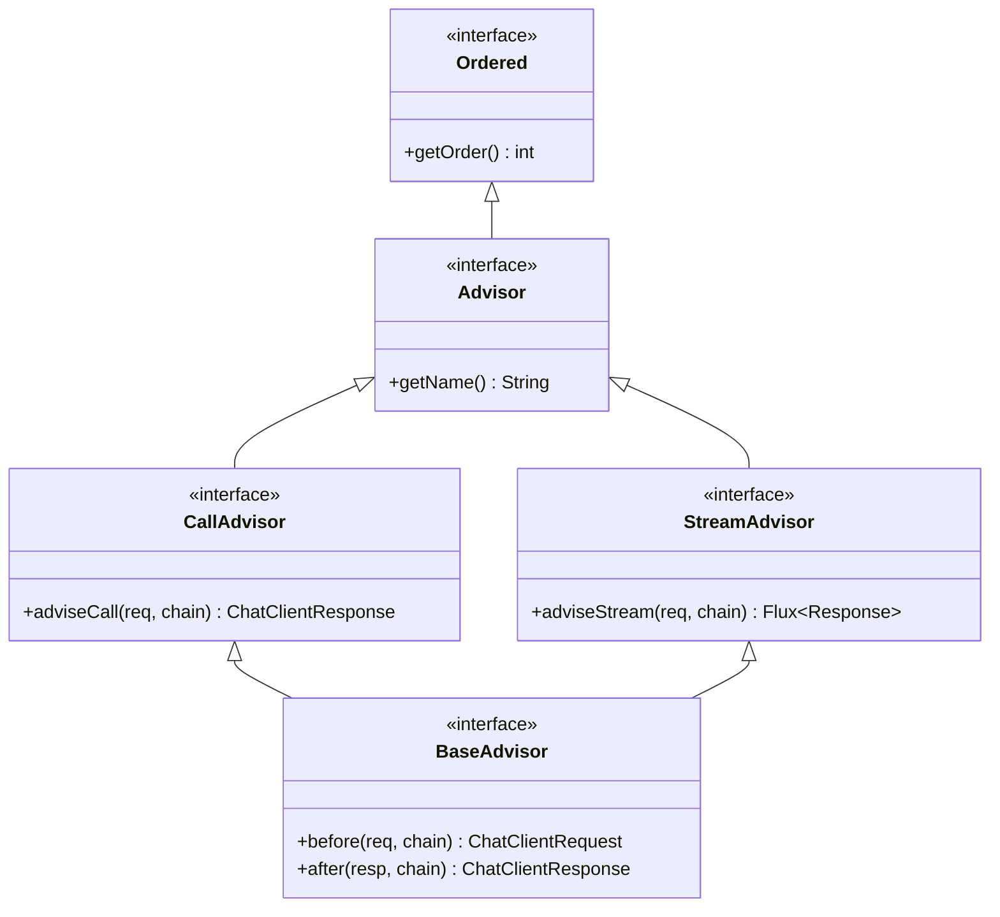
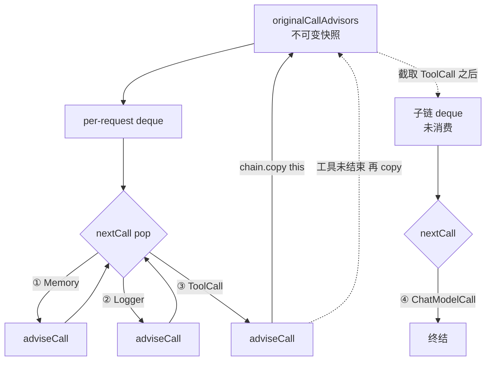
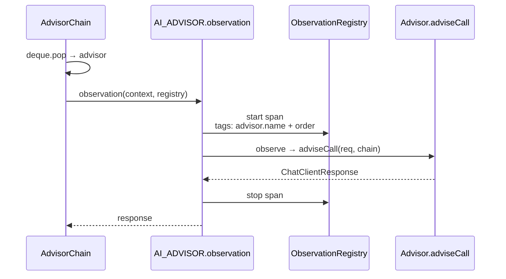
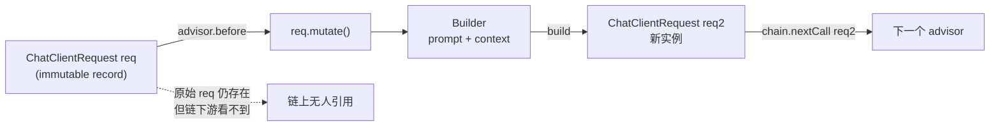

# 第 4 篇：ChatClient 与 Advisor 链——Spring AI 的总线

如果只能花一天理解 Spring AI 的设计骨架，应该花在这一篇。`ChatModel` 是干活的（拨通 Provider 的 HTTP），`ChatClient` 是发号施令的（组装 prompt、解析结构化输出）；夹在两者中间、把记忆 / RAG / 工具循环 / 日志 / 限流全部串成一条线的，是 **Advisor 链**。所有横切关注点最终都被翻译成"挂在链上某个 order 位置的一个 Advisor"，而真正调用模型本身——`ChatModel.call`——也被打扮成一个特殊的 Advisor 钉在链尾。读懂这条链，就握住了 Spring AI 的总线。

下面分五个角度拆：接口三层为什么这么切、终结 advisor 为什么要存在、deque 链为什么不写成 `chain[i++]`、order 常量为什么留 1000 个 slot、record + `mutate()` 为什么必要。

---

## 一、接口三层：Advisor / CallAdvisor / BaseAdvisor

打开 `spring-ai-client-chat/.../advisor/api/`，一眼看到接口被刻意切成三层：



> 顶层 `Advisor` 只管身份（name + order），中层 `CallAdvisor` / `StreamAdvisor` 暴露 around 能力，便捷层 `BaseAdvisor` 把 90% "前后插一脚"的场景压成 before/after。

最顶层 `Advisor` 只有 4 行实质代码（`spring-ai-client-chat/.../advisor/api/Advisor.java:31-47`）：

```java
public interface Advisor extends Ordered {

    int DEFAULT_CHAT_MEMORY_PRECEDENCE_ORDER = Ordered.HIGHEST_PRECEDENCE + 1000;

    String getName();
}
```

它没有任何"业务方法"，只规定 advisor 必须能告诉链"我叫什么、我排第几"。`extends Ordered` 让链能用 `OrderComparator.sort` 对 advisor 排序——这是后面 reorder 机制的前提。

往下一层是 `CallAdvisor` 和 `StreamAdvisor`，它们才长出真正的 around 方法（`CallAdvisor.java:30-34`）：

```java
public interface CallAdvisor extends Advisor {
    ChatClientResponse adviseCall(ChatClientRequest chatClientRequest, CallAdvisorChain callAdvisorChain);
}
```

```java
public interface StreamAdvisor extends Advisor {
    Flux<ChatClientResponse> adviseStream(ChatClientRequest chatClientRequest, StreamAdvisorChain streamAdvisorChain);
}
```

两份签名长得一样，差别只在返回类型：同步是 `ChatClientResponse`，流式是 `Flux<ChatClientResponse>`。这两个接口故意分开，不合并成一个泛型接口，原因是流式分支和同步分支底层的链是分开两个 deque（看 `DefaultAroundAdvisorChain.java:67-69`）——一个 advisor 既可能只想拦截 call，也可能只想拦截 stream。强制合一会害用户写一堆空实现。

第三层 `BaseAdvisor` 是给"我懒得自己写 around"的用户准备的便捷层（`BaseAdvisor.java:42-89`）：

```java
public interface BaseAdvisor extends CallAdvisor, StreamAdvisor {

    default ChatClientResponse adviseCall(ChatClientRequest chatClientRequest, CallAdvisorChain callAdvisorChain) {
        ChatClientRequest processedChatClientRequest = before(chatClientRequest, callAdvisorChain);
        ChatClientResponse chatClientResponse = callAdvisorChain.nextCall(processedChatClientRequest);
        return after(chatClientResponse, callAdvisorChain);
    }

    ChatClientRequest before(ChatClientRequest chatClientRequest, AdvisorChain advisorChain);

    ChatClientResponse after(ChatClientResponse chatClientResponse, AdvisorChain advisorChain);
}
```

`before` / `after` 是模板方法。Spring AI 内置的 `MessageChatMemoryAdvisor`、`PromptChatMemoryAdvisor`、`RetrievalAugmentationAdvisor`、`StructuredOutputValidationAdvisor` 都走这层——它们的逻辑都能整齐地切成"调用模型前改 request、调用模型后读 response"。

但留意：流式分支的 default 实现并不只是镜像。`BaseAdvisor.adviseStream`（行 57-73）用 reactor 把 before 放到一个调度器上、把 after **只在 finishReason 出现时**才调用一次：

```java
default Flux<ChatClientResponse> adviseStream(ChatClientRequest chatClientRequest,
        StreamAdvisorChain streamAdvisorChain) {
    Flux<ChatClientResponse> chatClientResponseFlux = Mono.just(chatClientRequest)
        .publishOn(getScheduler())
        .map(request -> this.before(request, streamAdvisorChain))
        .flatMapMany(streamAdvisorChain::nextStream);

    return chatClientResponseFlux.map(response -> {
        if (AdvisorUtils.onFinishReason().test(response)) {
            response = after(response, streamAdvisorChain);
        }
        return response;
    }).onErrorResume(error -> Flux.error(new IllegalStateException("Stream processing failed", error)));
}
```

也就是说：流式下，下游 chunk 一段一段过来，`after` 只在 LLM 给出 `finishReason`（比如 stop、tool_calls）的那一帧才执行。这避免了 ChatMemoryAdvisor 这种 advisor 在流式下把每个 partial chunk 都写进 memory。

**这三层切法的真正取舍**：底层（`Advisor`）只规定身份信息，不沾业务，让链管理器只用 `Ordered` 一招就能排序；中层（`CallAdvisor` / `StreamAdvisor`）暴露"完整 around"的能力，让重型 advisor（比如 `ToolCallAdvisor`，自己起循环）有完全控制权；顶层（`BaseAdvisor`）把 90% 的"前后插一脚"的场景压成 before/after。这样每一类 advisor 作者都不用为别人的能力买单。

不必要时，谁也不会写 `adviseCall` 那个签名——它需要你自己调 `chain.nextCall`，写错就把链断了。

---

## 二、终结 advisor：让"调模型"也变成链的一站

读完接口你会问：链最末是谁？答案在 `DefaultChatClient.buildAdvisorChain()`（`DefaultChatClient.java:1026-1036`）：

```java
private BaseAdvisorChain buildAdvisorChain() {
    // At the stack bottom add the model call advisors.
    // They play the role of the last advisors in the advisor chain.
    this.advisors.add(ChatModelCallAdvisor.builder().chatModel(this.chatModel).build());
    this.advisors.add(ChatModelStreamAdvisor.builder().chatModel(this.chatModel).build());

    return DefaultAroundAdvisorChain.builder(this.observationRegistry)
        .observationConvention(this.advisorObservationConvention)
        .pushAll(this.advisors)
        .build();
}
```

每次 `call()` / `stream()` 都会构建一条新链，并在用户配的 advisors 后面追加两个内置 advisor。这两个内置 advisor 的 order 都是 `Ordered.LOWEST_PRECEDENCE`（看 `ChatModelCallAdvisor.java:103-105`）：

```java
@Override
public int getOrder() {
    return Ordered.LOWEST_PRECEDENCE;
}
```

链在 reorder 之后它们就稳稳排在最尾。打开 `ChatModelCallAdvisor.adviseCall`（`ChatModelCallAdvisor.java:53-64`）：

```java
public ChatClientResponse adviseCall(ChatClientRequest chatClientRequest, CallAdvisorChain callAdvisorChain) {
    ChatClientRequest formattedChatClientRequest = augmentWithFormatInstructions(chatClientRequest);

    ChatResponse chatResponse = this.chatModel.call(formattedChatClientRequest.prompt());

    return ChatClientResponse.builder()
        .chatResponse(chatResponse)
        .context(Map.copyOf(formattedChatClientRequest.context()))
        .build();
}
```

它不调用 `callAdvisorChain.nextCall`——链到这里就 **停**。它直接调 `ChatModel.call`，把结果包成 `ChatClientResponse`。也就是说：从用户视角看，整条链长这样：

```
[memory advisor] -> [rag advisor] -> [logger advisor] -> ... -> [ChatModelCallAdvisor (terminal)] -> ChatModel
```

**这个设计的关键好处**是链保持同构。前面所有 advisor 都按 `adviseCall(req, chain)` 的契约写，最后一个也按这个契约写——用户写的 advisor 里 `chain.nextCall(req)` 这一行最终一定会推到 `ChatModelCallAdvisor.adviseCall`，再没有任何"末端特例"。

如果不这么做会怎样？最自然的写法是把"调模型"作为 `nextCall` 内部的一个 if 分支：当 advisors 队列空了，就直接调 `chatModel.call`。但这样链上就有了一个特殊节点——它没有 advisor、没有 observation、不参与 order 排序、也无法被替换。Spring AI 选择把它包装成 advisor，于是就连"调模型"这件事本身都自动获得了 observation 包装（下文会讲）、自动可以被换掉（比如换成一个调 mock model 的 advisor 来做单元测试）、自动能拿到 order 序号。

顺便：`ChatModelCallAdvisor.augmentWithFormatInstructions` 里塞了结构化输出的 schema 注入逻辑——这是给第 6 篇留的引子。

---

## 三、deque + pop：为什么不写成 `chain[i++]`

`DefaultAroundAdvisorChain` 的链状态是两个 `Deque`（`DefaultAroundAdvisorChain.java:67-69`）：

```java
private final Deque<CallAdvisor> callAdvisors;
private final Deque<StreamAdvisor> streamAdvisors;
```

`nextCall` 的核心三行是 pop 一个 advisor、包 observation、调它的 `adviseCall`（`DefaultAroundAdvisorChain.java:96-119`）：

```java
public ChatClientResponse nextCall(ChatClientRequest chatClientRequest) {
    if (this.callAdvisors.isEmpty()) {
        throw new IllegalStateException("No CallAdvisors available to execute");
    }

    var advisor = this.callAdvisors.pop();

    var observationContext = AdvisorObservationContext.builder()
        .advisorName(advisor.getName())
        .chatClientRequest(chatClientRequest)
        .order(advisor.getOrder())
        .build();

    return AdvisorObservationDocumentation.AI_ADVISOR
        .observation(this.observationConvention, DEFAULT_OBSERVATION_CONVENTION, () -> observationContext,
                this.observationRegistry)
        .observe(() -> {
            var chatClientResponse = advisor.adviseCall(chatClientRequest, this);
            observationContext.setChatClientResponse(chatClientResponse);
            return chatClientResponse;
        });
}
```

注意一个关键事实：**链是有状态的**。每调用一次 `nextCall`，deque 就少一个 advisor。这条链是"消费式"的，走一遍就空了。

为什么要这样？乍一看更安全的写法是数组 + index：

```java
// 假想的、并未使用的实现
ChatClientResponse nextCall(req) {
    if (i >= advisors.size()) return finalCall(req);
    var advisor = advisors[i++];
    return advisor.adviseCall(req, this);
}
```

这样链是"只读"的，多次 `nextCall` 互不干扰。问题在于：Spring AI 需要支持一种 advisor 行为——**重入子链**。

最经典的例子就是 `ToolCallAdvisor`（`ToolCallAdvisor.java:141`）：

```java
chatClientResponse = callAdvisorChain.copy(this).nextCall(processedChatClientRequest);
```

这一行在工具循环里——LLM 返回 `tool_calls`、本地把 tool 跑完、再把结果灌回 LLM，直到 LLM 不再要工具为止。每一轮都需要"从我自己的下一个 advisor 开始重新走一遍尾部链"。`callAdvisorChain.copy(this)` 就是干这个的（`DefaultAroundAdvisorChain.java:155-180`）：

```java
public CallAdvisorChain copy(CallAdvisor after) {
    return this.copyAdvisorsAfter(this.getCallAdvisors(), after);
}

private DefaultAroundAdvisorChain copyAdvisorsAfter(List<? extends Advisor> advisors, Advisor after) {
    int afterAdvisorIndex = advisors.indexOf(after);

    if (afterAdvisorIndex < 0) {
        throw new IllegalArgumentException("The specified advisor is not part of the chain: " + after.getName());
    }

    var remainingStreamAdvisors = advisors.subList(afterAdvisorIndex + 1, advisors.size());

    return DefaultAroundAdvisorChain.builder(this.getObservationRegistry())
        .pushAll(remainingStreamAdvisors)
        .build();
}
```

注意它访问的是 `originalCallAdvisors`（链构造时拷贝的不可变快照，行 85-86）——也就是说，每次 `copy(this)` 都是从**原始**链截一段，再 build 出一条全新的、未被消费过的链。

如果链是 index-based 的"只读"链，这个 API 仍然可以做，但代价是要把"游标位置"也作为状态存出来。Spring AI 选 deque 是因为它顺手做了一件事：**链的剩余状态就是 deque 自身**。`pop` 把元素拿走，剩下的就是"还没走过的 advisor"。`copy(this)` 不需要传游标，只要从 `originalCallAdvisors` 里截一段重新 push 就完事。状态语义和数据结构是统一的。



> 链是"消费式"的，每个 advisor 被 pop 一次。`chain.copy(this)` 不传游标——它从原始快照截取"我之后"那段、重新 push 出新链——这是工具循环每一轮重走尾部链的关键。

另一个隐含好处：链一旦消费就不能 rewind。这是个有用的约束——如果 advisor 想"看一眼下游再决定要不要继续"，它必须显式 `copy(this)` 拿一份新链。规范了"重入子链"这件事的发生方式。

**注意**：链是 per-request 构建的（`buildAdvisorChain` 每次都 new），所以"消费式"不会带来线程安全问题。`callAdvisors` 用的是 `ConcurrentLinkedDeque`（行 209）——但并发性不是为了多个用户共用一条链，而是给流式分支里 reactor 调度器的多线程消费留余量。

---

## 四、Order 常量与 1000 个 slot：留位置的艺术

跳回 `Advisor.java:39`：

```java
int DEFAULT_CHAT_MEMORY_PRECEDENCE_ORDER = Ordered.HIGHEST_PRECEDENCE + 1000;
```

`Ordered.HIGHEST_PRECEDENCE` 是 `Integer.MIN_VALUE`，所以这个常量是 `Integer.MIN_VALUE + 1000`。`MessageChatMemoryAdvisor.Builder` 的 default order 用的是它（`MessageChatMemoryAdvisor.java:148`）：

```java
private int order = Advisor.DEFAULT_CHAT_MEMORY_PRECEDENCE_ORDER;
```

而 `SimpleLoggerAdvisor` / `SafeGuardAdvisor` 之类用户层 advisor 默认 order 是 `0`。这里有一个非常具体的取舍：

- `[HIGHEST_PRECEDENCE, HIGHEST_PRECEDENCE+999]` 这 1000 个 slot 留给"想跑在框架内置 advisor 之前"的用户
- `HIGHEST_PRECEDENCE+1000` 是框架内置 advisor（memory 等）的标准位置
- `0` 是普通用户 advisor
- `LOWEST_PRECEDENCE` 是终结 advisor

举个具体场景：你写了一个限流 advisor，希望它在 memory 加载会话前就把超限的请求挡掉——把 order 设成 `HIGHEST_PRECEDENCE + 100`，保证排在 `MessageChatMemoryAdvisor`（默认 `+1000`）之前。1000 个 slot 给了用户充足的"我比框架更早执行"的腾挪空间。

链如何应用 order？看 `DefaultAroundAdvisorChain.Builder.reOrder`（行 253-263）：

```java
private void reOrder() {
    ArrayList<CallAdvisor> callAdvisors = new ArrayList<>(this.callAdvisors);
    OrderComparator.sort(callAdvisors);
    this.callAdvisors.clear();
    callAdvisors.forEach(this.callAdvisors::addLast);

    ArrayList<StreamAdvisor> streamAdvisors = new ArrayList<>(this.streamAdvisors);
    OrderComparator.sort(streamAdvisors);
    this.streamAdvisors.clear();
    streamAdvisors.forEach(this.streamAdvisors::addLast);
}
```

每次 `pushAll` 之后都会 reorder——这是个细节：你不需要按顺序往里塞 advisor，链构建时会按 `Ordered.getOrder()` 重排一次。

**这个常量值得借鉴的一点**：Spring AI 没有简单地写 `int order = 0`，也没有把 memory advisor 钉死在某个魔数（比如 `1000`）。它选的是 `HIGHEST_PRECEDENCE + 1000`——一个表达"从最早往后数 1000 个 slot"的语义化常量。这个"留 N 个 slot"的小模式可以带走：当你的框架要让用户能"插在内置组件之前"时，给一段连续的整数空间，并把内置组件钉在这段空间的末尾，比直接用 0 / 100 这种魔数自洽得多。

---

## 五、自动埋点：每个 advisor 都被 Observation 包一层

回到 `nextCall`（行 111-118）：

```java
return AdvisorObservationDocumentation.AI_ADVISOR
    .observation(this.observationConvention, DEFAULT_OBSERVATION_CONVENTION, () -> observationContext,
            this.observationRegistry)
    .observe(() -> {
        var chatClientResponse = advisor.adviseCall(chatClientRequest, this);
        observationContext.setChatClientResponse(chatClientResponse);
        return chatClientResponse;
    });
```



> chain 每 pop 一个 advisor，就被 `AI_ADVISOR.observation` 包一层 span。advisor 作者只写业务逻辑，埋点由链统一托管。

每个 advisor 的 `adviseCall` 调用都被包了一层 Micrometer Observation。`AdvisorObservationDocumentation.AI_ADVISOR`（`AdvisorObservationDocumentation.java:32-119`）定义了埋点的标签：

```java
public enum LowCardinalityKeyNames implements KeyName {
    AI_OPERATION_TYPE { ... },
    AI_PROVIDER { ... },
    SPRING_AI_KIND { ... },          // "spring.ai.kind"
    ADVISOR_NAME { ... },            // "spring.ai.advisor.name"
}

public enum HighCardinalityKeyNames implements KeyName {
    ADVISOR_ORDER { ... },           // "spring.ai.advisor.order"
}
```

这意味着：用户随手实现一个 advisor，挂上去就自动有 span，自动带 advisor name + order 标签，Grafana / Tempo 一接入就能看到调用链路。这是"自动满足横切关注点"的样板：观测能力不绑定在某个具体 advisor 上，而绑定在**链本身**上——链每走一步都会自动观测一步。

流式分支稍微复杂一些（行 121-152），它要做 reactor 的 context propagation，把 observation 和 reactor context 通过 `ObservationThreadLocalAccessor.KEY` 串起来：

```java
observation.parentObservation(contextView.getOrDefault(ObservationThreadLocalAccessor.KEY, null)).start();

Flux<ChatClientResponse> chatClientResponse = Flux.defer(() -> advisor.adviseStream(chatClientRequest, this)
    .doOnError(observation::error)
    .doFinally(s -> observation.stop())
    .contextWrite(ctx -> ctx.put(ObservationThreadLocalAccessor.KEY, observation)));
```

普通 advisor 写作者不需要碰这个——他只要写 `adviseCall` 或 `before`/`after`，剩下都由链托管。

**带走一句话**：把"插件机制"和"观测机制"绑在同一个数据结构上，意味着用户每加一个插件都自动"被看见"。这比给每个 advisor 都要求"自己加一个 try/finally + meter.increment"的设计干净得多。

---

## 六、record + `mutate()`：copy-on-write 是契约

`ChatClientRequest` / `ChatClientResponse` 是 Java 17 record（`ChatClientRequest.java:36`）：

```java
public record ChatClientRequest(Prompt prompt, Map<String, @Nullable Object> context) {

    public ChatClientRequest copy() {
        return new ChatClientRequest(this.prompt.copy(), new HashMap<>(this.context));
    }

    public Builder mutate() {
        return new Builder().prompt(this.prompt.copy()).context(new HashMap<>(this.context));
    }
    ...
}
```

`record` 自带不可变 + canonical 构造器；额外加了一个 `mutate()` 返回 Builder——builder 上修改、最后 `build()` 出一个新实例。`Prompt`、`UserMessage` 这些下游类也都遵循这个模式。

`MessageChatMemoryAdvisor.before`（`MessageChatMemoryAdvisor.java:79-108`）展示了一个 advisor 怎么改 request：

```java
public ChatClientRequest before(ChatClientRequest chatClientRequest, AdvisorChain advisorChain) {
    String conversationId = getConversationId(chatClientRequest.context(), this.defaultConversationId);

    List<Message> memoryMessages = this.chatMemory.get(conversationId);

    List<Message> processedMessages = new ArrayList<>(memoryMessages);
    processedMessages.addAll(chatClientRequest.prompt().getInstructions());

    // ... (排 system message 到第一位) ...

    ChatClientRequest processedChatClientRequest = chatClientRequest.mutate()
        .prompt(chatClientRequest.prompt().mutate().messages(processedMessages).build())
        .build();

    Message userMessage = processedChatClientRequest.prompt().getLastUserOrToolResponseMessage();
    this.chatMemory.add(conversationId, userMessage);

    return processedChatClientRequest;
}
```

注意它**没有**碰原始 `chatClientRequest`——所有改动都通过 `mutate()` 拷一份新的。`before` 返回的是新 request，链下游拿到的是这个新 request。



> `record` 让你写不出"直接改字段"的代码；`mutate()` + `build()` 是显式拷贝。链上每个 advisor 都看到自己那份快照，advisor 之间互不污染。

为什么强制 copy-on-write？想象 advisor A 把 `prompt` 里的 user message 改了，advisor B 在它之后跑、却拿到原始的 request（因为 A 直接改了 list）——这会让链上的执行顺序和数据流向解耦。advisor 之间会互相污染，调试起来是地狱。强制 immutable + `mutate()` 让链上每个节点都拿到一个**它自己看到**的 request 快照。

`record` 在这里担当了关键角色：你**写不出**修改 record 字段的代码，编译器会拦你。这把"不要直接改"从口头约定变成了语言级保证。

`context` 这个 `Map<String, Object>` 是约定好的"链上副本传递"通道——advisor 之间通过它传内部状态（比如结构化输出的 schema 是怎么塞进 `STRUCTURED_OUTPUT_SCHEMA` key 的，下一步终结 advisor 就能读出来）。注意它的写时复制是**浅拷贝**：`new HashMap<>(this.context)`。也就是说 key 集合是独立的，但 value 共享。这是个工程取舍：context 里可能塞 VectorStore、Schema 这种重对象，深拷贝代价太大；浅拷贝足够阻止"谁加了哪个 key 互相影响"。

**带走的一条工程经验**：用 record + 显式 `mutate()` 取代"传 setter 的对象"，能在编译期就拦住 80% 的"链上互相污染"问题。多人协作的链式架构里值得抄。

---

## 关键代码索引

- `spring-ai-client-chat/.../advisor/api/Advisor.java:31-47` — 顶层接口 + `DEFAULT_CHAT_MEMORY_PRECEDENCE_ORDER` 常量
- `spring-ai-client-chat/.../advisor/api/CallAdvisor.java:30-34` — 同步 around 契约
- `spring-ai-client-chat/.../advisor/api/StreamAdvisor.java:32-36` — 流式 around 契约
- `spring-ai-client-chat/.../advisor/api/BaseAdvisor.java:42-89` — 便捷层 + 流式 `after` 的 `onFinishReason` 触发
- `spring-ai-client-chat/.../advisor/api/CallAdvisorChain.java:39-54` — `nextCall` / `copy(after)` 接口
- `spring-ai-client-chat/.../advisor/DefaultAroundAdvisorChain.java:67-119` — deque 状态 + pop 式 `nextCall` + observation 包装
- `spring-ai-client-chat/.../advisor/DefaultAroundAdvisorChain.java:155-180` — `copy(after)` 实现
- `spring-ai-client-chat/.../advisor/DefaultAroundAdvisorChain.java:253-263` — `reOrder` 排序逻辑
- `spring-ai-client-chat/.../advisor/ChatModelCallAdvisor.java:53-105` — 终结 advisor + `LOWEST_PRECEDENCE`
- `spring-ai-client-chat/.../DefaultChatClient.java:1026-1036` — `buildAdvisorChain` 把终结 advisor 钉到链尾
- `spring-ai-client-chat/.../advisor/SafeGuardAdvisor.java:79-97` — 短路型 advisor 样例（不调 `nextCall` 直接返回）
- `spring-ai-client-chat/.../advisor/SimpleLoggerAdvisor.java:73-91` — 标准 around 样例
- `spring-ai-client-chat/.../advisor/MessageChatMemoryAdvisor.java:79-123` — `BaseAdvisor` + `mutate()` 样例
- `spring-ai-client-chat/.../advisor/ToolCallAdvisor.java:141` — `chain.copy(this).nextCall` 重入子链的关键调用
- `spring-ai-client-chat/.../advisor/observation/AdvisorObservationDocumentation.java:32-119` — observation 标签定义
- `spring-ai-client-chat/.../ChatClientRequest.java:36-90`、`ChatClientResponse.java:35-86` — record + `mutate()`

## 思考题

1. `DefaultAroundAdvisorChain` 用 `ConcurrentLinkedDeque` 而不是 `ArrayDeque`，但链是 per-request 构建的。这层并发性给谁用？流式 reactor 调度器吗？如果换成 `ArrayDeque`，哪些场景会出问题？
2. `BaseAdvisor.adviseStream` 里的 `after` 只在 `onFinishReason()` 触发的那一帧执行一次。如果你写一个"统计 token 数"的 advisor，希望流式下每个 chunk 都累加——它应该走 `BaseAdvisor` 还是直接实现 `StreamAdvisor`？为什么？
3. `ChatClientRequest.mutate()` 用浅拷贝 `new HashMap<>(this.context)`。假设两个 advisor 都往 context 里塞了同一个 `Map<String, Object>` value，并且其中一个 advisor 在 `after` 阶段把这个 value map 改了——会发生什么？这是 bug 还是 feature？

## 延伸阅读

- 第 5 篇会详细讲 `ToolCallAdvisor.adviseCall` 怎么用 `chain.copy(this)` 跑工具循环——以及为什么 OpenAiChatModel 内部还保留了一份"provider 内置工具循环"。
- 第 6 篇会讲 `ChatModelCallAdvisor.augmentWithFormatInstructions` 是怎么把结构化输出的 schema 从 `ChatClientAttributes.STRUCTURED_OUTPUT_SCHEMA` 这个 context key 取出来塞进 prompt 或 native options 的。
- 第 7 篇 Modular RAG 的 `RetrievalAugmentationAdvisor` 也是个 `BaseAdvisor`——RAG 的整条流水线就长在 `before` 方法里。
- 第 9 篇讲 Boot 整合时会回到 `AdvisorObservationDocumentation` 这条线：观测分四层（client / advisor / model / vector store），每一层的 Convention 都可以替换。

> 基于 spring-ai commit 9cde97c1
