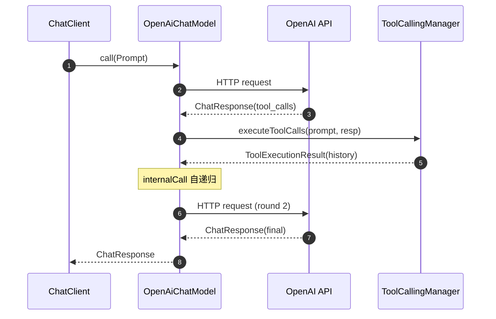
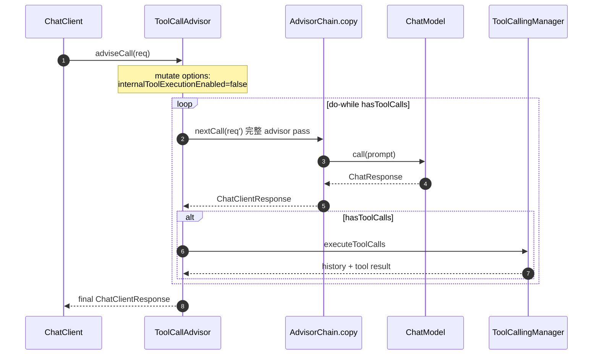
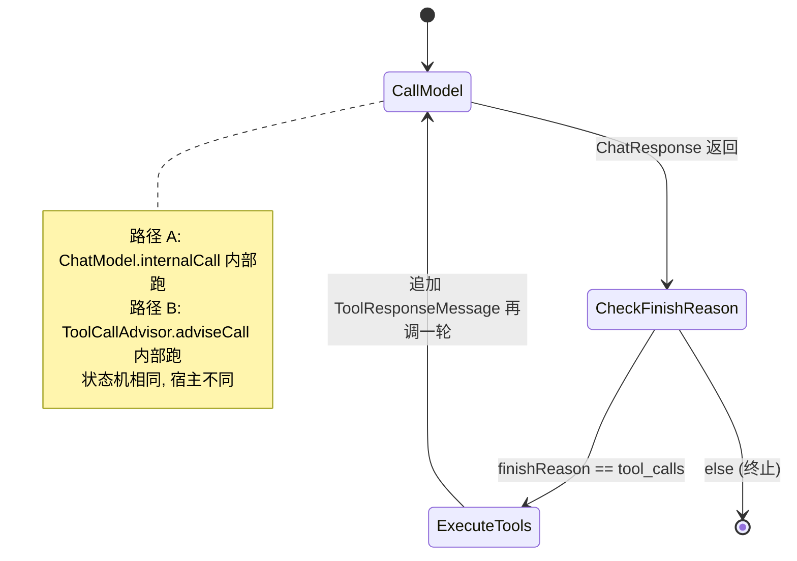
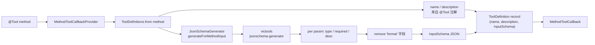
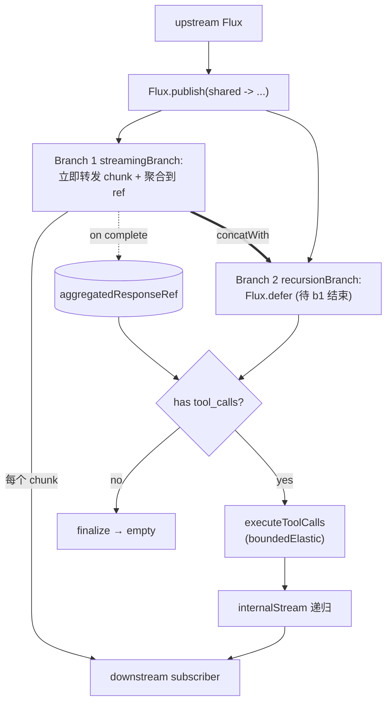

# Tool Calling 的双路径——为什么有两套实现并存

写一段 `@Tool` 方法挂上 `ChatClient`，它就被模型当成可调用的函数。这个故事所有 LLM 框架都讲，但在 Spring AI 里，"调用循环"被实现了**两次**：一次写在每个 `ChatModel` 实现里（`OpenAiChatModel.internalCall` 自己 while-loop 直到没有 tool call），一次写在 `ChatClient` 的 advisor 链上（`ToolCallAdvisor` 也自己跑一个一模一样形状的 loop）。这一篇专门解释这个看起来矛盾的设计：两条路径是怎么共存的、用一个布尔开关切换、在流式下又怎么处理。理解它会顺手解释另一个问题：MCP 这种"远程工具协议"为什么不是新概念。

## 一、两条路径：循环到底要不要被 advisor 看到

**路径 A：provider 内部循环**。`OpenAiChatModel.call(Prompt)` 走到 `internalCall`，在拿到模型响应后判断要不要执行工具，要的话执行完再递归调一次自己——这是绝大多数框架用的形态。

```java
// models/spring-ai-openai/.../OpenAiChatModel.java:194-261
private ChatResponse internalCall(Prompt prompt, @Nullable ChatResponse previousChatResponse) {

    ChatCompletionCreateParams request = createRequest(prompt, false);
    // ... 调 OpenAI、组装 ChatResponse 略

    if (this.toolExecutionEligibilityPredicate.isToolExecutionRequired(prompt.getOptions(), response)) {
        var toolExecutionResult = this.toolCallingManager.executeToolCalls(prompt, response);
        if (toolExecutionResult.returnDirect()) {
            return ChatResponse.builder()
                .from(response)
                .generations(ToolExecutionResult.buildGenerations(toolExecutionResult))
                .build();
        }
        else {
            // Send the tool execution result back to the model.
            return this.internalCall(new Prompt(toolExecutionResult.conversationHistory(), prompt.getOptions()),
                    response);
        }
    }
    return response;
}
```

特点：
- 循环写在 `ChatModel` 内部，**对外看就是一次普通的 `call`**——同步阻塞、调用方拿到的就是最终带答案的 `ChatResponse`
- 中间几轮 tool 执行 / 再请求 LLM 的过程，对 advisor 链是**透明**的：advisor 只在第一次 request 进来、最后一次 response 出去时被调用一次
- 简单、自洽、便于复用——任何不挂 `ChatClient` 直接用 `ChatModel.call(Prompt)` 的代码都能跑



> 路径 A：循环关在 `OpenAiChatModel` 内部，advisor 只在最外层进入/离开各看到一次。

**路径 B：advisor 链循环**。当用户给 `ChatClient` 注册了 `ToolCallAdvisor`（或更上层的 `ChatClient.builder().defaultAdvisors(...)`），循环被搬到了 advisor 链里。`ToolCallAdvisor.adviseCall` 在每一轮 do-while 里都重新走一遍 advisor 链——也就是说**每一次"再发一次 LLM 请求"都是一次完整的 advisor pass**。

```java
// spring-ai-client-chat/.../advisor/ToolCallAdvisor.java:106-182
public ChatClientResponse adviseCall(ChatClientRequest chatClientRequest, CallAdvisorChain callAdvisorChain) {
    ...
    // Disable internal tool execution to allow ToolCallAdvisor to handle tool calls
    var optionsCopy = ((ToolCallingChatOptions.Builder<?>) chatClientRequest.prompt().getOptions().mutate())
        .internalToolExecutionEnabled(false)
        .build();

    var instructions = chatClientRequest.prompt().getInstructions();
    ChatClientResponse chatClientResponse = null;
    boolean isToolCall = false;

    do {
        var processedChatClientRequest = ChatClientRequest.builder()
            .prompt(new Prompt(instructions, optionsCopy))
            .context(chatClientRequest.context())
            .build();
        processedChatClientRequest = this.doBeforeCall(processedChatClientRequest, callAdvisorChain);

        chatClientResponse = callAdvisorChain.copy(this).nextCall(processedChatClientRequest);

        chatClientResponse = this.doAfterCall(chatClientResponse, callAdvisorChain);

        ChatResponse chatResponse = chatClientResponse.chatResponse();
        isToolCall = chatResponse != null && chatResponse.hasToolCalls();

        if (isToolCall) {
            ToolExecutionResult toolExecutionResult = this.toolCallingManager
                .executeToolCalls(processedChatClientRequest.prompt(), chatResponse);
            if (toolExecutionResult.returnDirect()) {
                chatClientResponse = chatClientResponse.mutate()
                    .chatResponse(ChatResponse.builder().from(chatResponse)
                        .generations(ToolExecutionResult.buildGenerations(toolExecutionResult)).build())
                    .build();
                break;
            }
            instructions = this.doGetNextInstructionsForToolCall(processedChatClientRequest,
                    chatClientResponse, toolExecutionResult);
        }
    } while (isToolCall);

    return this.doFinalizeLoop(chatClientResponse, callAdvisorChain);
}
```



> 路径 B：循环搬到 advisor 链外，每一轮 LLM 调用都重走除自身外的整条链——记忆 / 日志 / 重试 advisor 都能精确拦每一轮。

把这两段循环并排放下，骨架几乎一样：调一次模型、判断是不是 tool call、有 tool call 就执行并把结果拼回 history、再循环。**唯一的差别是循环的"宿主"——一个在 ChatModel 内部，一个在 advisor 链外面**。

为什么差别要紧？看 `chatClientResponse = callAdvisorChain.copy(this).nextCall(processedChatClientRequest)` 这一行：每次 tool 调完再发请求，都会**重新走一遍除自己之外的整条 advisor 链**。这意味着：

- `MessageChatMemoryAdvisor` 看得见**每一轮**助手消息和 tool response，可以增量写进 memory，而不是只看到最后那次合并后的对话
- `SimpleLoggerAdvisor` 能把每一次请求/响应都日志一行
- 重试 advisor、限流 advisor、observability advisor 都能精确拦每一轮

路径 A 的 `internalCall` 递归是"后门递归"，advisor 链根本不知道发生了几次 LLM 调用；路径 B 是"显式递归"，把循环的每一步都暴露给链。两条路径不是历史包袱，是对同一个问题给出的两种回答：**工具循环要不要被横切关注点看到？** 不要——给路径 A；要——给路径 B。

## 二、切换开关：`internalToolExecutionEnabled`

两条循环不能同时跑，否则就死循环了——两边都看到 tool call、两边都执行、模型反复被回灌结果。Spring AI 用一个布尔字段 `internalToolExecutionEnabled` 协调它们：

```java
// spring-ai-model/.../model/tool/ToolCallingChatOptions.java:43-110
public interface ToolCallingChatOptions extends ChatOptions {

    boolean DEFAULT_TOOL_EXECUTION_ENABLED = true;
    ...
    @Nullable Boolean getInternalToolExecutionEnabled();
    void setInternalToolExecutionEnabled(@Nullable Boolean internalToolExecutionEnabled);

    static boolean isInternalToolExecutionEnabled(ChatOptions chatOptions) {
        boolean internalToolExecutionEnabled;
        if (chatOptions instanceof ToolCallingChatOptions toolCallingChatOptions
                && toolCallingChatOptions.getInternalToolExecutionEnabled() != null) {
            internalToolExecutionEnabled = Boolean.TRUE
                .equals(toolCallingChatOptions.getInternalToolExecutionEnabled());
        }
        else {
            internalToolExecutionEnabled = DEFAULT_TOOL_EXECUTION_ENABLED;
        }
        return internalToolExecutionEnabled;
    }
}
```

判定执行不执行的真正裁判是 `DefaultToolExecutionEligibilityPredicate.test`：

```java
// spring-ai-model/.../model/tool/DefaultToolExecutionEligibilityPredicate.java:32-35
public boolean test(ChatOptions promptOptions, ChatResponse chatResponse) {
    return ToolCallingChatOptions.isInternalToolExecutionEnabled(promptOptions) && chatResponse != null
            && chatResponse.hasToolCalls();
}
```

`OpenAiChatModel.internalCall` 调它来决定要不要进路径 A（见 `OpenAiChatModel.java:244`）。`ToolCallAdvisor` 进入路径 B 后，第一件事是反过来把这个旗子关掉：

```java
// spring-ai-client-chat/.../advisor/ToolCallAdvisor.java:118-122
// Overwrite the ToolCallingChatOptions to disable internal tool execution.
// Disable internal tool execution to allow ToolCallAdvisor to handle tool calls
var optionsCopy = ((ToolCallingChatOptions.Builder<?>) chatClientRequest.prompt().getOptions().mutate())
    .internalToolExecutionEnabled(false)
    .build();
```

`mutate()` + `internalToolExecutionEnabled(false)` 制造了一个**新的 options 副本**，原来传进来的对象不动；之后每一次 do-while 里发出去的请求带的都是这个副本。所以同一份 `ChatModel.call` 的代码——既能在没有 advisor 的场景跑路径 A，也能在 advisor 注入后乖乖只跑一次然后让出去。

为什么用一个 boolean 而不是策略对象？两点务实理由：

1. **跨进程边界**：选项是要序列化进每次请求 prompt 的，最终随着 `Prompt.getOptions()` 一直传到 ChatModel。如果换成 `ToolExecutionStrategy` 接口（代码里没有这个），就要解决"自定义实现怎么跨调用栈传递、怎么与默认值合并"的问题。一个布尔可空字段（`@Nullable Boolean`）走 `combineWith` 合并语义最简单
2. **两种状态足够覆盖现实场景**：你要么"让 ChatModel 自己处理"，要么"我接管"。中间没有第三种语义。boolean 是"够用就行"——上下层各保留一个谓词（`ToolExecutionEligibilityPredicate`/`ToolExecutionEligibilityChecker`）来读它，都没真的依赖一个继承体系

可空（`@Nullable Boolean`）的设计也有意义：null 表示"未声明"，由全局默认值 `DEFAULT_TOOL_EXECUTION_ENABLED = true` 兜底；显式 `true`/`false` 才是用户/advisor 表态。这让 advisor 把它强行翻成 `false` 时不会"覆盖一个未设定的值导致语义漂移"。



> 从状态机视角看，两条路径其实是**同一个循环**——区别只在于这个循环的"宿主"在哪一层。

## 三、`@Tool` 方法 → `ToolDefinition`：反射 + JSON Schema

无论走哪条路径，循环里被调的对象都是同一个 `ToolCallback`：

```java
// spring-ai-model/.../tool/ToolCallback.java:33-66
public interface ToolCallback {
    ToolDefinition getToolDefinition();
    default ToolMetadata getToolMetadata() { return ToolMetadata.builder().build(); }
    String call(String toolInput);
    default String call(String toolInput, @Nullable ToolContext toolContext) { ... }
}
```

只有四个东西：定义（给模型看的元数据）、可选元数据（如 `returnDirect`）、`call(String)`（无上下文）、`call(String, ToolContext)`（带上下文）。最常用的实现是 `MethodToolCallback`——把一个普通 Java 方法包装成 ToolCallback。

`MethodToolCallback.call` 干的事是反向序列化 + 反射调用：

```java
// spring-ai-model/.../tool/method/MethodToolCallback.java:97-116
public String call(String toolInput, @Nullable ToolContext toolContext) {
    Assert.hasText(toolInput, "toolInput cannot be null or empty");
    this.validateToolContextSupport(toolContext);
    Map<String, Object> toolArguments = this.extractToolArguments(toolInput);   // JSON → Map
    Object[] methodArguments = this.buildMethodArguments(toolArguments, toolContext); // Map → 参数数组
    Object result = this.callMethod(methodArguments);                           // 反射 invoke
    Type returnType = this.toolMethod.getGenericReturnType();
    return this.toolCallResultConverter.convert(result, returnType);            // 返回值 → String
}
```

要点：
- 输入是 LLM 给的 JSON 字符串（`toolInput`），用 Jackson 转成 `Map<String, Object>`
- 按方法参数名匹配（`parameter.getName()`）从 map 里挑值，再用 `JsonParser.toTypedObject` 反序列化成参数类型
- 特殊参数 `ToolContext` 不在 JSON 里，由框架在 `buildMethodArguments` 里塞进去
- 返回值由 `ToolCallResultConverter` 序列化成字符串，再回灌给 LLM

那"模型那边的 schema 从哪儿来"？看 `MethodToolCallbackProvider` 怎么造 callback：

```java
// spring-ai-model/.../tool/method/MethodToolCallbackProvider.java:93-99
.map(toolMethod -> MethodToolCallback.builder()
    .toolDefinition(ToolDefinitions.from(toolMethod))
    .toolMetadata(ToolMetadata.from(toolMethod))
    .toolMethod(toolMethod)
    .toolObject(toolObject)
    .toolCallResultConverter(ToolUtils.getToolCallResultConverter(toolMethod))
    .build())
```

`ToolDefinitions.from(method)` 调进 `JsonSchemaGenerator.generateForMethodInput`：

```java
// spring-ai-model/.../util/json/schema/JsonSchemaGenerator.java:121-159
public static String generateForMethodInput(Method method, SchemaOption... schemaOptions) {
    ObjectNode schema = JsonParser.getJsonMapper().createObjectNode();
    schema.put("$schema", SchemaVersion.DRAFT_2020_12.getIdentifier());
    schema.put("type", "object");
    ObjectNode properties = schema.putObject("properties");
    List<String> required = new ArrayList<>();

    for (int i = 0; i < method.getParameterCount(); i++) {
        String parameterName = method.getParameters()[i].getName();
        Type parameterType = method.getGenericParameterTypes()[i];
        if (parameterType instanceof Class<?> parameterClass
                && ClassUtils.isAssignable(ToolContext.class, parameterClass)) {
            continue;  // ToolContext 不进 schema
        }
        if (isMethodParameterRequired(method, i)) {
            required.add(parameterName);
        }
        ObjectNode parameterNode = SUBTYPE_SCHEMA_GENERATOR.generateSchema(parameterType);
        parameterNode.remove("format");  // 部分 LLM 不认 OpenAPI format
        ...
        properties.set(parameterName, parameterNode);
    }
    ...
    return schema.toPrettyString();
}
```

底层用的是 `victools/jsonschema-generator`，配上 Jackson 模块、Swagger 模块、自定义的 `SpringAiSchemaModule`，生成 JSON Schema Draft 2020-12。两个不易察觉的工程细节：

- **默认所有字段 required**：`PROPERTY_REQUIRED_BY_DEFAULT = true`（`JsonSchemaGenerator.java:83`）。很多 LLM 对"可选字段"理解不一致——干脆把"是否必填"的判定权完全收回到注解上（`@ToolParam(required = false)` / `@Nullable` / `@JsonProperty(required = false)`）
- **`parameterNode.remove("format")`**（`JsonSchemaGenerator.java:145`）：JSON Schema 里 `format` 是合法的（`date-time`/`uuid`/`int64`），但 Mistral 等模型解析时会报错。Spring AI 选择"摘掉"——是工程上和模型博弈的产物

`@Tool` / `@ToolParam` 提供的是元数据接口（名字、描述、required、resultConverter），真正干活的还是反射加 schema 生成器：

```java
// spring-ai-model/.../tool/annotation/Tool.java:34-71
@Target({ ElementType.METHOD, ElementType.ANNOTATION_TYPE })
@Retention(RetentionPolicy.RUNTIME)
@Documented
public @interface Tool {
    String name() default "";
    String description() default "";
    boolean returnDirect() default false;
    Class<? extends ToolCallResultConverter> resultConverter() default DefaultToolCallResultConverter.class;
}
```

代价：JVM 编译时必须保留参数名（`-parameters`），否则 `parameter.getName()` 拿到的是 `arg0/arg1`。好处：业务代码完全不知道有 LLM 这回事——`@Tool` 加在普通方法上，函数体不变。

`ToolDefinition` 本身就是个三元组 record——`name`/`description`/`inputSchema`：

```java
// spring-ai-model/.../tool/definition/DefaultToolDefinition.java:31-37
public record DefaultToolDefinition(String name, String description, String inputSchema) implements ToolDefinition {
    public DefaultToolDefinition {
        Assert.hasText(name, "name cannot be null or empty");
        Assert.hasText(description, "description cannot be null or empty");
        Assert.hasText(inputSchema, "inputSchema cannot be null or empty");
    }
    ...
}
```

抽象简洁的好处是各 Provider 都能把它翻译成自己 SDK 的工具描述（OpenAI 的 `function`、Anthropic 的 `tool` 描述）——`ToolDefinition` 只关心"模型层语义"，不关心 wire format。



> `@Tool` 方法被三步抽干净：注解 → 反射 + 元数据 → JSON Schema。`@Tool` 本身只装名字、描述这种轻量元数据，schema 由方法签名直接推。

## 四、流式工具调用：用 `Flux.publish` 多播

把工具循环搬进流式分支会立刻撞上一个矛盾：

- 上游消费方想要**边来边吐**——LLM 每吐一个 token 就要送到客户端
- 但工具调用要在**完整的一轮**结束后才能判断（chunk 里的 `tool_calls` 是分片的，要等完才能拼出 name 和 arguments）

也就是说，同一份流既要"立刻 forward"，也要"完整地等一下"。`ToolCallAdvisor.streamWithToolCallResponses` 的解法是 Reactor 的 `publish`：

```java
// spring-ai-client-chat/.../advisor/ToolCallAdvisor.java:272-293
private Flux<ChatClientResponse> streamWithToolCallResponses(Flux<ChatClientResponse> responseFlux,
        AtomicReference<ChatClientResponse> aggregatedResponseRef, ChatClientRequest finalRequest,
        StreamAdvisorChain streamAdvisorChain, ChatClientRequest originalRequest,
        ToolCallingChatOptions optionsCopy) {

    return responseFlux.publish(shared -> {
        // Branch 1: Stream chunks immediately for real-time streaming UX
        Flux<ChatClientResponse> streamingBranch = new ChatClientMessageAggregator()
            .aggregateChatClientResponse(shared, aggregatedResponseRef::set);

        // Branch 2: After streaming completes, check for tool calls and
        // potentially recurse.
        Flux<ChatClientResponse> recursionBranch = Flux
            .defer(() -> this.handleToolCallRecursion(aggregatedResponseRef.get(), finalRequest, streamAdvisorChain,
                    originalRequest, optionsCopy));

        // Emit all streaming chunks first, then append any recursive results
        return streamingBranch.concatWith(recursionBranch);
    })
        .filter(ccr -> this.streamToolCallResponses
                || !(ccr.chatResponse() != null && ccr.chatResponse().hasToolCalls()));
}
```

`publish(shared -> ...)` 把上游的 chunk 流变成一个**多播源**——同一份数据可以分成多支被不同的 subscriber 看到。这里分了两支：

- **Branch 1 `streamingBranch`**：用 `ChatClientMessageAggregator.aggregateChatClientResponse` 一边把 chunk 立刻发出去（保持流式 UX），一边把它们累加成一个完整的 `ChatClientResponse`，最后把这个聚合体写进 `aggregatedResponseRef`
- **Branch 2 `recursionBranch`**：`Flux.defer` 包着 `handleToolCallRecursion`——这一支只在第一支结束以后才启动（用 `concatWith` 串起来），这时 `aggregatedResponseRef.get()` 已经是完整聚合体，可以判断有没有 tool call



> "边吐边等"用 `publish` 多播解决：一支即时 forward 保 UX，一支等聚合完判断递归。`subscribeOn(boundedElastic)` 给阻塞的 tool 执行专属调度器。

判断完之后在 `handleToolCallRecursion` 里递归调 `internalStream`：

```java
// spring-ai-client-chat/.../advisor/ToolCallAdvisor.java:299-348
private Flux<ChatClientResponse> handleToolCallRecursion(...) {
    if (aggregatedResponse == null) return Flux.empty();
    aggregatedResponse = this.doAfterStream(aggregatedResponse, streamAdvisorChain);

    ChatResponse chatResponse = aggregatedResponse.chatResponse();
    boolean isToolCall = chatResponse != null && chatResponse.hasToolCalls();
    if (!isToolCall) {
        return this.doFinalizeLoopStream(Flux.empty(), streamAdvisorChain);
    }

    Flux<ChatClientResponse> toolCallFlux = Flux.deferContextual(ctx -> {
        ToolExecutionResult toolExecutionResult;
        try {
            ToolCallReactiveContextHolder.setContext(ctx);
            toolExecutionResult = this.toolCallingManager.executeToolCalls(finalRequest.prompt(), chatResponse);
        }
        finally {
            ToolCallReactiveContextHolder.clearContext();
        }
        if (toolExecutionResult.returnDirect()) {
            return Flux.just(...);
        }
        else {
            List<Message> nextInstructions = this.doGetNextInstructionsForToolCallStream(...);
            return this.internalStream(streamAdvisorChain, originalRequest, optionsCopy, nextInstructions);
        }
    });
    return toolCallFlux.subscribeOn(Schedulers.boundedElastic());
}
```

两个值得注意的点：

1. **`subscribeOn(Schedulers.boundedElastic())`**：tool 执行（调数据库、HTTP 等）大概率是**阻塞**的，不能跑在 reactor 默认的 parallel 调度器上——会污染。`boundedElastic` 是 reactor 给阻塞 I/O 准备的弹性线程池
2. **`ToolCallReactiveContextHolder.setContext(ctx)`**：tool 执行是同步代码，但它有时需要拿到上层 reactor 的 ContextView（如 traceId、observation context）——这个 holder 把 context 暂存进 ThreadLocal，再在 `finally` 里清掉。这是把"reactor 的 context 传播"翻译给"同步执行体"的桥梁

把流式工具调用做成"先广播后过滤"，结构上比"先 collect 完再决定"更难写，但语义上正确得多——用户最关心的"边来边吐 token"的体验没被 tool call 拉低延迟。`OpenAiChatModel.internalStream` 里的 `collectList().flatMapMany` 路径走的是路径 A 形态（先收完再判断），这意味着没挂 ToolCallAdvisor 的纯 ChatModel 流式调用，**会等一整轮 LLM 完成再开始流式输出**——这里有体感差异。

## 五、MCP 是一种 ToolCallback 来源

MCP（Model Context Protocol）是 Anthropic 推的一个协议，让外部进程把工具/资源暴露给 LLM 应用。把 MCP 接进 Spring AI 是个很自然的"协议适配"问题：怎么把 MCP 服务器暴露的 tool 接进现有抽象里？答案：写一个 `ToolCallback` 实现，把 `call(String)` 翻译成 MCP 的 RPC：

```java
// mcp/common/.../SyncMcpToolCallback.java:46-146
public class SyncMcpToolCallback implements ToolCallback {

    private final McpSyncClient mcpClient;
    private final Tool tool;
    private final String prefixedToolName;
    private final ToolContextToMcpMetaConverter toolContextToMcpMetaConverter;

    @Override
    public ToolDefinition getToolDefinition() {
        return McpToolUtils.createToolDefinition(this.prefixedToolName, this.tool);
    }

    @Override
    public String call(String toolCallInput, @Nullable ToolContext toolContext) {
        if (!StringUtils.hasText(toolCallInput)) {
            toolCallInput = "{}";
        }
        Map<String, Object> arguments = ModelOptionsUtils.jsonToMap(toolCallInput);
        var mcpMeta = toolContext != null ? this.toolContextToMcpMetaConverter.convert(toolContext) : null;
        var request = CallToolRequest.builder()
            .name(this.tool.name())
            .arguments(arguments)
            .meta(mcpMeta)
            .build();
        CallToolResult response = this.mcpClient.callTool(request);
        ...
        return ModelOptionsUtils.toJsonString(response.content());
    }
}
```

整个适配只做了三件事：

1. **`getToolDefinition()`**：把 MCP 的 `Tool` schema 翻译成 Spring AI 的 `ToolDefinition`，三元组（name/description/inputSchema）一一对应。MCP 的 tool 名字会被加前缀（`prefixedToolName`），避免多个 MCP 服务器之间撞名
2. **`call`**：把 LLM 给的 JSON 字符串解析成 `Map`，包成 `CallToolRequest`，走 MCP RPC 调远端，再把响应 content 再 JSON 序列化回字符串
3. **`ToolContextToMcpMetaConverter`**：把 Spring AI 的 `ToolContext` 翻成 MCP 的 metadata 字段——这是协议层差异的薄薄一层封装

效果是什么？回到第一节那两段循环——里面调的都是 `toolCallback.call(...)`。**`ToolCallingManager` 不会知道这个 callback 背后是反射跑的本地 Java 方法、还是用 RPC 调的远端 MCP 服务器。** advisor 链不知道、`ChatModel` 不知道、`internalToolExecutionEnabled` 那个开关也不知道。MCP 在 Spring AI 里不是一等公民、不是新增加的概念，它只是**`ToolCallback` 这个接口的另一种实现来源**。

这呼应了 Spring AI 一个一贯的姿势：**新功能优先复用既有抽象**。MCP 一来就接住、不需要新接口、不需要破坏现有体系。一个相同框架下还可以看到的例子是 `ChatMemory`——它本身只是个 advisor，不是新的一等概念（这部分留到第 10 篇展开）。

## 关键代码索引

- `spring-ai-model/src/main/java/org/springframework/ai/tool/ToolCallback.java:33-66` —— `ToolCallback` 接口
- `spring-ai-model/src/main/java/org/springframework/ai/tool/method/MethodToolCallback.java:97-116` —— 反射执行
- `spring-ai-model/src/main/java/org/springframework/ai/tool/method/MethodToolCallbackProvider.java:84-107` —— `@Tool` 扫描
- `spring-ai-model/src/main/java/org/springframework/ai/tool/annotation/Tool.java:34-71` —— `@Tool` 注解
- `spring-ai-model/src/main/java/org/springframework/ai/tool/definition/DefaultToolDefinition.java:31-37` —— `ToolDefinition` 三元组
- `spring-ai-model/src/main/java/org/springframework/ai/tool/support/ToolDefinitions.java:47-60` —— `Method → ToolDefinition`
- `spring-ai-model/src/main/java/org/springframework/ai/util/json/schema/JsonSchemaGenerator.java:121-159` —— `Method → JSON Schema`
- `spring-ai-model/src/main/java/org/springframework/ai/model/tool/ToolCallingChatOptions.java:43-110` —— `internalToolExecutionEnabled` 与默认值
- `spring-ai-model/src/main/java/org/springframework/ai/model/tool/DefaultToolExecutionEligibilityPredicate.java:32-35` —— 执行裁判
- `spring-ai-model/src/main/java/org/springframework/ai/model/tool/DefaultToolCallingManager.java:127-243` —— `executeToolCalls`、`executeToolCall`
- `models/spring-ai-openai/src/main/java/org/springframework/ai/openai/OpenAiChatModel.java:194-261` —— **路径 A** `internalCall`
- `models/spring-ai-openai/src/main/java/org/springframework/ai/openai/OpenAiChatModel.java:292-466` —— 流式聚合 + 工具递归
- `spring-ai-client-chat/src/main/java/org/springframework/ai/chat/client/advisor/ToolCallAdvisor.java:106-182` —— **路径 B** `adviseCall`
- `spring-ai-client-chat/src/main/java/org/springframework/ai/chat/client/advisor/ToolCallAdvisor.java:240-348` —— 流式分支 `internalStream` / `streamWithToolCallResponses` / `handleToolCallRecursion`
- `mcp/common/src/main/java/org/springframework/ai/mcp/SyncMcpToolCallback.java:46-146` —— MCP 适配

## 思考题

1. 路径 A 和路径 B 同时存在，意味着同一个 `ChatClient.prompt(...).call()` 在挂不挂 `ToolCallAdvisor` 时，对 advisor 看到的"调用次数"、对可观测埋点产生的 span 数量，会是不一样的。如果你现在想给 LLM 调用做"按 tool 轮次计费"，应该选路径 A 还是路径 B？理由是什么？
2. `MethodToolCallback` 把 LLM 输入 JSON 反序列化成方法参数时，对参数名敏感（依赖 `parameter.getName()`）。如果业务代码 build 时没开 `-parameters`，会得到 `arg0`/`arg1`。这是"运行时反射"路线绕不开的代价。如果让你用编译期 APT（注解处理器）重做一遍 `@Tool`，能换掉哪些反射调用？又会失去什么灵活性？
3. 流式分支用了 `Flux.publish` + `concatWith` 把"边来边吐"和"等聚合后递归"组合在一起。如果不用 `publish`，改用先 `collectList()` 再 `flatMapMany`，行为差在哪儿？哪些用户用例会受影响？

## 延伸阅读

- 第 4 篇 ChatClient 与 Advisor 链——总线模式 / `mutate()` / advisor chain copy 的内涵
- 第 9 篇 Boot 整合 + 观测——`ToolCallingObservationDocumentation` 的埋点会因为路径 A/B 有什么差异
- 第 10 篇 MCP 与 ChatMemory——MCP `ToolCallbackProvider` 在自动配置里如何被装配
- spring-ai issue #1234 / 类似讨论："Why two tool execution paths?"（建议查 git log 中关于 `ToolCallAdvisor` 引入的 commit）

> 基于 spring-ai commit 9cde97c1
