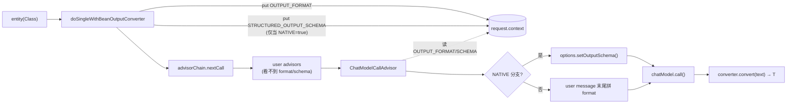
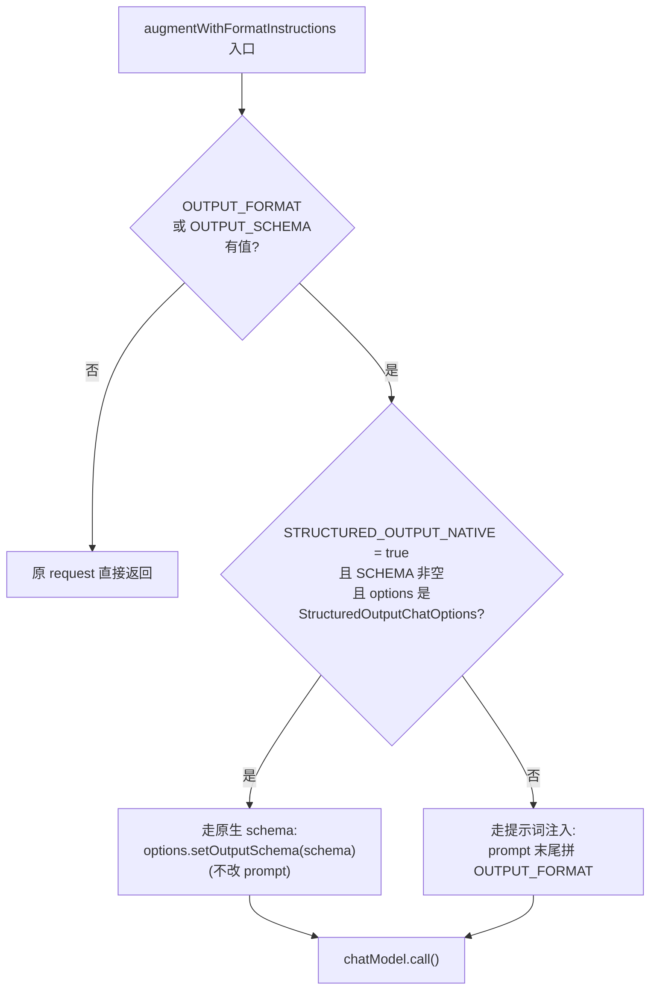
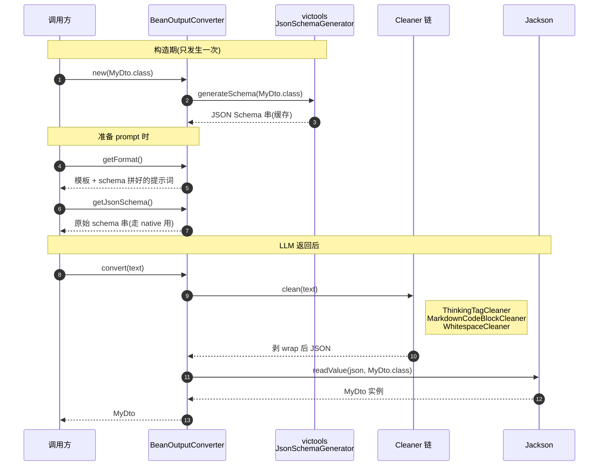

# 第 6 篇：结构化输出——把 schema 塞进链里

`chatClient.prompt(...).call().entity(MyDto.class)` 一行就能拿到一个填好字段的 Java 对象。这一篇要回答的是：从这一行调用到模型吐出 JSON、再到反序列化成 `MyDto`，中间发生了什么？为什么 Spring AI 不为"结构化输出"加一组新接口，而是把它编织进既有的 advisor 链？看完会发现，这又是用 `ChatClientRequest.context` 当数据总线、用终结 advisor 收尾的那套老配方——只是这次合作的另一头不是用户，而是模型本身。

## 一、链上模式：用 `context` 当总线，用终结 advisor 收尾

先看 `BeanOutputConverter` 自己。它实现 `StructuredOutputConverter<T>`，对外暴露三件事：`getFormat()` 返回给模型看的提示词、`getJsonSchema()` 返回标准 JSON Schema、`convert(String)` 负责把模型的回复塞进目标类型。

```java
// spring-ai-model/.../converter/StructuredOutputConverter.java:31
public interface StructuredOutputConverter<T> extends Converter<String, T>, FormatProvider {
    String NO_JSON_SCHEMA = "";
    default String getJsonSchema() { return NO_JSON_SCHEMA; }
}
```

接口本身分了两层职责：`Converter<String, T>` 来自 Spring Core，负责"把字符串转成类型"；`FormatProvider` 是 Spring AI 自己的接口，只有一个方法 `getFormat()`。`getJsonSchema()` 是 2.0 才加的 default 方法，它的存在意味着"有些场景我们想直接拿到 schema，而不是只拿到给模型的那段提示词"——这个细节后面会变得很关键。

从这里再往上看一层，到调用入口 `DefaultChatClient`：

```java
// spring-ai-client-chat/.../client/DefaultChatClient.java:464
private <T> @Nullable T doSingleWithBeanOutputConverter(StructuredOutputConverter<T> outputConverter) {
    if (StringUtils.hasText(outputConverter.getFormat())) {
        this.request.context().put(ChatClientAttributes.OUTPUT_FORMAT.getKey(),
                outputConverter.getFormat());
    }
    if (Boolean.TRUE.equals(this.request.context().get(
            ChatClientAttributes.STRUCTURED_OUTPUT_NATIVE.getKey()))) {
        this.request.context().put(ChatClientAttributes.STRUCTURED_OUTPUT_SCHEMA.getKey(),
                outputConverter.getJsonSchema());
    }
    var chatResponse = doGetObservableChatClientResponse(this.request).chatResponse();
    var stringResponse = getContentFromChatResponse(chatResponse);
    if (stringResponse == null) return null;
    return outputConverter.convert(stringResponse);
}
```

这段代码最值得停下来看。它没有给 ChatModel 多加一个参数，没有让 advisor 接口长出新方法，只是往 `request.context` 里塞了两个键：`OUTPUT_FORMAT` 永远塞、`STRUCTURED_OUTPUT_SCHEMA` 仅当用户显式开了原生模式才塞。然后照常走 advisor 链。

这两个键定义在 `ChatClientAttributes`：

```java
// spring-ai-client-chat/.../client/ChatClientAttributes.java:25
public enum ChatClientAttributes {
    OUTPUT_FORMAT("spring.ai.chat.client.output.format"),
    STRUCTURED_OUTPUT_SCHEMA("spring.ai.chat.client.structured.output.schema"),
    STRUCTURED_OUTPUT_NATIVE("spring.ai.chat.client.structured.output.native");
    // ...
}
```

链的最末端是 `ChatModelCallAdvisor`，它的 `getOrder()` 返回 `Ordered.LOWEST_PRECEDENCE`——保证它永远是 advisor 链最后一个执行。它干两件事：先拼上 format 指令，再调 `chatModel.call()`：

```java
// spring-ai-client-chat/.../advisor/ChatModelCallAdvisor.java:53
public ChatClientResponse adviseCall(ChatClientRequest req, CallAdvisorChain chain) {
    ChatClientRequest formatted = augmentWithFormatInstructions(req);
    ChatResponse chatResponse = this.chatModel.call(formatted.prompt());
    return ChatClientResponse.builder()
        .chatResponse(chatResponse)
        .context(Map.copyOf(formatted.context()))
        .build();
}

// :66
private static ChatClientRequest augmentWithFormatInstructions(ChatClientRequest req) {
    String outputFormat = (String) req.context().get(ChatClientAttributes.OUTPUT_FORMAT.getKey());
    String outputSchema = (String) req.context().get(ChatClientAttributes.STRUCTURED_OUTPUT_SCHEMA.getKey());

    if (!StringUtils.hasText(outputFormat) && !StringUtils.hasText(outputSchema)) {
        return req;
    }

    if (req.context().containsKey(ChatClientAttributes.STRUCTURED_OUTPUT_NATIVE.getKey())
            && StringUtils.hasText(outputSchema)
            && req.prompt().getOptions() instanceof StructuredOutputChatOptions options) {
        options.setOutputSchema(outputSchema);
        return req;
    }

    Prompt augmented = req.prompt()
        .augmentUserMessage(um -> um.mutate()
            .text(um.getText() + System.lineSeparator() + outputFormat)
            .build());
    return ChatClientRequest.builder().prompt(augmented).context(Map.copyOf(req.context())).build();
}
```

整条数据流是：



读图要点：左边的 `B` 写入两个 context 键、中间的 advisor 链对它们一无所知、右边的终结 advisor `F` 才把它们取出来用——`F` 之前的链是 format/schema 的"沉默通道"。

这个设计的利落之处在于：**advisor 链不需要知道"结构化输出"的存在**。`MessageChatMemoryAdvisor`、`SimpleLoggerAdvisor`、`SafeGuardAdvisor` 都不必为它升级接口；它们只看到一个普通的 `ChatClientRequest`，里面的 `context` map 本来就允许塞任意键值。结构化输出走到末端 advisor 才被消费——既不污染中间环节，也保证了"格式注入"是最后一步发生的（详见下面那个关键 commit）。

这一步还有一个常被忽略的副作用：`augmentWithFormatInstructions` 用的是 `prompt.augmentUserMessage`——它把 format 指令拼到**最后一条 user message** 而不是 system message。这避开了"提示词模板渲染冲突"——上层 advisor 改 system 时不必关心 format 指令是不是被它的 `${variable}` 占位符意外吃掉。

## 二、`STRUCTURED_OUTPUT_NATIVE`：一面开关，两条路径

`augmentWithFormatInstructions` 的真正分支在第二段 if：当 `STRUCTURED_OUTPUT_NATIVE` 在 context 里、又有 `outputSchema`、并且 prompt 上挂的 `ChatOptions` 实现了 `StructuredOutputChatOptions`，就走"原生 schema"路径——把 schema 直接 setter 进 options，**不改 prompt**。否则退回到默认路径——把 format 指令拼进 user message。



三个判断从上到下层层收紧：先看用户有没有要求结构化（没有就什么都不做），再看 provider 支不支持原生（不支持就退化到 prompt）。这套二分支是"feature degrade"在框架层落地的具体长相。


```java
// spring-ai-model/.../model/tool/StructuredOutputChatOptions.java:29
public interface StructuredOutputChatOptions extends ChatOptions {
    @Nullable String getOutputSchema();
    void setOutputSchema(String outputSchema);

    interface Builder<B extends Builder<B>> extends ChatOptions.Builder<B> {
        B outputSchema(@Nullable String outputSchema);
    }
}
```

OpenAI 的 options 是怎么实现这个接口的：

```java
// models/spring-ai-openai/.../OpenAiChatOptions.java:663
public void setOutputSchema(@Nullable String outputSchema) {
    if (outputSchema != null) {
        this.setResponseFormat(OpenAiChatModel.ResponseFormat.builder()
            .type(Type.JSON_SCHEMA)
            .jsonSchema(outputSchema)
            .build());
    }
}
```

也就是说：在 OpenAI 这种支持 `response_format: json_schema` 的 provider 上，schema 走 HTTP 请求字段而不是 prompt。Anthropic 类似——它在最近的 commit 195c4fde5 里加了 `structured-outputs-2025-11-13` beta header 和对应字段，并让自家 options 实现 `StructuredOutputChatOptions`。

开关怎么打开？两种方式都通过 advisor 的 `param`：

```java
// spring-ai-client-chat/.../client/AdvisorParams.java:35
public static final Consumer<ChatClient.AdvisorSpec> ENABLE_NATIVE_STRUCTURED_OUTPUT = a -> a
    .param(ChatClientAttributes.STRUCTURED_OUTPUT_NATIVE.getKey(), true);
```

用户写：

```java
ChatClient.builder(model).build()
    .prompt("List 3 cities")
    .advisors(AdvisorParams.ENABLE_NATIVE_STRUCTURED_OUTPUT)
    .call().entity(Cities.class);
```

这里有两点设计上值得借鉴：

**第一，feature degrade 写在框架里而不是写在用户代码里。** 用户只表达"我想要原生模式"，至于 provider 不支持时该怎么办，框架自己降级——`augmentWithFormatInstructions` 里那个 `instanceof StructuredOutputChatOptions` 检查就是那道闸门。如果换个不实现接口的 provider（比如老版本 Ollama），直接走 prompt 注入；用户代码不用改，最多结果稍差一点。这是"宁可静默退化也不给用户报错"的工程姿势——只在结果质量上有差异，调用面不变。

**第二，开关粒度和 advisor 一样细。** `STRUCTURED_OUTPUT_NATIVE` 是 advisor 维度的参数，意味着同一个 ChatClient 实例可以"对这个调用走原生、对那个调用走 prompt"。这种粒度选择背后的判断是：是否走原生不应该由全局配置决定，而应该由"这次调用对结构精度的要求"决定——和 `ChatOptions` 的"per-call 覆盖默认"一脉相承。

## 三、`BeanOutputConverter.getFormat()` 的演化：和模型博弈

这一段提示词看起来朴素，但每一行都是踩坑踩出来的：

```java
// spring-ai-model/.../converter/BeanOutputConverter.java:266
String template = """
        Your response should be in JSON format.
        Do not include any explanations, only provide a RFC8259 compliant JSON response following this format without deviation.
        Do not include markdown code blocks in your response.
        Remove the ```json markdown from the output.
        Here is the JSON Schema instance your output must adhere to:
        ```%s```
        """;
```

翻 git history（`git log --follow BeanOutputConverter.java`）能看到三段演化：

1. **最早期**：`Here is the JSON Schema instance your output must adhere to in the enclosed markdown codeblock:` ——主动让模型用 ```json 包裹。当时的模型不太会主动 wrap，所以是用户手动设的栅栏。

2. **中期**：去掉 "in the enclosed markdown codeblock"，只说"adhere to this schema"。原因不难猜——后来的指令调优模型默认就爱 wrap，输出再用 markdown 包一次反而会被 wrap 两层，解析失败。

3. **现在**：连续加了两道反向指令——`Do not include markdown code blocks in your response.` 和 `Remove the ```json markdown from the output.`。两句话说一件事，是因为模型对前一句的遵守率不够高，加冗余明示降低 wrap 概率。

这条曲线很有意思：这一段提示词从"邀请模型加格式"反转成"反复要求模型不要加格式"。它揭示的是结构化输出在框架层的根本困境——你给模型的 schema 越详细，模型越倾向用 markdown 把 JSON 包起来"郑重交付"。所以才有了第二条解法：**让支持 native structured output 的 provider 直接吃 schema，绕开提示词层这场拉锯**。第二节那个 `ResponseFormat.JSON_SCHEMA` 路径，本质上是用协议约束代替自然语言约束。

`convert()` 这一端也针对这场拉锯加了护栏：

```java
// :177
private static ResponseTextCleaner createDefaultTextCleaner() {
    return CompositeResponseTextCleaner.builder()
        .addCleaner(new WhitespaceCleaner())
        .addCleaner(new ThinkingTagCleaner())     // 剥 Nova/Qwen 的 <thinking>
        .addCleaner(new MarkdownCodeBlockCleaner()) // 剥 ```json 包裹
        .addCleaner(new WhitespaceCleaner())
        .build();
}
```

`ThinkingTagCleaner` 处理的是另一类模型——Amazon Nova、Qwen 系会自带思考链 `<thinking>...</thinking>`。Cleaner 链是个组合模式，每种"模型怪癖"对应一个 cleaner。这种"大量小适配器拼成一条流水线"的模式，比起在主类里写 if-else 干净得多——加新怪癖只是 `addCleaner` 一行。

把第二节、第三节合起来看，结构化输出是一个典型的"双保险设计"：能用协议（`STRUCTURED_OUTPUT_NATIVE`）就用协议，用不了协议就用提示词；提示词靠不住的时候用 cleaner 兜底。每一层失败都还有下一层。这种思路在跟外部不可控系统打交道时（不只是 LLM，也包括第三方 API、爬虫、协议解析）几乎都成立。

`BeanOutputConverter` 自身的三段生命周期可以这样画：



构造期把昂贵的 schema 生成做一次并缓存——后续 `getFormat()`/`getJsonSchema()` 只是返回字段。准备期由 `DefaultChatClient` 把结果塞进 context；解析期由用户在 `entity()` 末尾隐式触发。三段时机解耦，是这个 converter 能既塞 prompt 又塞 native schema、还能兜底 cleaner 的根因。

## 四、为什么 Spring AI 选择不加新接口

回到那个本来可以另一种方式实现的反事实：如果给 `ChatModel` 加一个 `call(Prompt p, JsonSchema schema)` 重载会怎样？

直接的代价是 `ChatModel` 接口扩张——而 `ChatModel` 是跨 Provider 的最小契约（参考第 3 篇）。一旦它长出第二个方法，所有 13 个 provider 都得实现。OpenAI/Anthropic 知道怎么做，但 Ollama 早期、Bedrock 部分模型、自托管模型怎么办？要么强制它们抛 `UnsupportedOperationException`（用户代码看到的就是运行期崩），要么给一个默认实现降级到 prompt——这就回到了现在的方案。

绕一圈，最干净的那条路就是：**让 ChatModel 接口保持极简，把"是否走 native"的分支留给请求级数据**。`ChatClientRequest.context` 在这里扮演的就是请求级数据的载体；`ChatModelCallAdvisor` 是看见这个数据并采取行动的"末端解释器"。

这个模式在 Spring AI 里被反复使用：

| 关注点 | context 中的键 | 末端 advisor / 消费者 |
| --- | --- | --- |
| 结构化输出 | `OUTPUT_FORMAT` / `STRUCTURED_OUTPUT_SCHEMA` / `STRUCTURED_OUTPUT_NATIVE` | `ChatModelCallAdvisor` |
| ChatMemory | `CHAT_MEMORY_CONVERSATION_ID` | `MessageChatMemoryAdvisor` |
| Tool 循环开关 | `internalToolExecutionEnabled`（在 options 上） | `ToolCallAdvisor` |
| RAG 文档 | RAG advisor 内部 context key | `RetrievalAugmentationAdvisor` |

**当一类新功能要嵌进调用链时，看看能不能用 `<context key, advisor consumer>` 这一对来表达，而不是新增一个抽象**——这是 Spring AI 模块图能保持稳定的根因之一。结构化输出、ChatMemory、Tool 循环都是这个范式的变种；如果它们各自加一组接口，`ChatModel` 早就臃肿到没法看了。

但这套范式不是没有代价。三个值得提防的点：

1. **类型安全弱化**。context 是 `Map<String, Object>`，键是字符串。`STRUCTURED_OUTPUT_NATIVE` 拼错一个字母编译期发现不了。Spring AI 用 `ChatClientAttributes` 这个 enum 把所有键收口，但用户自定义 advisor 时这道闸门就消失了。
2. **链上耦合隐式化**。`doSingleWithBeanOutputConverter` 写入键，`ChatModelCallAdvisor` 读取键，两点之间没有显式契约；只有读完两份代码的人才知道它们在协作。需要靠测试（如 `ChatClientNativeStructuredResponseTests`）来锁定这个契约。
3. **末端 advisor 不可拆**。`ChatModelCallAdvisor.augmentWithFormatInstructions` 处理了 format 注入、native schema 注入两件事；如果未来再加第三件（比如 token 预算注入），这个方法会膨胀。届时是再拆一个末端 advisor、还是用职责链拆方法，是个未定的问题。

`StructuredOutputValidationAdvisor` 是这套范式里"用户侧"的另一个例子——它没有改框架接口，只是塞了一个新 advisor，里面用 `chain.copy(this).nextCall()` 做了重试循环（这点和 `ToolCallAdvisor` 同款写法，详见第 4、5 篇）。如果你写自己的扩展，这是模板：复制一份子链、按需重入即可。

---

## 关键代码索引

- `spring-ai-model/src/main/java/org/springframework/ai/converter/StructuredOutputConverter.java:31` — `Converter<String,T>` + `FormatProvider` 双继承的接口设计
- `spring-ai-model/src/main/java/org/springframework/ai/converter/BeanOutputConverter.java:266` — `getFormat()` 的提示词模板
- `spring-ai-model/src/main/java/org/springframework/ai/converter/BeanOutputConverter.java:189` — `generateSchema()` 用 victools/jsonschema-generator + Jackson 模块
- `spring-ai-model/src/main/java/org/springframework/ai/converter/BeanOutputConverter.java:177` — `createDefaultTextCleaner()` 的 cleaner 链组合
- `spring-ai-client-chat/src/main/java/org/springframework/ai/chat/client/ChatClientAttributes.java:25` — context key 的 enum 收口
- `spring-ai-client-chat/src/main/java/org/springframework/ai/chat/client/AdvisorParams.java:35` — 用户侧开关 `ENABLE_NATIVE_STRUCTURED_OUTPUT`
- `spring-ai-client-chat/src/main/java/org/springframework/ai/chat/client/DefaultChatClient.java:464` — `doSingleWithBeanOutputConverter` 的 context 注入端
- `spring-ai-client-chat/src/main/java/org/springframework/ai/chat/client/advisor/ChatModelCallAdvisor.java:66` — `augmentWithFormatInstructions` 的双路径终结
- `spring-ai-client-chat/src/main/java/org/springframework/ai/chat/client/advisor/StructuredOutputValidationAdvisor.java:124` — 用 `chain.copy(this).nextCall()` 做校验重试
- `spring-ai-model/src/main/java/org/springframework/ai/model/tool/StructuredOutputChatOptions.java:29` — provider 实现的 mixin 接口
- `models/spring-ai-openai/src/main/java/org/springframework/ai/openai/OpenAiChatOptions.java:663` — OpenAI 把 `outputSchema` 翻译成 `response_format: json_schema`

关键 commit：

- `195c4fde5` — feat: Add native structured output support for ChatClient（引入 `STRUCTURED_OUTPUT_NATIVE` 路径与 `StructuredOutputChatOptions` mixin）
- `90cab219d` — Inner advisor should handle output format instructions（把 format 注入挪到末端 advisor，避免提示词模板冲突）
- `91afed5ae` — OpenAi: Add support for structured outputs and JSON schema（OpenAI 端 native schema 的最早雏形）
- `bf8fce995` — update beanoutput parser prompt（提示词反 wrap 演化的早期 commit）

## 思考题

1. 假设你要给 Spring AI 加一个"软约束输出长度"的功能（用户希望 LLM 输出不超过 N tokens 的 JSON）。按本篇看到的范式，你会用 advisor + context key、还是给 `ChatOptions` 加字段？两种方案各自的代价是什么？  
2. `ChatModelCallAdvisor.augmentWithFormatInstructions` 把 format 拼到 user message 末尾——如果用户是流式、分多轮 user/assistant 交错调用，每轮都拼一次会不会重复污染？查一下 `ChatMemory` 怎么处理这种情况（第 10 篇会展开）。  
3. 如果 provider 支持 native structured output，但模型本身仍把 JSON 包在 markdown 里返回，会发生什么？走读 `BeanOutputConverter.convert()` 路径分析能不能恢复——再问问自己：cleaner 链兜底到这个程度是好设计还是坏设计？

## 延伸阅读

- 第 4 篇 _Advisor 链_：`ChatClientRequest.context` 作为总线、`Ordered.LOWEST_PRECEDENCE` 终结 advisor 的更系统讨论
- 第 3 篇 _ChatModel 与 ChatOptions_：为什么 `ChatModel` 不加新方法、为什么用 mixin 接口扩 options
- 第 5 篇 _Tool Calling 双路径_：`StructuredOutputValidationAdvisor` 的 `chain.copy(this).nextCall()` 和 `ToolCallAdvisor` 是同一招
- 测试 `spring-ai-client-chat/.../ChatClientNativeStructuredResponseTests.java`：里面 13 个用例完整覆盖了"开/关 NATIVE × 各种 entity 重载"的组合，是理解此处分支最好的活文档
- 模型供应商的官方 docs：OpenAI Structured Outputs、Anthropic Structured Outputs (beta)、Google Gemini responseSchema——能看到这些"原生 schema"长什么样、和 Spring AI 的 mixin 怎么对应

> 基于 spring-ai commit `9cde97c1`
