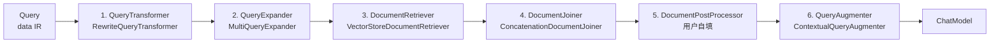
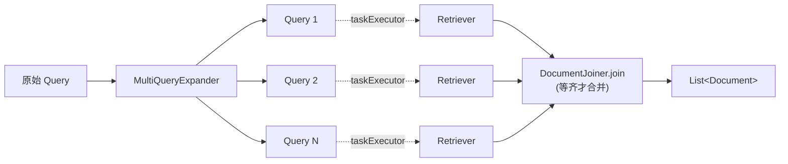
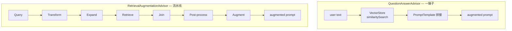
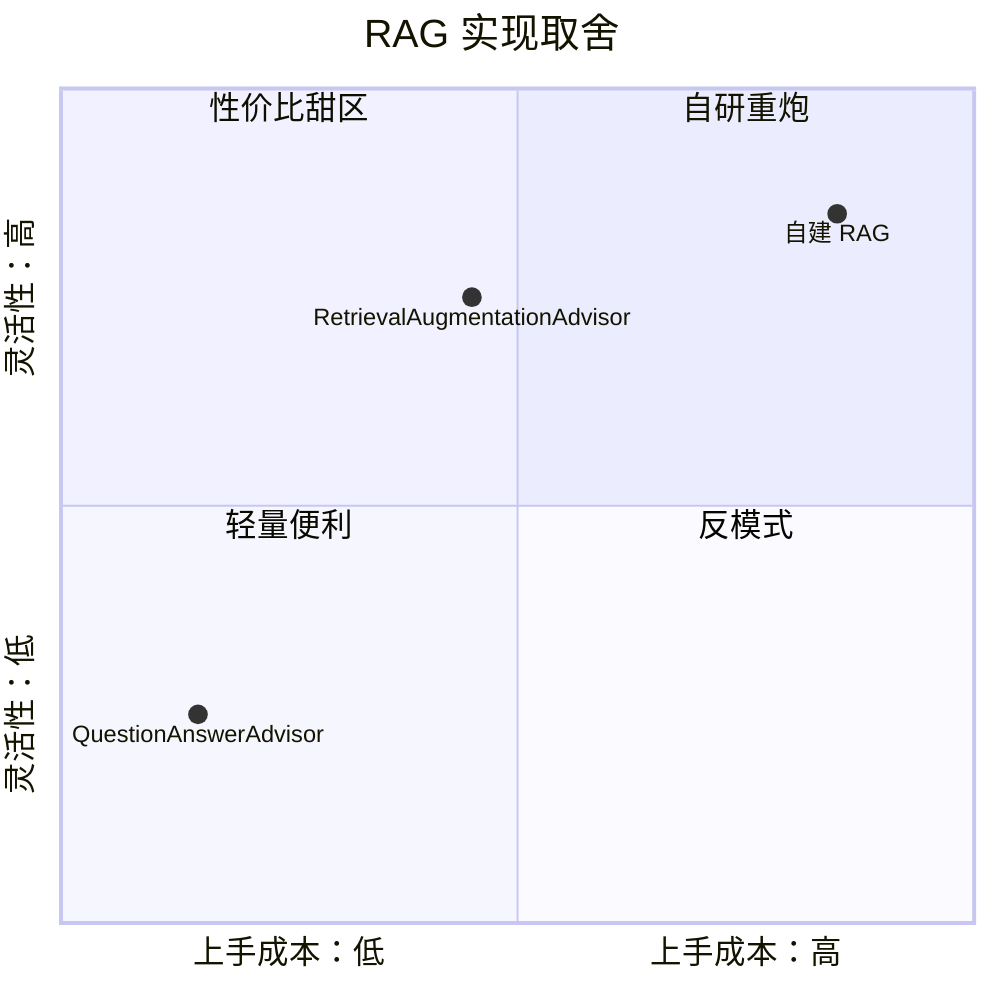

# 第 7 篇：Modular RAG——把 RAG 拆成可替换的零件

Spring AI 里其实有两套 RAG。早一版叫 `QuestionAnswerAdvisor`，全部逻辑塞在一个 advisor 的 `before()` 里：拿用户问题去 `VectorStore.similaritySearch` 一把、把文档拼到 prompt 里、走人。新一版叫 `RetrievalAugmentationAdvisor`，对应学术界 Modular RAG 的拆法（arXiv:2407.21059），把整条 pipeline 切成六个接口加一个数据 IR，每段都能换。

这一篇把这条 pipeline 一段段拆开看：每个接口在干什么、为什么这样切，以及——更值得讨论的——新旧两套是不是要弃旧从新，并发为什么用 `CompletableFuture` 而不是 Reactor。

## 一、七个核心抽象与拆分粒度

`RetrievalAugmentationAdvisor.before()`（`spring-ai-rag/.../advisor/RetrievalAugmentationAdvisor.java:107-154`）一上来就把 RAG 的全部环节列出来：

```java
@Override
public ChatClientRequest before(ChatClientRequest chatClientRequest, @Nullable AdvisorChain advisorChain) {
    Map<String, Object> context = new HashMap<>(chatClientRequest.context());

    // 0. Create a query from the user text, parameters, and conversation history.
    String text = chatClientRequest.prompt().getUserMessage().getText();
    Query originalQuery = Query.builder()
        .text(Objects.requireNonNullElse(text, ""))
        .history(chatClientRequest.prompt().getInstructions())
        .context(context)
        .build();

    // 1. Transform original user query based on a chain of query transformers.
    Query transformedQuery = originalQuery;
    for (var queryTransformer : this.queryTransformers) {
        transformedQuery = queryTransformer.apply(transformedQuery);
    }

    // 2. Expand query into one or multiple queries.
    List<Query> expandedQueries = this.queryExpander != null ? this.queryExpander.expand(transformedQuery)
            : List.of(transformedQuery);

    // 3. Get similar documents for each query.
    Map<Query, List<List<Document>>> documentsForQuery = expandedQueries.stream()
        .map(query -> CompletableFuture.supplyAsync(() -> getDocumentsForQuery(query), this.taskExecutor))
        .toList()
        .stream()
        .map(CompletableFuture::join)
        .collect(Collectors.toMap(Map.Entry::getKey, entry -> List.of(entry.getValue())));

    // 4. Combine documents retrieved based on multiple queries and from multiple data sources.
    List<Document> documents = this.documentJoiner.join(documentsForQuery);

    // 5. Post-process the documents.
    for (var documentPostProcessor : this.documentPostProcessors) {
        documents = documentPostProcessor.process(originalQuery, documents);
    }
    context.put(DOCUMENT_CONTEXT, documents);

    // 6. Augment user query with the document contextual data.
    Query augmentedQuery = this.queryAugmenter.augment(originalQuery, documents);

    // 7. Update ChatClientRequest with augmented prompt.
    return chatClientRequest.mutate()
        .prompt(chatClientRequest.prompt().augmentUserMessage(augmentedQuery.text()))
        .context(context)
        .build();
}
```

这段代码本身就是 RAG 流水线的最小可运行版。整条流水线串起来是这样：



把它对照接口看，七个抽象一一对应：

| 阶段 | 抽象 | 类型签名 | 默认实现 |
| --- | --- | --- | --- |
| 数据 IR | `Query` | `record(text, history, context)` | — |
| 1. 改写 | `QueryTransformer` | `Query → Query` | `RewriteQueryTransformer` / `CompressionQueryTransformer` / `TranslationQueryTransformer` |
| 2. 扩展 | `QueryExpander` | `Query → List<Query>` | `MultiQueryExpander` |
| 3. 检索 | `DocumentRetriever` | `Query → List<Document>` | `VectorStoreDocumentRetriever` |
| 4. 合并 | `DocumentJoiner` | `Map<Query, List<List<Document>>> → List<Document>` | `ConcatenationDocumentJoiner` |
| 5. 后处理 | `DocumentPostProcessor` | `(Query, List<Document>) → List<Document>` | 无（用户自填，例如 reranker） |
| 6. 增强 | `QueryAugmenter` | `(Query, List<Document>) → Query` | `ContextualQueryAugmenter` |

为什么是这个粒度？看每个接口的定义就知道——它们不是抽象一坨"业务模块"，而是抽象一段"函数关系"：

```java
// QueryTransformer
public interface QueryTransformer extends Function<Query, Query> {
    Query transform(Query query);
    default Query apply(Query query) { return transform(query); }
}

// QueryExpander
public interface QueryExpander extends Function<Query, List<Query>> {
    List<Query> expand(Query query);
}

// DocumentRetriever
public interface DocumentRetriever extends Function<Query, List<Document>> {
    List<Document> retrieve(Query query);
}

// DocumentJoiner
public interface DocumentJoiner extends Function<Map<Query, List<List<Document>>>, List<Document>> {
    List<Document> join(Map<Query, List<List<Document>>> documentsForQuery);
}
```

每一个都 `extends Function`/`BiFunction`。这意味着：

- 外部用户写一个 lambda 就能塞进流水线
- 内部组合、测试，都可以脱离 ChatClient/Spring 容器
- 几乎所有阶段的"输入/输出类型"都收敛到 `Query` 与 `List<Document>` 这两个数据上——类型代数被压到很窄，串得起来

代价也不小。一个看起来再简单不过的 RAG（"检索一下，拼回 prompt"），现在你要 `documentRetriever()` + `documentJoiner()` + `queryAugmenter()` 三件至少。这就是为什么旧的 `QuestionAnswerAdvisor` 没被废弃（详见第五节）：粒度细的优势是"能换零件"，但代价是"零件多"，对"一锤子买卖"的用户是负担。

值得专门说的是 `DocumentPostProcessor`。源码注释里点明了它的应用场景（`spring-ai-rag/.../postretrieval/document/DocumentPostProcessor.java:26-33`）：

```java
/**
 * A component for post-processing retrieved documents based on a query, addressing
 * challenges such as "lost-in-the-middle", context length restrictions from the model,
 * and the need to reduce noise and redundancy in the retrieved information.
 * <p>
 * For example, it could rank documents based on their relevance to the query, remove
 * irrelevant or redundant documents, or compress the content of each document...
 */
```

这一段官方没给默认实现，留给生态自己填。Spring AI 里的 reranker、context compression 等高级特性几乎全长在这个接口下面。框架克制不写默认实现，是个好习惯——这不是"框架忘了做"，是"框架知道这里会有很多有偏见的实现"。

## 二、`Query` 作为内部 IR——为什么不直接传 String

`Query` 是这套体系的"数据中线"（`spring-ai-rag/.../Query.java:36-44`）：

```java
public record Query(String text, List<Message> history, Map<String, Object> context) {

    public Query {
        Assert.hasText(text, "text cannot be null or empty");
        Assert.notNull(history, "history cannot be null");
        Assert.noNullElements(history, "history elements cannot be null");
        Assert.notNull(context, "context cannot be null");
        Assert.noNullElements(context.keySet(), "context keys cannot be null");
    }

    public Query(String text) {
        this(text, List.of(), Map.of());
    }
    // ...
}
```

只有三个字段：`text`（用户原文）、`history`（对话历史）、`context`（运行时上下文，例如 user_id、tenant_id、filter expression）。但这三个字段的组合非常关键。看几个具体的 Transformer/Retriever 怎么用它：

`CompressionQueryTransformer` 是把"长对话历史 + 后续问题"压缩成一条独立 query（`CompressionQueryTransformer.java:77-95`）。它得能拿到 `history`：

```java
@Override
public Query transform(Query query) {
    var compressedQueryText = this.chatClient.prompt()
        .user(user -> user.text(this.promptTemplate.getTemplate())
            .param("history", formatConversationHistory(query.history()))
            .param("query", query.text()))
        .call()
        .content();
    // ...
    return query.mutate().text(compressedQueryText).build();
}
```

`VectorStoreDocumentRetriever` 想要按用户身份做 metadata 过滤，又得能拿到 `context`（`VectorStoreDocumentRetriever.java:110-121`）：

```java
private Filter.Expression computeRequestFilterExpression(Query query) {
    var contextFilterExpression = query.context().get(FILTER_EXPRESSION);
    if (contextFilterExpression != null) {
        if (contextFilterExpression instanceof Filter.Expression) {
            return (Filter.Expression) contextFilterExpression;
        }
        else if (StringUtils.hasText(contextFilterExpression.toString())) {
            return new FilterExpressionTextParser().parse(contextFilterExpression.toString());
        }
    }
    return this.filterExpression.get();
}
```

如果 `Query` 只是 `String`，下面这些事就办不成：

- 改写阶段拿不到对话历史，"回顾上下文的指代"就压缩不了
- 检索阶段拿不到运行时身份，"按租户隔离"就做不出来
- 后处理阶段拿不到原始问题，re-rank 跟谁比都没法说

更妙的是 `mutate()`：每次变换都返回**新的** `Query`，旧的还在调用栈里。`RetrievalAugmentationAdvisor` 第 6 步 `queryAugmenter.augment(originalQuery, documents)` 用的就是 `originalQuery`，不是 transformer 链处理过的 `transformedQuery`——意思是"扩写/翻译只为了检索得更准，最终发给 LLM 看的还是原问题加 context"。这个细节藏在不可变 record + 引用保留里，不写注释也立得住。

## 三、多 Query 并行——为什么用 `CompletableFuture` 而不是 Reactor

第 3 步是整段代码里最不"流水线"的一段。`MultiQueryExpander` 把一条 query 扩成 N 条以后，要给每条 query 都跑一次 `documentRetriever.retrieve()`。这里 Spring AI 选了线程池 + `CompletableFuture`（`RetrievalAugmentationAdvisor.java:128-134`）：

```java
// 3. Get similar documents for each query.
Map<Query, List<List<Document>>> documentsForQuery = expandedQueries.stream()
    .map(query -> CompletableFuture.supplyAsync(() -> getDocumentsForQuery(query), this.taskExecutor))
    .toList()
    .stream()
    .map(CompletableFuture::join)
    .collect(Collectors.toMap(Map.Entry::getKey, entry -> List.of(entry.getValue())));
```



线程池是这样配的（`RetrievalAugmentationAdvisor.java:194-202`）：

```java
private static TaskExecutor buildDefaultTaskExecutor() {
    ThreadPoolTaskExecutor taskExecutor = new ThreadPoolTaskExecutor();
    taskExecutor.setThreadNamePrefix("ai-advisor-");
    taskExecutor.setCorePoolSize(4);
    taskExecutor.setMaxPoolSize(16);
    taskExecutor.setTaskDecorator(new ContextPropagatingTaskDecorator());
    taskExecutor.initialize();
    return taskExecutor;
}
```

这个选择放在 Spring AI 的整体上下文里有点"反 Spring"——上层 ChatClient 流式分支大量用 `Mono`/`Flux`，advisor 的非阻塞调度也走 `Scheduler`（看 `BaseAdvisor.DEFAULT_SCHEDULER`）。为什么这里偏要走老牌的 `CompletableFuture`？

答案在 `DocumentRetriever` 的现实实现上。看 `VectorStoreDocumentRetriever.retrieve()`（`VectorStoreDocumentRetriever.java:85-96`）：

```java
@Override
public List<Document> retrieve(Query query) {
    Assert.notNull(query, "query cannot be null");
    var requestFilterExpression = computeRequestFilterExpression(query);
    var searchRequest = SearchRequest.builder()
        .query(query.text())
        .filterExpression(requestFilterExpression)
        .similarityThreshold(this.similarityThreshold)
        .topK(this.topK)
        .build();
    return this.vectorStore.similaritySearch(searchRequest);
}
```

最后一行 `vectorStore.similaritySearch(searchRequest)` 是同步阻塞调用——绝大多数 `VectorStore` 实现走 JDBC/HTTP 同步客户端（PgVector、Redis、Elasticsearch、Milvus 都是）。把这种阻塞调用包到 `Mono.fromCallable(...).subscribeOn(boundedElastic)` 里看似"reactive"，但本质还是在弹性线程池上跑同步任务，多了一层调度开销。

直接用 `taskExecutor` 反而更诚实：你阻塞我就给你专门的线程池，调用方拿到结果靠 `join` 阻塞等待。`ContextPropagatingTaskDecorator` 把外面的 Observation/MDC 上下文带过去，跨线程的可观测性也保住了。

这是个值得学的取舍：**当下游清楚是阻塞的，给一个专属线程池比硬套 reactive 更便宜**。Spring AI 在流式 chat 路径上吃 reactor 的红利，在 RAG 检索路径上回到线程池——按场景分而治之，比"全栈 reactive"更接近工程现实。

`buildDefaultTaskExecutor()` 默认 4 核 16 max——保守得有点保守。生产里 expandedQueries 数量不大（`MultiQueryExpander` 默认 `numberOfQueries=3`，加原始 query 一共 4 条），4 个核也撑得住。但如果你接了多个 `DocumentRetriever`（混合检索：vector + ES + 知识图谱），就需要自己注入 `TaskExecutor`。

`CompletableFuture` + `join` 的另一个隐含选择：第 4 步 `DocumentJoiner.join` 必须等所有分支完成才能开始。它没办法做"先到先合并"——这一段是 batch 风格的 fan-out / fan-in，不是流。`DocumentJoiner` 拿到的 `Map<Query, List<List<Document>>>` 类型签名也印证了这个事实：先收齐，再合并。

## 四、`RetrievalAugmentationAdvisor` 仍然是个 `BaseAdvisor`——RAG 不是另起炉灶

把目光拉回 advisor 这一层。`RetrievalAugmentationAdvisor` 类签名：

```java
public final class RetrievalAugmentationAdvisor implements BaseAdvisor {
    @Override
    public ChatClientRequest before(...) { /* 七步流水线 */ }

    @Override
    public ChatClientResponse after(ChatClientResponse chatClientResponse, ...) {
        // 把命中的文档放到 ChatResponse.metadata 里，便于上层审计
        Object ctx = chatClientResponse.context().get(DOCUMENT_CONTEXT);
        if (ctx != null) {
            chatResponseBuilder.metadata(DOCUMENT_CONTEXT, ctx);
        }
        // ...
    }
}
```

这一点呼应第 4 篇 Advisor 链：**RAG 没有自己的执行框架，它是 advisor 链上的一站**。流水线全部塞在 `before()` 里，跑完就把改造过的 prompt 交给链上的下一个环节。`after()` 只负责把检索到的文档原样塞回 `ChatResponse.metadata`，让上层可以审计"模型这次回答用了哪些文档"。

这个设计的好处是：

- **可观测性免费来**：上一篇讲过每个 advisor 都被 Micrometer Observation 单独包了一层。你写 RAG 不用再做埋点，自动有 `gen_ai.advisor` span
- **可重排可叠加**：你可以把 `RetrievalAugmentationAdvisor` 和 `MessageChatMemoryAdvisor` 一起塞进 `chatClient.advisors(...)`，靠 `getOrder()` 调先后。先叫记忆（把对话历史塞进 messages）、再叫 RAG（把检索到的文档拼进 user prompt），这种串联框架不需要任何特殊代码
- **可关闭**：调用时不挂这个 advisor，就退化成普通对话，不需要改其它代码

值得对比的是 LangChain 里 `Runnable` 的 LCEL 写法：那是把整条 chain 自己拼起来。而 Spring AI 的选择是"链是 advisor 链，RAG 只是一个有点复杂的 advisor"——简单、与既有抽象同构。

## 五、新旧并存——为什么 `QuestionAnswerAdvisor` 没被废弃



打开 `advisors/spring-ai-advisors-vector-store/.../QuestionAnswerAdvisor.java:108-141`，会发现它干的事简化得几乎不像同一种 RAG：

```java
@Override
public ChatClientRequest before(ChatClientRequest chatClientRequest, AdvisorChain advisorChain) {
    // 1. Search for similar documents in the vector store.
    var searchRequestBuilder = SearchRequest.from(this.searchRequest)
        .query(Objects.requireNonNullElse(chatClientRequest.prompt().getUserMessage().getText(), ""));

    var filterExpr = doGetFilterExpression(chatClientRequest.context());
    if (filterExpr != null) {
        searchRequestBuilder.filterExpression(filterExpr);
    }

    var searchRequestToUse = searchRequestBuilder.build();
    List<Document> documents = this.vectorStore.similaritySearch(searchRequestToUse);

    // 2. Create the context from the documents.
    Map<String, Object> context = new HashMap<>(chatClientRequest.context());
    context.put(RETRIEVED_DOCUMENTS, documents);

    String documentContext = documents.stream()
        .map(Document::getText)
        .collect(Collectors.joining(System.lineSeparator()));

    // 3. Augment the user prompt with the document context.
    UserMessage userMessage = chatClientRequest.prompt().getUserMessage();
    String augmentedUserText = this.promptTemplate
        .render(Map.of("query", userMessage.getText(), "question_answer_context", documentContext));

    return chatClientRequest.mutate()
        .prompt(chatClientRequest.prompt().augmentUserMessage(augmentedUserText))
        .context(context)
        .build();
}
```

四步：搜索、装上下文、拼模板、改 prompt。没有 transformer、没有 expander、没有 joiner、没有 post-processor。所有"高级"环节都被压回到一个 `PromptTemplate` 和一个 `VectorStore.similaritySearch` 上。

它用起来也极简：

```java
ChatClient.builder(chatModel)
    .defaultAdvisors(QuestionAnswerAdvisor.builder(vectorStore)
        .searchRequest(SearchRequest.builder().topK(5).build())
        .build())
    .build();
```

看包路径就明白态度：`QuestionAnswerAdvisor` 在 `advisors/spring-ai-advisors-vector-store/`，`RetrievalAugmentationAdvisor` 在 `spring-ai-rag/`。不是"老的要废"，是**两个适用面**：

- `QuestionAnswerAdvisor`：Demo、单领域 FAQ、内部知识库——你只有一个 vector store、一种检索口径，PromptTemplate 调一下就够
- `RetrievalAugmentationAdvisor`：多源检索、长对话、跨语言、需要 reranker、需要 query 改写——任何"我得在每段插钩子"的场景

什么时候要从前者迁到后者？几个明显信号：

1. **要做 query 改写或翻译**：`QuestionAnswerAdvisor` 没有这个钩子，注入只能改 PromptTemplate，不能改 query 文本本身
2. **多个 retriever**（vector + 关键词 + 图谱）：`QuestionAnswerAdvisor` 锁死一个 `VectorStore`，没法扩
3. **要 reranker / context compression**：必须要 `DocumentPostProcessor` 这个钩子
4. **多语言索引**：`TranslationQueryTransformer` 直接用，自己实现一套是浪费

反过来，下面几种情况留在老的反而舒服：

1. 单 vector store、单语言、无 query 改写需求
2. 你关心的是"如何调 PromptTemplate"而不是"如何编排流水线"
3. 受众是初学者，不想引入七个抽象的认知负担

值得额外一提：两者的 `after()` 写法几乎一样——都把检索到的文档塞回 `ChatResponse.metadata`。这暗示一个未来的迭代方向：把 `QuestionAnswerAdvisor` 重写成一个"特化的 `RetrievalAugmentationAdvisor`"（默认 retriever+joiner+augmenter，其它 transformer/expander/postprocessor 全部 no-op）。但目前没这么做，估计是因为旧 advisor 的 `PromptTemplate` 写法已经被很多人当作配置接口在用，强行改会吃大量回归。

把三种姿态摆在同一张图上看选型：



## 关键代码索引

- `spring-ai-rag/src/main/java/org/springframework/ai/rag/advisor/RetrievalAugmentationAdvisor.java:107-154` —— 七步流水线
- `spring-ai-rag/src/main/java/org/springframework/ai/rag/advisor/RetrievalAugmentationAdvisor.java:128-134` —— 多 query 并行检索
- `spring-ai-rag/src/main/java/org/springframework/ai/rag/advisor/RetrievalAugmentationAdvisor.java:194-202` —— 默认 `TaskExecutor` 配置
- `spring-ai-rag/src/main/java/org/springframework/ai/rag/Query.java:36-48` —— `Query` 数据 IR
- `spring-ai-rag/src/main/java/org/springframework/ai/rag/preretrieval/query/transformation/QueryTransformer.java` —— `Function<Query, Query>`
- `spring-ai-rag/src/main/java/org/springframework/ai/rag/preretrieval/query/transformation/RewriteQueryTransformer.java:75-93`
- `spring-ai-rag/src/main/java/org/springframework/ai/rag/preretrieval/query/transformation/CompressionQueryTransformer.java:77-107`
- `spring-ai-rag/src/main/java/org/springframework/ai/rag/preretrieval/query/transformation/TranslationQueryTransformer.java:50-80`
- `spring-ai-rag/src/main/java/org/springframework/ai/rag/preretrieval/query/expansion/QueryExpander.java`
- `spring-ai-rag/src/main/java/org/springframework/ai/rag/preretrieval/query/expansion/MultiQueryExpander.java:96-134`
- `spring-ai-rag/src/main/java/org/springframework/ai/rag/retrieval/search/DocumentRetriever.java`
- `spring-ai-rag/src/main/java/org/springframework/ai/rag/retrieval/search/VectorStoreDocumentRetriever.java:85-121`
- `spring-ai-rag/src/main/java/org/springframework/ai/rag/retrieval/join/DocumentJoiner.java`
- `spring-ai-rag/src/main/java/org/springframework/ai/rag/retrieval/join/ConcatenationDocumentJoiner.java:46-64`
- `spring-ai-rag/src/main/java/org/springframework/ai/rag/postretrieval/document/DocumentPostProcessor.java`
- `spring-ai-rag/src/main/java/org/springframework/ai/rag/generation/augmentation/QueryAugmenter.java`
- `spring-ai-rag/src/main/java/org/springframework/ai/rag/generation/augmentation/ContextualQueryAugmenter.java:53-133` —— 默认 prompt 模板与 empty-context 处理
- `advisors/spring-ai-advisors-vector-store/src/main/java/org/springframework/ai/chat/client/advisor/vectorstore/QuestionAnswerAdvisor.java:108-164` —— 旧版"一锤子" RAG

## 思考题

1. `RetrievalAugmentationAdvisor.before()` 的第 6 步用的是 `originalQuery` 而不是 `transformedQuery`。这意味着 transformer 的工作只服务于"检索得更准"，最终给 LLM 看的还是原问题。如果你想做 HyDE（先用 LLM 生成假设答案，再用假设答案做检索）这种范式，应该改流水线的哪一步？是把 transformer 接到第 6 步前面，还是把这套机制下放到 `DocumentRetriever` 内部？两种路径分别意味着什么样的可观测性差异？
2. 当前的 `CompletableFuture.supplyAsync(...).join()` 是阻塞 fan-out / fan-in。假设你的 retriever 列表里有一个特别慢（5 秒）、几个特别快（200 毫秒），整体延迟由最慢的决定。如果想让 `DocumentJoiner` 拿到部分结果就开始合并（"先到先得"），你会改 `DocumentJoiner` 的接口，还是把整条流水线改写成 reactive？哪种破坏更小？
3. `Query` 是个 record，`mutate()` 每次返回新的 `Query`。在 query 链很长时，会不会出现内存放大问题（每次 transformer 都生成一个新 Query，旧的还被引用）？如果你想做"transformer 链调试"——回放每一步的 Query 状态——这种不可变设计是优势还是负担？

## 延伸阅读

- 第 4 篇 Advisor 链：`RetrievalAugmentationAdvisor` 是 `BaseAdvisor` 的一个例子，链上其它内置 advisor（`MessageChatMemoryAdvisor`、`SafeGuardAdvisor`）共享同一套不可变 Request/Response 模型
- 第 8 篇 VectorStore 与 Filter IR：`VectorStoreDocumentRetriever` 的 `Filter.Expression` 是怎么从一个统一 IR 翻译到 PgVector / Pinecone / Milvus 等十几种向量库的本地查询语言的——这是这一篇 RAG 流水线的"地基"
- 第 6 篇 结构化输出：`QueryAugmenter` 输出的最终 prompt 仍走结构化输出那一套——RAG 与结构化输出可以叠加在同一个调用上，看一眼那一篇可以帮你理解当 advisor 链很长时，prompt 改写的次序和归属
- 论文：[arXiv:2407.21059](http://export.arxiv.org/abs/2407.21059) Modular RAG，[arXiv:2305.14283](https://arxiv.org/pdf/2305.14283) Query Rewriting for Retrieval-Augmented LLMs

> 基于 spring-ai commit 9cde97c1
