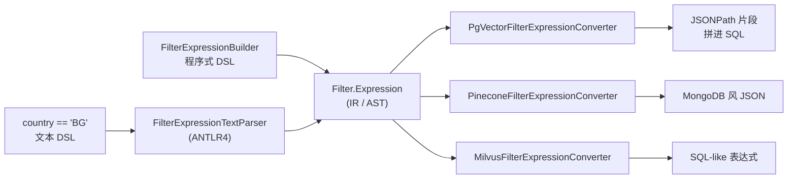
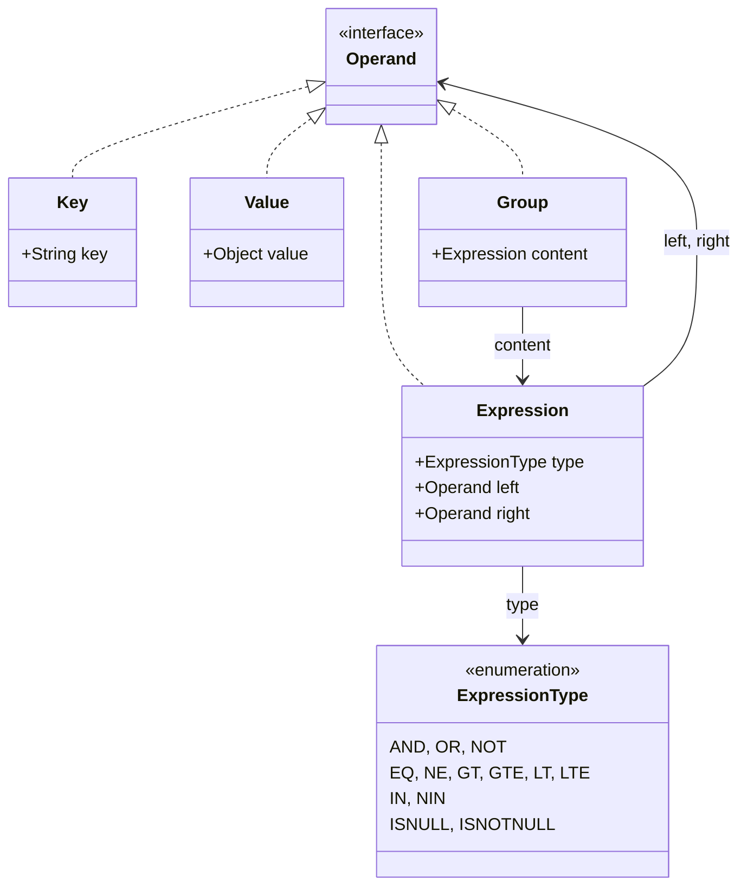
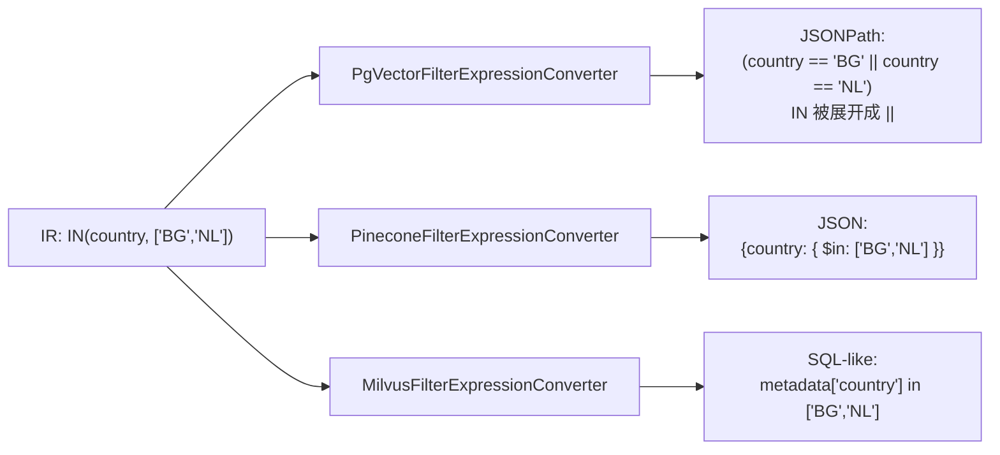

# 第 8 篇：VectorStore 与 Filter IR——便携 metadata 过滤的代价

Spring AI 已经把十几种向量库（PgVector、Pinecone、Milvus、Chroma、Weaviate、Elasticsearch、OpenSearch、Redis、Cassandra、Neo4j、MariaDB、Couchbase、Coherence、Infinispan、Typesense、Azure AI Search、S3 Vectors……）都接进同一个 `VectorStore` 接口。光做"取相似向量"是简单的——难点在 metadata filter：每家厂商语法各不一样，怎么让用户只写一份 filter 就能跑？这一篇拆 Spring AI 的答案：一套通用 IR + 两条 DSL（程序式 builder + ANTLR 文本解析）+ 每家 store 一个 converter。代价是抽象的边界——`getNativeClient()` 留了条逃生通道。

## 一、共同 IR + 一族 converter：本质上是一台小型编译器

`VectorStore` 把通用过滤行为定在两条方法上：

```java
// spring-ai-vector-store/src/main/java/.../VectorStore.java:62-83
void delete(List<String> idList);
void delete(Filter.Expression filterExpression);
default void delete(String filterExpression) {
    SearchRequest searchRequest = SearchRequest.builder()
        .filterExpression(filterExpression).build();
    Filter.Expression textExpression = searchRequest.getFilterExpression();
    Assert.notNull(textExpression, "Filter expression must not be null");
    this.delete(textExpression);
}
```

注意 `delete(String)` 是 default 方法，它把字符串走 `FilterExpressionTextParser` 解析成 `Filter.Expression`，再委托给 `delete(Filter.Expression)`。同样的姿势也出现在 `SearchRequest.Builder.filterExpression(String)` 里：

```java
// spring-ai-vector-store/src/main/java/.../SearchRequest.java:283-287
public Builder filterExpression(@Nullable String textExpression) {
    this.searchRequest.filterExpression = (textExpression != null)
            ? new FilterExpressionTextParser().parse(textExpression) : null;
    return this;
}
```

也就是说，**真正流到 store 实现的只有 `Filter.Expression`**——一个不依赖任何具体库的中间表示（IR）。每家 store 实现 `FilterExpressionConverter`，把 IR 翻成自己的原生语法。`PgVectorStore.doSimilaritySearch` 这一段最能说明问题：

```java
// vector-stores/spring-ai-pgvector-store/src/main/java/.../PgVectorStore.java:353-372
public List<Document> doSimilaritySearch(SearchRequest request) {
    String nativeFilterExpression = (request.getFilterExpression() != null)
            ? this.filterExpressionConverter.convertExpression(request.getFilterExpression())
            : "";
    String jsonPathFilter = "";
    if (StringUtils.hasText(nativeFilterExpression)) {
        jsonPathFilter = " AND " + nativeFilterExpression + " ";
    }
    double distance = 1 - request.getSimilarityThreshold();
    PGvector queryEmbedding = getQueryEmbedding(request.getQuery());
    return this.jdbcTemplate.query(
            String.format(this.getDistanceType().similaritySearchSqlTemplate,
                    getFullyQualifiedTableName(), jsonPathFilter),
            this.documentRowMapper, queryEmbedding, queryEmbedding, distance, request.getTopK());
}
```

`filterExpressionConverter.convertExpression(...)` 返回的就是 PostgreSQL JSONPath 字符串，直接拼进 SQL。

把这件事说穿：这是个**小型编译器**。前端是 IR `Filter.Expression`（AST），后端是十几个 converter（codegen 后端），每家 store 是一个目标平台。一旦你看清这层结构，"为什么 Spring AI 要在 VectorStore 之外另起一套 filter 模块"就有答案了——因为 filter 不属于任何一家 store，它是被独立编译的语言。



替代方案是**直接透传 native filter**——Spring 团队完全可以写：

```java
record SearchRequest(String query, int topK, Object nativeFilter) {}
```

让用户传 `Map<String, Object>` 给 Pinecone、SQL 字符串给 PgVector、`Query` 对象给 Lucene。这条路省工程量，代价是你换 store 就要重写所有 filter——这恰恰是 Spring 想避免的"换不动"。Spring AI 选了多花一道 IR/converter 的工程量，换来 `chatClient` + RAG advisor 在用户不察觉的情况下能切底层 store。这是一种成本前移：让框架编译一次，用户少改十次。

## 二、为什么用 ANTLR 而不是手撸 parser

文本 DSL 用的是完整的 ANTLR4 文法。先看文法摘录（`spring-ai-vector-store/src/main/antlr4/.../Filters.g4`，共 126 行）：

```antlr
where
    : WHERE booleanExpression EOF
    ;

booleanExpression
    : identifier compare constant                                 # CompareExpression
    | identifier IN constantArray                                 # InExpression
    | identifier (NOT IN | NIN) constantArray                     # NinExpression
    | identifier IS NULL                                          # IsNullExpression
    | identifier IS NOT NULL                                      # IsNotNullExpression
    | left=booleanExpression operator=AND right=booleanExpression # AndExpression
    | left=booleanExpression operator=OR right=booleanExpression  # OrExpression
    | LEFT_PARENTHESIS booleanExpression RIGHT_PARENTHESIS        # GroupExpression
    | NOT booleanExpression                                       # NotExpression
    ;

compare: EQUALS | GT | GE | LT | LE | NE;

AND: 'AND' | 'and' | '&&';
OR:  'OR' | 'or' | '||';
IN:  'IN' | 'in';
NIN: 'NIN' | 'nin';
```

注意 `AndExpression`/`OrExpression` 是左递归的——这是 ANTLR4 的招牌特性，它会自动把左递归改成迭代加上隐式的优先级处理。要是手写递归下降 parser，光是处理 `a == 1 && b == 2 || c == 3` 的优先级和结合性就要写一堆嵌套函数，再加上一套显式的 precedence climbing。

`FilterExpressionTextParser.parse` 几乎是教科书式的 ANTLR 用法：

```java
// spring-ai-vector-store/src/main/java/.../FilterExpressionTextParser.java:126-163
public Filter.Expression parse(String textFilterExpression) {
    Assert.hasText(textFilterExpression, "Expression should not be empty!");
    if (!textFilterExpression.toUpperCase().startsWith(WHERE_PREFIX)) {
        textFilterExpression = String.format("%s %s", WHERE_PREFIX, textFilterExpression);
    }
    if (this.cache.containsKey(textFilterExpression)) {
        return this.cache.get(textFilterExpression);
    }
    var lexer = new FiltersLexer(CharStreams.fromString(textFilterExpression));
    var tokens = new CommonTokenStream(lexer);
    var parser = new FiltersParser(tokens);
    parser.removeErrorListeners();
    this.errorListener.errorMessages.clear();
    parser.addErrorListener(this.errorListener);
    if (this.errorHandler != null) {
        parser.setErrorHandler(this.errorHandler);
    }
    var filterExpressionVisitor = new FilterExpressionVisitor();
    try {
        Filter.Operand operand = filterExpressionVisitor.visit(parser.where());
        var filterExpression = filterExpressionVisitor.castToExpression(operand);
        this.cache.putIfAbsent(textFilterExpression, filterExpression);
        return filterExpression;
    }
    catch (ParseCancellationException e) {
        var msg = String.join("", this.errorListener.errorMessages);
        var rootCause = NestedExceptionUtils.getRootCause(e);
        throw new FilterExpressionParseException(msg, rootCause);
    }
}
```

三件事值得停一下：

1. **错误提示**：`DescriptiveErrorListener`（同文件 329-347）把 lexer/parser 的报错收集起来，最终拼回 `FilterExpressionParseException`。手撸 parser 想做到"列号 + 行号 + 位置 + 期望 token"成本极高，ANTLR 免费给你。
2. **缓存**：解析结果用 `ConcurrentHashMap` 缓住——同一条 filter 被 advisor 链反复用，解析一次足够。
3. **强制 WHERE 前缀**：用户写 `country == 'BG'` 时，parser 自动补 `WHERE` 关键字。这是文法强制的一段"语义糖"，让 DSL 更像 SQL 又不强求用户写 WHERE。

总结一句话：**表达式语义稳定，加错信息和缓存的工程代价大**。表达式语义稳定意味着每年文法不会改三回，扔个 ANTLR 进去一劳永逸；加错误位置、token 提示、容错恢复这些是 ANTLR 强项，自己写一套要花的时间够再读一遍《编译原理》了。

## 三、IR 数据结构：Java 17 时代的 sealed-type 替身

`Filter.java` 拢共 145 行，IR 的全部数据类型在这里：

```java
// spring-ai-vector-store/src/main/java/.../Filter.java:81-145
public enum ExpressionType {
    AND, OR, EQ, NE, GT, GTE, LT, LTE, IN, NIN, NOT, ISNULL, ISNOTNULL
}

public interface Operand {
}

public record Key(String key) implements Operand {}
public record Value(Object value) implements Operand {}
public record Expression(ExpressionType type, Operand left, @Nullable Operand right) implements Operand {
    public Expression(ExpressionType type, Operand operand) {
        this(type, operand, null);
    }
}
public record Group(Expression content) implements Operand {}
```



四个 record + 一个 marker interface + 一个 enum，全部数据全部不可变。两个细节值得注意：

**第一，`Operand` 是 marker interface 而不是 sealed interface。** `sealed interface` 是 Java 17 的新特性（JEP 409），可以严格枚举所有实现：

```java
public sealed interface Operand permits Key, Value, Expression, Group { }
```

但 Spring AI 选了普通 `interface`，靠 `instanceof` 链做派发。看 `AbstractFilterExpressionConverter.convertOperand`：

```java
// spring-ai-vector-store/src/main/java/.../converter/AbstractFilterExpressionConverter.java:95-119
protected void convertOperand(Operand operand, StringBuilder context) {
    if (operand instanceof Filter.Group group) {
        this.doGroup(group, context);
    }
    else if (operand instanceof Filter.Key key) {
        this.doKey(key, context);
    }
    else if (operand instanceof Filter.Value value) {
        this.doValue(value, context);
    }
    else if (operand instanceof Filter.Expression expression) {
        // ...check + dispatch...
    }
}
```

为什么不用 sealed 拿编译期穷尽性？两条理由可推：一是 Spring 6 / Spring Boot 4 起 baseline 才到 JDK 17，Spring AI 1.0 早期可能还要兼容 11；二是 marker interface 留了"用户扩展自定义 Operand"的口子（虽然现在没人这么做）。这是个典型的"Java 17 没把 sealed 用死"的折中：record 享了语言新特性，sealed 暂时不上车。

**第二，递归 record 的双向角色。** `Expression(type, left, right)` 既是 IR 节点也是 `Operand`——当 `type` 是 `AND/OR` 时，`left/right` 也是 `Expression`；当 `type` 是 `EQ/NE/...` 时，`left` 是 `Key`，`right` 是 `Value`。这种"一个 record 装多角色"的姿势让 IR 极其紧凑（145 行就讲完了），代价是 `convertOperand` 里那一坨判型逻辑：

```java
// 同文件 106-118
else if (operand instanceof Filter.Expression expression) {
    if ((expression.type() != ExpressionType.NOT && expression.type() != ExpressionType.AND
            && expression.type() != ExpressionType.OR) && !(expression.right() instanceof Filter.Value)
            && !(expression.type() == ExpressionType.ISNULL || expression.type() == ExpressionType.ISNOTNULL)) {
        throw new RuntimeException("Non AND/OR/ISNULL/ISNOTNULL expression must have Value right argument!");
    }
    if (expression.type() == ExpressionType.NOT) {
        this.doNot(expression, context);
    }
    else {
        this.doExpression(expression, context);
    }
}
```

那一长串 `&&` 校验，本质是在运行期补回类型系统没强制的约束——本来"`EQ` 的 `right` 必须是 `Value`"这种事，是可以让类型系统帮忙的（比如分成 `BinaryCompareExpression` / `LogicalExpression` 两个 record），但那样就得 8 个 record + sealed permits 一长串。Spring 选了"少类多 if"，把约束挪到运行期。

`NOT` 的处理还有个更妙的设计：

```java
// 同文件 126-132
protected void doNot(Filter.Expression expression, StringBuilder context) {
    // Default behavior is to convert the NOT expression into its semantically
    // equivalent negation expression.
    // Effectively removing the NOT types form the boolean expression tree before
    // passing it to the doExpression.
    this.convertOperand(FilterHelper.negate(expression), context);
}
```

`FilterHelper.negate` 用 De Morgan 律把整棵树重写成无 NOT 的等价形式：`NOT(a AND b)` 变成 `NOT(a) OR NOT(b)`、`NOT(a EQ b)` 变成 `a NE b`、`NOT(a IN [...])` 变成 `a NIN [...]`（参见 `FilterHelper.java:34-39` 的 `TYPE_NEGATION_MAP` 与 `negate`）。这样所有 converter 都不用单独实现 NOT——很多向量库（如 Pinecone）原生只有 `$ne`/`$nin`，没有 `$not`。把 NOT 在 IR 层就消解掉，省了每家 converter 各自写一遍。

## 四、`getNativeClient()`——预设的逃生通道

`VectorStore` 在抽象的最末加了一段：

```java
// spring-ai-vector-store/src/main/java/.../VectorStore.java:86-102
default <T> Optional<T> getNativeClient() {
    return Optional.empty();
}
```

`PgVectorStore` 的实现把 `JdbcTemplate` 直接还给用户：

```java
// vector-stores/spring-ai-pgvector-store/src/main/java/.../PgVectorStore.java:512-517
@Override
public <T> Optional<T> getNativeClient() {
    @SuppressWarnings("unchecked")
    T client = (T) this.jdbcTemplate;
    return Optional.of(client);
}
```

这一招值得讨论：**框架要不要预设逃生通道？**

预设的好处：当用户碰到抽象不够用的场景（比如想做 PgVector 的 IVFFlat 调参、Pinecone 的 namespace 切换、Milvus 的 partition 操作），可以直接拿底层 client 干，不用 fork 整个 store。坏处也明显：一旦用户开始用 native client，他就被锁在那家 store 上，"可移植"的承诺当场失效。

Spring 的取舍是：**承认抽象不可能覆盖一切**，所以把逃生通道做成接口默认方法——大多数 store 不实现就得到空 Optional，明确实现的（PgVector、Pinecone 等）才暴露原生 client。这是给资深用户的"小灶"，新手压根不需要看到它。

实际形态上，`Optional<T>` + 类型擦除有个尴尬：你得**预先知道 client 的具体类型**。文档里也直白写了：

> Note: Using Optional<?> will return the native client if one exists, rather than an empty Optional. For type safety, prefer using the specific client type.

意思是 `vectorStore.<JdbcTemplate>getNativeClient()` 是用户要保证的——拿错类型的 ClassCast 会在运行期才炸。一个更稳的设计是 `<T> Optional<T> getNativeClient(Class<T> type)`，先做类型校验。Spring AI 没这么写，应该是觉得这一层"逃生通道"的语义本身就是约定俗成的——"用了就要担类型"是合理代价。

## 五、converter 之间的小差异：抽象的边界露在哪里

抽象做得多好，看几个 converter 怎么处理同一个操作就清楚了。挑 `EQ` 和 `IN` 三家对比。下图先给个走向，再看代码细节：




**Pinecone**（`PineconeFilterExpressionConverter.java`）走 MongoDB 风格的 JSON：

```java
// vector-stores/spring-ai-pinecone-store/src/main/java/.../PineconeFilterExpressionConverter.java:33-57
protected void doExpression(Expression exp, StringBuilder context) {
    Assert.state(exp.right() != null, "Codepath expects exp.right to be non-null");
    context.append("{");
    if (exp.type() == ExpressionType.AND || exp.type() == ExpressionType.OR) {
        context.append(getOperationSymbol(exp));
        context.append("[");
        this.convertOperand(exp.left(), context);
        context.append(",");
        this.convertOperand(exp.right(), context);
        context.append("]");
    }
    else {
        this.convertOperand(exp.left(), context);
        context.append("{");
        context.append(getOperationSymbol(exp));
        this.convertOperand(exp.right(), context);
        context.append("}");
    }
    context.append("}");
}

private String getOperationSymbol(Expression exp) {
    return "\"$" + exp.type().toString().toLowerCase() + "\": ";
}
```

输出像 `{"country": {"$eq": "BG"}}` 或 `{"country": {"$in": ["BG", "NL"]}}`。`AND/OR` 走数组 `[...]`，比较运算符走嵌套 object——典型的 MongoDB 风。

**PgVector**（`PgVectorFilterExpressionConverter.java`）走 PostgreSQL JSONPath：

```java
// vector-stores/spring-ai-pgvector-store/src/main/java/.../PgVectorFilterExpressionConverter.java:56-100
protected void doExpression(Expression expression, StringBuilder context) {
    Assert.state(expression.right() != null, "expression should have a right operand");
    if (expression.type() == Filter.ExpressionType.IN) {
        handleIn(expression, context);
    }
    else if (expression.type() == Filter.ExpressionType.NIN) {
        handleNotIn(expression, context);
    }
    else {
        this.convertOperand(expression.left(), context);
        context.append(getOperationSymbol(expression));
        this.convertOperand(expression.right(), context);
    }
}

private void handleIn(Expression expression, StringBuilder context) {
    context.append("(");
    convertToConditions(expression, context);
    context.append(")");
}

private void convertToConditions(Expression expression, StringBuilder context) {
    Filter.Value right = (Filter.Value) expression.right();
    List<Object> values = (List) right.value();
    for (int i = 0; i < values.size(); i++) {
        this.convertOperand(expression.left(), context);
        context.append(" == ");
        this.doSingleValue(normalizeDateString(values.get(i)), context);
        if (i < values.size() - 1) {
            context.append(" || ");
        }
    }
}
```

注意 `handleIn`：JSONPath 没有 `IN` 操作符，PgVector 只能把 `country IN ['BG','NL']` **展开**成 `(country == 'BG' || country == 'NL')`。这是 IR 抽象到底层语言时常见的"语义降级"——一个 IR 节点对应多个目标节点。最终输出再被 `convertExpression` 包成 SQL：

```java
// 同文件 117-120
public String convertExpression(Expression expression) {
    String jsonPath = super.convertExpression(expression);
    return quoteIdentifier(this.metadataColumn) + "::jsonb @@ '" + jsonPath + "'::jsonpath";
}
```

最终拿到的是 `metadata::jsonb @@ '$.country == "BG" || $.country == "NL"'::jsonpath` 这种 SQL 片段。

**Milvus**（`MilvusFilterExpressionConverter.java`）走 SQL-like 表达式：

```java
// vector-stores/spring-ai-milvus-store/src/main/java/.../MilvusFilterExpressionConverter.java:43-57
private String getOperationSymbol(Expression exp) {
    return switch (exp.type()) {
        case AND -> " && ";
        case OR -> " || ";
        case EQ -> " == ";
        case NE -> " != ";
        case LT -> " < ";
        case LTE -> " <= ";
        case GT -> " > ";
        case GTE -> " >= ";
        case IN -> " in ";
        case NIN -> " not in ";
        default -> throw new RuntimeException("Not supported expression type:" + exp.type());
    };
}
```

Milvus 原生支持 `IN/NOT IN` 操作符，所以不用展开——直接拼 `metadata["country"] in ["BG","NL"]`。

**三家对照看出抽象的边界**：

- IR 表达力是**所有 store 的最大公约数**，不是最小公倍数：`ISNULL/ISNOTNULL` 出现在 IR 里，但很多 store 实际不支持，调用就抛 `RuntimeException`。
- **同一个 IR 节点，每家展开方式不同**：PgVector 展开 `IN` 成 `||`、Milvus 直接用 `in`、Pinecone 包成 `$in`——这是后端各自的事，IR 不关心。
- **少数操作得在 IR 层做归一化**：`NOT` 通过 `FilterHelper.negate` 推平，不让 converter 各自实现；这是 IR 设计者帮 converter 拦了一刀脏活。

边界的尾巴还有：`Milvus.doGroup` 那一行 `// trick`：

```java
// MilvusFilterExpressionConverter.java:60-62
@Override
protected void doGroup(Group group, StringBuilder context) {
    this.convertOperand(new Expression(ExpressionType.AND, group.content(), group.content()), context);
}
```

把 `(expr)` 翻译成 `expr && expr` 来制造分组——这是 Milvus 表达式语法没干净支持括号时的应急手法，注释里直白写着 "trick"。每个 converter 都有自己的"trick"行，是抽象边界最诚实的露馅处。

---

回到开头的问题：让用户写一份 filter 跑遍十几家 store，代价是什么？答案是这个仓库的 `filter/` 包加上每家 store 一个 200 行左右的 converter，加上一份 ANTLR 文法。Spring AI 选择把这些代价前置在框架里，换来用户切 store 时不用改 filter。以编译器的视角看 vector-store 这个模块——你会发现它远不只是一组适配器，而是一台跨多种语言的 metadata-filter 编译器。

## 关键代码索引

- `spring-ai-vector-store/src/main/java/org/springframework/ai/vectorstore/VectorStore.java`（接口契约 + `getNativeClient()`，行 40-142）
- `spring-ai-vector-store/src/main/java/org/springframework/ai/vectorstore/SearchRequest.java`（builder + 字符串/AST 双入口，行 244-287）
- `spring-ai-vector-store/src/main/java/org/springframework/ai/vectorstore/filter/Filter.java`（IR 全部数据类型）
- `spring-ai-vector-store/src/main/antlr4/.../Filters.g4`（126 行文法）
- `spring-ai-vector-store/src/main/java/.../FilterExpressionTextParser.java`（ANTLR 解析 + 缓存 + 错误监听）
- `spring-ai-vector-store/src/main/java/.../FilterExpressionBuilder.java`（程序式 DSL）
- `spring-ai-vector-store/src/main/java/.../filter/converter/AbstractFilterExpressionConverter.java`（converter 模板方法 + JSON/Lucene 转义）
- `spring-ai-vector-store/src/main/java/.../filter/FilterHelper.java`（NOT 推平的 De Morgan 工具）
- `vector-stores/spring-ai-pgvector-store/.../PgVectorFilterExpressionConverter.java`（JSONPath 后端）
- `vector-stores/spring-ai-pinecone-store/.../PineconeFilterExpressionConverter.java`（MongoDB-like JSON 后端）
- `vector-stores/spring-ai-milvus-store/.../MilvusFilterExpressionConverter.java`（SQL-like 后端）
- `vector-stores/spring-ai-pgvector-store/.../PgVectorStore.java`（`doAdd:256`、`doDelete(Filter):338`、`doSimilaritySearch:353`、`getNativeClient:512`）

## 思考题

1. 现在 IR 用 `record + marker interface` 表达 `Operand`，运行期靠 `instanceof` 派发。如果改成 `sealed interface Operand permits Key, Value, Expression, Group`，再把 `Expression` 拆成 `BinaryCompareExpression` / `LogicalExpression` / `UnaryExpression`，能消掉 `AbstractFilterExpressionConverter.convertOperand` 里那串 if 校验吗？代价是什么？
2. `Filter.ExpressionType` 是个固定 enum——意味着用户没办法引入新操作符（比如 `LIKE`、`GEO_WITHIN`）。如果要让 filter IR 可扩展，应该怎么改？这种扩展会不会让"一份 filter 跨 store"的承诺崩掉？
3. `getNativeClient()` 是预设的逃生通道。换个角度：如果 Spring 不提供 `getNativeClient`，用户只能 fork 实现或直接绕开 `VectorStore`，框架的"可移植"承诺会更牢吗？逃生通道是放大还是缩小了抽象的可信度？

## 延伸阅读

- 配套阅读第 7 篇 Modular RAG——`VectorStoreDocumentRetriever` 在调 `similaritySearch` 时怎么把 `Query.context` 翻成 `Filter.Expression`
- ANTLR 4 的 Reference：`org/antlr/v4/runtime/BailErrorStrategy` 是这里用的"遇错就抛"策略，对照 `DefaultErrorStrategy` 的容错恢复版本
- PostgreSQL JSONPath（PG12+）的语法文档：`@@`、`@?` 操作符与 `jsonpath` 类型——理解 PgVector converter 输出形态的前提
- Pinecone 的 metadata filter 文档（`$eq`/`$in`/`$and` 等）——和 MongoDB 几乎同源，理解 `PineconeFilterExpressionConverter` 输出的来历
- 仓库内 `spring-ai-vector-store/src/test/java/.../filter/FilterExpressionTextParserTests.java` 有几十个用例，一眼看完文法的全部表达力

> 基于 spring-ai commit 9cde97c1
