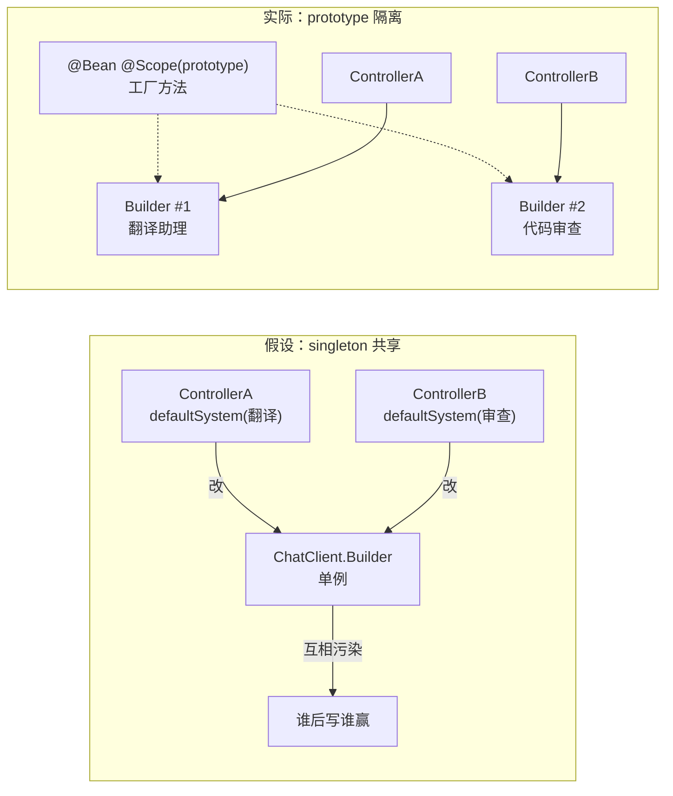
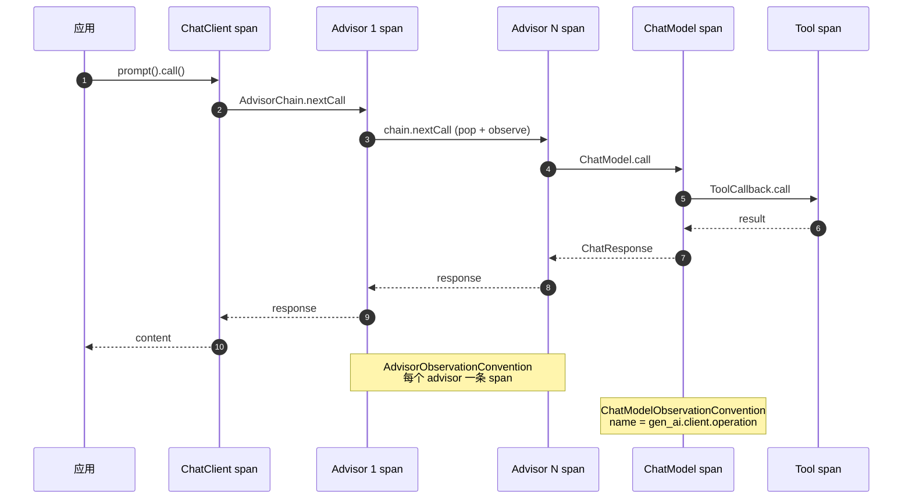
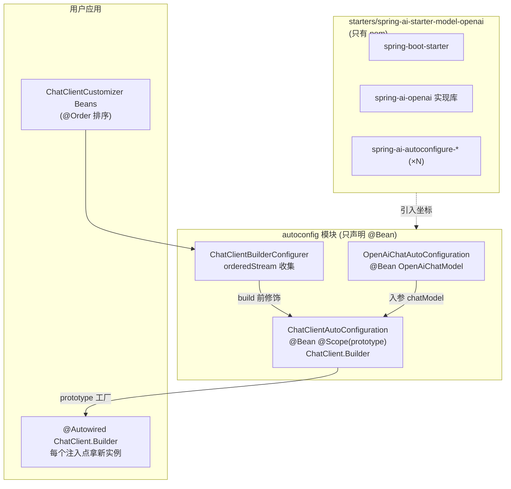

# 第 9 篇：Spring Boot 整合 + 可观测性

前八篇讲的都是 Spring AI 的内核：模块切分、调用链、抽象、扩展机制。这一篇换个角度，看它怎么"接进 Spring Boot"——为什么 starter 只有几行 pom、为什么 `ChatClient.Builder` 要走 prototype scope、为什么观测要在 ChatClient/Advisor/ChatModel/Tool/VectorStore 五层各自发埋点。这些选择不大，但叠加起来决定了它能不能在生产环境落地。

---

## 1. `ChatClient.Builder` 是 prototype scope，不是 singleton

按 Spring 的默认习惯，所有 `@Bean` 都是 singleton：在容器里只存一份，谁注入谁拿到同一个实例。但 Spring AI 的 `ChatClient.Builder` 反着来：

```java
// auto-configurations/.../ChatClientAutoConfiguration.java:88-99
@Bean
@Scope("prototype")
@ConditionalOnMissingBean
ChatClient.Builder chatClientBuilder(ChatClientBuilderConfigurer chatClientBuilderConfigurer, ChatModel chatModel,
        ObjectProvider<ObservationRegistry> observationRegistry,
        ObjectProvider<ChatClientObservationConvention> chatClientObservationConvention,
        ObjectProvider<AdvisorObservationConvention> advisorObservationConvention) {
    ChatClient.Builder builder = ChatClient.builder(chatModel,
            observationRegistry.getIfUnique(() -> ObservationRegistry.NOOP),
            chatClientObservationConvention.getIfUnique(), advisorObservationConvention.getIfUnique());
    return chatClientBuilderConfigurer.configure(builder);
}
```

`@Scope("prototype")` 这一行的副作用是：**每个注入点都会触发一次工厂方法**。如果有十个 `@RestController` 都写了 `@Autowired ChatClient.Builder builder`，它们各自拿到一个全新的 builder 实例。

为什么这么做？因为 `ChatClient.Builder` 的设计就是"流式 API + 内部可变"——`builder.defaultSystem("...").defaultAdvisors(new SafeGuardAdvisor(...))` 这种调用每一步都在改 builder 自身的状态。如果它是 singleton，两个 controller 同时配置就会互相污染。比如 controller A 想要"翻译助理"的 system prompt，controller B 想要"代码审查员"，最后谁先 build，谁就赢。

prototype scope 把这个隐患从根上消除。同时它也回答了一个常见困惑——**为什么 Spring AI 不直接给你 `@Autowired ChatClient`？** 因为 ChatClient 是不可变的最终成品，要不要带 advisor、要不要默认 user prompt，是用户的事；框架只能保证给你一个干净的 builder。



类文档注释里写得很直白：

```java
// auto-configurations/.../ChatClientAutoConfiguration.java:46-51
/**
 * This will produce a {@link ChatClient.Builder ChatClient.Builder} bean with the
 * {@code prototype} scope, meaning each injection point will receive a newly cloned
 * instance of the builder.
 */
```

这是一个值得借鉴的小模式：**带状态的 builder 暴露成 bean 时，不要忘了加 prototype scope**。Spring Boot 的 `RestClient.Builder`、`WebClient.Builder` 走的也是同一思路。

---

## 2. 扩展点放在 Builder 阶段：`ChatClientCustomizer` 而不是 BeanPostProcessor

prototype scope 解决了"实例隔离"，但还有一个问题：**框架/用户怎么对 builder 做横切配置**？比如全公司都要给 ChatClient 套一个日志 advisor，或者强制限制 max tokens。

Spring AI 选了 `ChatClientCustomizer` 这条路：

```java
// spring-ai-client-chat/src/main/java/org/springframework/ai/chat/client/ChatClientCustomizer.java
@FunctionalInterface
public interface ChatClientCustomizer {
    void customize(ChatClient.Builder chatClientBuilder);
}
```

注入点有专门的 configurer：

```java
// auto-configurations/.../ChatClientBuilderConfigurer.java:49-60
public ChatClient.Builder configure(ChatClient.Builder builder) {
    applyCustomizers(builder);
    return builder;
}

private void applyCustomizers(ChatClient.Builder builder) {
    if (this.customizers != null) {
        for (ChatClientCustomizer customizer : this.customizers) {
            customizer.customize(builder);
        }
    }
}
```

而上层 autoconfig 用 `ObjectProvider.orderedStream()` 按 `@Order` 顺序收集所有 customizer：

```java
// auto-configurations/.../ChatClientAutoConfiguration.java:80-86
@Bean
@ConditionalOnMissingBean
ChatClientBuilderConfigurer chatClientBuilderConfigurer(ObjectProvider<ChatClientCustomizer> customizerProvider) {
    ChatClientBuilderConfigurer configurer = new ChatClientBuilderConfigurer();
    configurer.setChatClientCustomizers(customizerProvider.orderedStream().toList());
    return configurer;
}
```

为什么是 `ChatClientCustomizer` 而不是 Spring 标配的 `BeanPostProcessor`？两者都能拦截 bean 创建：

- `BeanPostProcessor` 在 bean **构造完之后**回调，看到的是已经组装好的 ChatClient.Builder（甚至 ChatClient 本身）
- `ChatClientCustomizer` 在 builder **build 之前**就介入，能改默认值、加 advisor、调 options

差别看似只是时机，本质上是"框架想让你扩展什么"的承诺。Builder 阶段的扩展点意味着：用户的配置和框架本身的配置走的是同一条流水线，没有"事后改成品"这种破坏性操作。如果换成 BeanPostProcessor，会让人误以为可以替换 ChatClient 实现——而 Spring AI 不希望开放这个口子。

这也是 Spring Boot 的一贯姿势：`RestTemplateCustomizer`、`RestClientCustomizer`、`WebClientCustomizer`、`Jackson2ObjectMapperBuilderCustomizer`，全部都是 builder 阶段的回调。`ChatClientCustomizer` 在生态里是顺势而为，不是发明新东西。

---

## 3. 观测分五层，每层一个 Convention

调用一次 `chatClient.prompt("hi").call().content()` 在 Micrometer 看来会产生**多层 span**，因为 Spring AI 在每一层关键边界都打了埋点：

| 层 | Documentation 枚举 | Convention 接口 |
| --- | --- | --- |
| ChatClient | `ChatClientObservationDocumentation.AI_CHAT_CLIENT` | `ChatClientObservationConvention` |
| Advisor（每个 advisor 一次） | `AdvisorObservationDocumentation.AI_ADVISOR` | `AdvisorObservationConvention` |
| ChatModel | `ChatModelObservationDocumentation` | `ChatModelObservationConvention` |
| Tool | `ToolCallingObservationDocumentation` | `ToolCallingObservationConvention` |
| VectorStore | `VectorStoreObservationDocumentation.AI_VECTOR_STORE` | `VectorStoreObservationConvention` |



所有 convention 接口都长一个样：

```java
// spring-ai-client-chat/.../advisor/observation/AdvisorObservationConvention.java
public interface AdvisorObservationConvention extends ObservationConvention<AdvisorObservationContext> {
    @Override
    default boolean supportsContext(Observation.Context context) {
        return context instanceof AdvisorObservationContext;
    }
}
```

把"发什么 span"和"span 长什么样"分开：埋点位置由 Documentation 枚举固定，标签和名字由 Convention 决定。用户要换某一层的命名/标签，只需替换那一层的 Convention bean。

埋点的真实位置可以从 `DefaultAroundAdvisorChain.nextCall` 看到：

```java
// spring-ai-client-chat/.../advisor/DefaultAroundAdvisorChain.java:95-119
@Override
public ChatClientResponse nextCall(ChatClientRequest chatClientRequest) {
    var advisor = this.callAdvisors.pop();

    var observationContext = AdvisorObservationContext.builder()
        .advisorName(advisor.getName())
        .chatClientRequest(chatClientRequest)
        .order(advisor.getOrder())
        .build();

    return AdvisorObservationDocumentation.AI_ADVISOR
        .observation(this.observationConvention, DEFAULT_OBSERVATION_CONVENTION, () -> observationContext,
                this.observationRegistry)
        .observe(() -> {
            var chatClientResponse = advisor.adviseCall(chatClientRequest, this);
            observationContext.setChatClientResponse(chatClientResponse);
            return chatClientResponse;
        });
}
```

每次 advisor 链 pop 一个 advisor 都会包一层 observation。结合第 4 篇讲的"链上有 N 个 advisor"，结果就是：用户写一个新 advisor，**不需要任何额外代码**，自动就有一条 span，名字和标签来自 `AdvisorObservationConvention`。

ChatModel 那一层的 Convention 跟 OpenTelemetry GenAI 语义约定（`gen_ai.*`）对齐：

```java
// spring-ai-model/.../chat/observation/DefaultChatModelObservationConvention.java:40
public static final String DEFAULT_NAME = "gen_ai.client.operation";
```

这就是为什么把 Spring AI 应用接到 Tempo / Jaeger / Datadog，看到的标签是 `gen_ai.request.model`、`gen_ai.response.model`、`gen_ai.system` 这些标准字段，而不是 Spring AI 自创的命名——它从一开始就在跟 OTel 标准一起演进。

最后还有一层"敏感内容观测"：默认情况下，prompt 和 completion 不会进 observation（怕泄漏隐私），但可以通过 properties 打开：

```java
// auto-configurations/.../ChatClientAutoConfiguration.java:101-128
@ConditionalOnClass(Tracer.class)
@ConditionalOnBean(Tracer.class)
static class TracerPresentObservationConfiguration {

    @Bean
    @ConditionalOnProperty(prefix = ChatClientBuilderProperties.CONFIG_PREFIX + ".observations",
            name = "log-prompt", havingValue = "true")
    TracingAwareLoggingObservationHandler<ChatClientObservationContext> chatClientPromptContentObservationHandler(
            Tracer tracer) {
        logPromptContentWarning();
        return new TracingAwareLoggingObservationHandler<>(new ChatClientPromptContentObservationHandler(), tracer);
    }
    // ...
}
```

打开开关时还会 `logger.warn` 一句"You have enabled logging out the ChatClient prompt content with the risk of exposing sensitive or private information"——把"安全默认"做成框架的一部分，而不是文档里的一段警告。

---

## 4. starter 只搭依赖图，autoconfig 只声明 bean

最后看仓库里两类模块的分工。`starters/spring-ai-starter-model-openai/pom.xml` 整个文件 70 行，里面没有任何 Java 代码，连一个 `package-info.java` 都没有：

```xml
<!-- starters/spring-ai-starter-model-openai/pom.xml:38-68 -->
<dependencies>
    <dependency>
        <groupId>org.springframework.boot</groupId>
        <artifactId>spring-boot-starter</artifactId>
    </dependency>
    <dependency>
        <groupId>org.springframework.ai</groupId>
        <artifactId>spring-ai-autoconfigure-model-openai</artifactId>
    </dependency>
    <dependency>
        <groupId>org.springframework.ai</groupId>
        <artifactId>spring-ai-openai</artifactId>
    </dependency>
    <dependency>
        <groupId>org.springframework.ai</groupId>
        <artifactId>spring-ai-autoconfigure-model-chat-client</artifactId>
    </dependency>
    <dependency>
        <groupId>org.springframework.ai</groupId>
        <artifactId>spring-ai-autoconfigure-model-chat-memory</artifactId>
    </dependency>
</dependencies>
```

这就是 starter 的全部职责：把"用 OpenAI 跑 ChatClient 还要带 chat memory"翻译成一组 Maven 依赖。它不写代码、不声明 bean、不读 properties。

真正的 bean 声明在 `spring-ai-autoconfigure-model-openai`：

```java
// auto-configurations/models/spring-ai-autoconfigure-model-openai/.../OpenAiChatAutoConfiguration.java:54-84
@AutoConfiguration
@EnableConfigurationProperties({ OpenAiConnectionProperties.class, OpenAiChatProperties.class })
@ConditionalOnProperty(name = SpringAIModelProperties.CHAT_MODEL, havingValue = SpringAIModels.OPENAI,
        matchIfMissing = true)
public class OpenAiChatAutoConfiguration {

    @Bean
    @ConditionalOnMissingBean
    public OpenAiChatModel openAiChatModel(OpenAiConnectionProperties commonProperties,
            OpenAiChatProperties chatProperties, ToolCallingManager toolCallingManager,
            ObjectProvider<ObservationRegistry> observationRegistry,
            ObjectProvider<ChatModelObservationConvention> observationConvention,
            ObjectProvider<ToolExecutionEligibilityPredicate> openAiToolExecutionEligibilityPredicate) {

        // ... resolve client + options ...

        var chatModel = OpenAiChatModel.builder()
            .openAiClient(openAIClient)
            .openAiClientAsync(openAIClientAsync)
            .options(chatProperties.getOptions())
            .toolCallingManager(toolCallingManager)
            .observationRegistry(observationRegistry.getIfUnique(() -> ObservationRegistry.NOOP))
            .toolExecutionEligibilityPredicate(
                    openAiToolExecutionEligibilityPredicate.getIfUnique(DefaultToolExecutionEligibilityPredicate::new))
            .build();

        observationConvention.ifAvailable(chatModel::setObservationConvention);
        return chatModel;
    }
}
```

几个细节都符合 Spring Boot 的成熟约定：

- `@ConditionalOnMissingBean`——用户自己声了 `OpenAiChatModel`，autoconfig 就闪开
- `ObjectProvider<X>.getIfUnique(default)`——可选依赖，没有就 fallback
- `@ConditionalOnProperty(SpringAIModelProperties.CHAT_MODEL, havingValue = OPENAI, matchIfMissing = true)`——多 Provider 共存时通过 `spring.ai.model.chat=openai` 切换，缺省是 OpenAI
- properties 类里把 `OpenAiChatOptions` 当 `@NestedConfigurationProperty`：

```java
// .../OpenAiChatProperties.java:29-37
@ConfigurationProperties(OpenAiChatProperties.CONFIG_PREFIX)
public class OpenAiChatProperties extends AbstractOpenAiOptions {
    public static final String CONFIG_PREFIX = "spring.ai.openai.chat";
    @NestedConfigurationProperty
    private final OpenAiChatOptions options = OpenAiChatOptions.builder().model(DEFAULT_CHAT_MODEL).build();
}
```



这两层分开有什么好处？最直接的是：**不想用 Spring Boot 的人也能用 Spring AI**。如果你只在一个 vanilla `main` 方法里写应用，引 `spring-ai-openai` + `spring-ai-client-chat` 就够用，自己 `new OpenAiChatModel.Builder().build()`；不需要 `@AutoConfiguration` 的那套机器。autoconfig 模块只为 Boot 用户存在。

第二个好处是模块依赖图清爽。看一下 starter 的依赖：starter → autoconfig + 实现库。如果 autoconfig 和实现混在一起，就成了 starter → 一坨。第三个隐性好处是**测试解耦**：autoconfig 模块可以单独跑 Boot 测试（`OpenAiChatAutoConfigurationIT.java` 就在 autoconfig 模块下，不在 starter 里），实现库自己跑单元测试，互不干扰。

这种二分法在 Spring 生态里不新鲜——但 Spring AI 把它执行得很彻底：仓库里 `auto-configurations/` 目录有几十个 autoconfig 模块，`starters/` 目录有几十个对应的 starter，每个 starter 都只有 pom，每个 autoconfig 都只是一堆 `@Bean`。它在用工程纪律抵御"什么都往 starter 里塞"的诱惑。

把整套装配从用户代码一路拉到 HTTP 调用，就是下面这张三层图——每一层只负责一件事，跨层只有"build / 调用 / 引坐标"三种关系。

```mermaid
flowchart TB
    subgraph App["用户应用层"]
        REST["@RestController"]
        SVC["@Service"]
    end
    subgraph Auto["自动配置层"]
        STARTER["spring-ai-starter-model-openai<br/>(纯 pom)"]
        OPENAI_AC["OpenAiAutoConfiguration"]
        CC_AC["ChatClientAutoConfiguration"]
        CM["@Bean OpenAiChatModel"]
        BLD["@Bean(prototype)<br/>ChatClient.Builder"]
    end
    subgraph Core["运行时核心"]
        CC["ChatClient"]
        CHAIN["Advisor 链"]
        MODEL["ChatModel.call"]
        HTTP["RestClient / WebClient"]
        OAI[("OpenAI HTTP API")]
    end
    REST -->|@Autowired| BLD
    SVC -->|@Autowired| BLD
    STARTER -.->|引坐标| OPENAI_AC
    STARTER -.->|引坐标| CC_AC
    OPENAI_AC --> CM
    CC_AC --> BLD
    CM -.->|入参| BLD
    BLD -->|build| CC
    CC --> CHAIN --> MODEL --> HTTP --> OAI
```

---

## 关键代码索引

- `auto-configurations/models/chat/client/spring-ai-autoconfigure-model-chat-client/src/main/java/org/springframework/ai/model/chat/client/autoconfigure/ChatClientAutoConfiguration.java:88-99`（`@Scope("prototype")` 的 builder bean）
- `.../ChatClientAutoConfiguration.java:80-86`（按 `@Order` 收集 `ChatClientCustomizer`）
- `.../ChatClientAutoConfiguration.java:101-152`（敏感内容观测 + Tracer 在场/缺席的双分支）
- `.../ChatClientBuilderConfigurer.java:49-60`（Customizer 的应用顺序）
- `spring-ai-client-chat/src/main/java/org/springframework/ai/chat/client/ChatClientCustomizer.java`
- `auto-configurations/models/spring-ai-autoconfigure-model-openai/.../OpenAiChatAutoConfiguration.java:54-84`（典型 Provider autoconfig）
- `.../OpenAiChatProperties.java:29-37`（`@NestedConfigurationProperty` 嵌入 ChatOptions）
- `starters/spring-ai-starter-model-openai/pom.xml`（70 行的纯依赖 starter）
- 五个 Convention 接口：
  - `spring-ai-client-chat/.../client/observation/ChatClientObservationConvention.java`
  - `spring-ai-client-chat/.../advisor/observation/AdvisorObservationConvention.java`
  - `spring-ai-model/.../chat/observation/ChatModelObservationConvention.java`
  - `spring-ai-model/.../tool/observation/ToolCallingObservationConvention.java`
  - `spring-ai-vector-store/.../observation/VectorStoreObservationConvention.java`
- `spring-ai-client-chat/.../advisor/DefaultAroundAdvisorChain.java:95-119`（每个 advisor 一个 span 的实际埋点处）
- `spring-ai-model/.../chat/observation/DefaultChatModelObservationConvention.java:40`（`gen_ai.client.operation`，对齐 OTel GenAI 约定）

---

## 思考题

1. `ChatClient.Builder` 用 `@Scope("prototype")` 解决了实例污染，但带来一个新问题：每次注入都要重新跑一遍 customizer 链。如果有 50 个 controller、每个 customizer 又要查数据库，这条路径会成为热点吗？应该怎么改？
2. `ChatClientCustomizer` 是 `@FunctionalInterface`，意味着用 lambda 也能写。但 lambda 在 ApplicationContext 里是匿名的，`@Order` 怎么作用？如果你要写一个项目级的 customizer 既要 `@Order(0)` 又要好调试，你怎么实现？
3. 五层观测里，`AdvisorObservationConvention` 是给"链路上每一个 advisor"都发一次 span 的——如果你的 advisor 链有 10 个 advisor，trace 看起来就有 10 层嵌套。这种"细粒度 trace"对生产来说是负担还是资产？什么场景下你会想关闭它？

---

## 延伸阅读

- 第 1 篇《模块地图》——`auto-configurations/` 与 `starters/` 二分法的全局视角
- 第 4 篇《Advisor 链》——`DefaultAroundAdvisorChain.nextCall` 里的 observation 包装是本篇第 3 节的前置
- Spring Boot 文档 *Auto-configuration*、*Customizer Pattern*——本篇用到的 `@AutoConfiguration` / `@ConditionalOnMissingBean` / `ObjectProvider.orderedStream()` 都是 Boot 的成熟用法
- OpenTelemetry GenAI Semantic Conventions（<https://opentelemetry.io/docs/specs/semconv/gen-ai/>）——`DefaultChatModelObservationConvention` 的字段命名直接对齐这份规范，读完会发现 Spring AI 不是在"自创观测"

> 基于 spring-ai commit 9cde97c1
