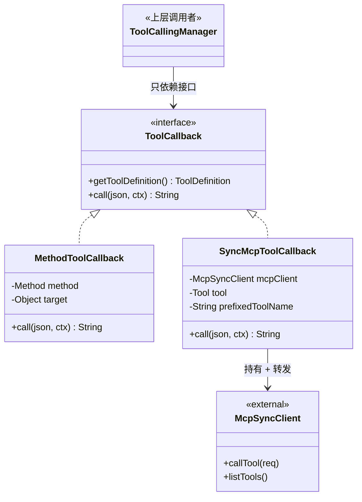
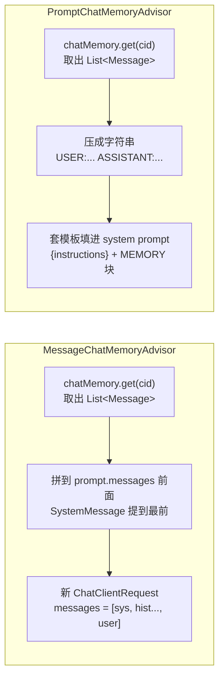
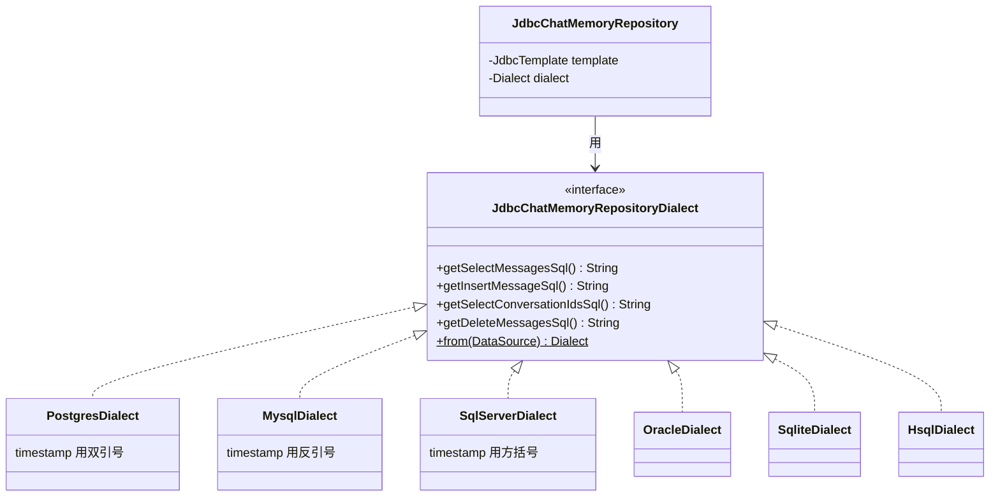

# 第 10 篇：MCP 集成与 ChatMemory——把外部能力转成既有抽象

收尾这一篇换一个视角：不再讲框架本身的"内核"，而是看它怎么把两类"外来户"——MCP（一个新协议）和 ChatMemory（一种状态）——接进现有体系。这两件事很容易做成新的一等抽象、引出新的接口家族，但 Spring AI 偏不。它的处理姿势是：**优先复用既有抽象**，能用 `ToolCallback` 就用 `ToolCallback`，能用 `Advisor` 就用 `Advisor`。这套姿势是前面九篇能保持模块图稳定的根因，也是这一篇要拆开看的事。

## 一、MCP 没有自己造一等抽象，它只是 ToolCallbackProvider

MCP（Model Context Protocol）是 Anthropic 牵头的协议，能让模型通过统一接口调用外部能力。如果照着协议名做框架，很自然会冒出 `McpClient`、`McpToolService`、`McpExecutor` 一连串新概念。Spring AI 没这么做——它把 MCP 翻译成了已经存在的 `ToolCallback`：

```java
// mcp/common/.../SyncMcpToolCallback.java:46
public class SyncMcpToolCallback implements ToolCallback {

    private final McpSyncClient mcpClient;
    private final Tool tool;
    private final String prefixedToolName;
    ...

    @Override
    public ToolDefinition getToolDefinition() {
        return McpToolUtils.createToolDefinition(this.prefixedToolName, this.tool);
    }

    @Override
    public String call(String toolCallInput, @Nullable ToolContext toolContext) {
        Map<String, Object> arguments = ModelOptionsUtils.jsonToMap(toolCallInput);
        var request = CallToolRequest.builder()
            .name(this.tool.name())
            .arguments(arguments)
            .meta(mcpMeta)
            .build();
        var response = this.mcpClient.callTool(request);
        return ModelOptionsUtils.toJsonString(response.content());
    }
}
```

这一段代码就是整个 MCP 集成的"接缝"。`SyncMcpToolCallback` 拿到 MCP server 暴露的一个 `Tool` 描述，把它包成 `ToolCallback`：`getToolDefinition()` 返回 schema 给 LLM；`call(...)` 把模型要求的 JSON 参数转 Map，组成 `CallToolRequest` 走 MCP 协议去执行，再把响应序列化回字符串。

意义在于：**第 5 篇讲过的工具循环——不论是 provider 内部的 `internalCall`，还是 `ToolCallAdvisor` 那条 advisor 链路径——根本不知道 MCP 存在**。它们只看到 `ToolCallback.call(json)`，背后是本地 Java 方法、是 MCP 远程调用、还是别的什么，都被这一层适配吃掉。



图里的关键事实：`ToolCallingManager`（以及它背后的工具循环）只依赖 `ToolCallback` 接口；MCP 的存在被 `SyncMcpToolCallback` 这一层适配器完全吃掉，调用方根本不需要新接口。

把"多个 MCP server 的工具"聚合成一组 `ToolCallback` 的责任在 `SyncMcpToolCallbackProvider`：

```java
// SyncMcpToolCallbackProvider.java:43
public class SyncMcpToolCallbackProvider
        implements ToolCallbackProvider, ApplicationListener<McpToolsChangedEvent> {

    @Override
    public ToolCallback[] getToolCallbacks() {
        if (this.invalidateCache) {
            this.lock.lock();
            try {
                if (this.invalidateCache) {
                    this.cachedToolCallbacks = this.mcpClients.stream()
                        .flatMap(mcpClient -> mcpClient.listTools().tools().stream()
                            .filter(tool -> this.toolFilter.test(connectionInfo(mcpClient), tool))
                            .<ToolCallback>map(tool -> SyncMcpToolCallback.builder()
                                .mcpClient(mcpClient)
                                .tool(tool)
                                .prefixedToolName(this.toolNamePrefixGenerator
                                    .prefixedToolName(connectionInfo(mcpClient), tool))
                                .build()))
                        .toList();
                    this.validateToolCallbacks(this.cachedToolCallbacks);
                    this.invalidateCache = false;
                }
            } finally { this.lock.unlock(); }
        }
        return this.cachedToolCallbacks.toArray(new ToolCallback[0]);
    }
}
```

`ToolCallbackProvider` 早在 MCP 进来之前就存在了（`spring-ai-model/.../tool/ToolCallbackProvider.java:27`），它的契约就是"给我一组 ToolCallback"。MCP 适配器只是它的另一个实现。这条路有几个值得注意的细节：

- **ApplicationListener\<McpToolsChangedEvent>**：MCP server 端可以通知"工具列表变了"，provider 监听到事件就 invalidate 缓存——下一次请求会重新 listTools。这是为协议特性补的钩子，但补的方式仍然是用 Spring 既有的 `ApplicationListener`，没有引入新机制。
- **缓存 + double-checked locking**：`listTools()` 是 RPC，每次请求 ChatClient 都重新拉显然不行。volatile flag + ReentrantLock 是常规做法。
- **`validateToolCallbacks`**：跨 MCP server 的工具名冲突要在 provider 层先暴露，避免下推到工具循环时才报错。

到 `McpToolCallbackAutoConfiguration` 这一层就只剩"装配"了：

```java
// auto-configurations/.../McpToolCallbackAutoConfiguration.java:71
@Bean
@ConditionalOnProperty(prefix = McpClientCommonProperties.CONFIG_PREFIX,
        name = "type", havingValue = "SYNC", matchIfMissing = true)
public SyncMcpToolCallbackProvider mcpToolCallbacks(...) {
    List<McpSyncClient> mcpClients = syncMcpClients.stream().flatMap(List::stream).toList();
    return SyncMcpToolCallbackProvider.builder()
        .mcpClients(mcpClients)
        .toolFilter(syncClientsToolFilter.getIfUnique(...))
        .toolNamePrefixGenerator(mcpToolNamePrefixGenerator.getIfUnique(...))
        .build();
}
```

注意它产出的 bean 类型是 `SyncMcpToolCallbackProvider`——但因为它实现了 `ToolCallbackProvider`，这个 bean 会被普通 `ChatClient.Builder` 的 tool 注入路径（默认通过 `ChatClient.Builder.defaultToolCallbacks(...)` 或 `ToolCallbackProvider` 注入）平等对待。**ChatClient 不需要知道这个 provider 是 MCP 来的**。

## 二、`McpToolNamePrefixGenerator` / `McpToolFilter`：适配层不可避免的细节

把 MCP 装进 `ToolCallback` 这条路看着很干净，但有两个真实问题不会自动消失：

1. 接两个 MCP server，都有一个叫 `search` 的工具，会撞名
2. 某些 MCP server 暴露的工具我并不想全部下放给 LLM

第一个问题催生了 `McpToolNamePrefixGenerator`：

```java
// McpToolNamePrefixGenerator.java:39
public interface McpToolNamePrefixGenerator {
    String prefixedToolName(McpConnectionInfo mcpConnectionInfo, Tool tool);

    static McpToolNamePrefixGenerator noPrefix() {
        return (mcpConnectionInfo, tool) -> tool.name();
    }
}
```

```java
// DefaultMcpToolNamePrefixGenerator.java:62
public String prefixedToolName(McpConnectionInfo mcpConnectionInfo, McpSchema.Tool tool) {
    String uniqueToolName = McpToolUtils.format(tool.name());
    if (this.existingConnections.add(new ConnectionId(...))) {
        if (!this.allUsedToolNames.add(uniqueToolName)) {
            uniqueToolName = "alt_" + this.counter.getAndIncrement() + "_" + uniqueToolName;
            this.allUsedToolNames.add(uniqueToolName);
            logger.warn("Tool name '{}' already exists. Using unique tool name '{}'", ...);
        }
    }
    return uniqueToolName;
}
```

策略有意思：默认实现**不预先加 server 前缀**，第一次见到的名字直接用；只有在第二次撞名时才加 `alt_N_` 前缀。原因合理——大部分用户只接一个 MCP server，前缀只会污染工具名而模型对短命名感知更好；只有真撞了才补救。如果用户偏好"统一加前缀"也行，自己实现 `McpToolNamePrefixGenerator` 即可。

第二个问题催生 `McpToolFilter`：

```java
// McpToolFilter.java:30
public interface McpToolFilter extends BiPredicate<McpConnectionInfo, McpSchema.Tool> { }
```

就是个 `BiPredicate`，没有任何额外语义。每个 MCP tool 加进 provider 之前先过一遍 filter，false 就丢弃。

这两个接口都很小，但它们说明了一件事：**适配层永远会有"协议特性映射回框架抽象时漏出来的小补丁"**。Spring AI 没有把"重命名规则"或"过滤规则"塞进 `ToolCallback` 接口本身（那会污染所有非 MCP 用户），而是放在 MCP provider 内部消化。这是一种克制——**抽象不漏，补丁就地**。

## 三、ChatMemory 也只是 Advisor——两种注入策略的对比

ChatMemory 是另一个被翻译成既有抽象的例子。模型本身无状态，要做"多轮对话"必须有人维护历史。Spring AI 的处理：把"维护历史"做成 `ChatMemory` 接口，把"在调用链上注入历史"做成 advisor。

`ChatMemory` 自身极简：

```java
// ChatMemory.java:31
public interface ChatMemory {
    String DEFAULT_CONVERSATION_ID = "default";
    String CONVERSATION_ID = "chat_memory_conversation_id";

    void add(String conversationId, List<Message> messages);
    List<Message> get(String conversationId);
    void clear(String conversationId);
}
```

四个方法、一个常量、一个 context key。它只是一个 conversationId → messages 的存储抽象，不关心怎么注入到 prompt 里。

注入是 advisor 的事，而且故意有两种：**`MessageChatMemoryAdvisor` 把历史拼到 messages 数组**，**`PromptChatMemoryAdvisor` 把历史塞进 system prompt**。两者代码长得像，差别就在 `before` 那几行：

```java
// MessageChatMemoryAdvisor.java:79
public ChatClientRequest before(ChatClientRequest chatClientRequest, AdvisorChain advisorChain) {
    String conversationId = getConversationId(chatClientRequest.context(), this.defaultConversationId);
    // 1. 取记忆
    List<Message> memoryMessages = this.chatMemory.get(conversationId);
    // 2. 把记忆放在前面，本次 instructions 放在后面
    List<Message> processedMessages = new ArrayList<>(memoryMessages);
    processedMessages.addAll(chatClientRequest.prompt().getInstructions());
    // 2.1 SystemMessage 提到最前
    for (int i = 0; i < processedMessages.size(); i++) {
        if (processedMessages.get(i) instanceof SystemMessage) {
            Message systemMessage = processedMessages.remove(i);
            processedMessages.add(0, systemMessage);
            break;
        }
    }
    // 3. 用拼好的 messages 构造新请求
    ChatClientRequest processed = chatClientRequest.mutate()
        .prompt(chatClientRequest.prompt().mutate().messages(processedMessages).build())
        .build();
    // 4. 把这一轮新增的 user message 写回 memory
    this.chatMemory.add(conversationId, processed.prompt().getLastUserOrToolResponseMessage());
    return processed;
}
```

```java
// PromptChatMemoryAdvisor.java:109
public ChatClientRequest before(ChatClientRequest chatClientRequest, AdvisorChain advisorChain) {
    String conversationId = getConversationId(chatClientRequest.context(), this.defaultConversationId);
    // 1. 取记忆
    List<Message> memoryMessages = this.chatMemory.get(conversationId);
    // 2. 把记忆压成一段字符串
    String memory = memoryMessages.stream()
        .filter(m -> m.getMessageType() == USER || m.getMessageType() == ASSISTANT)
        .map(m -> m.getMessageType() + ":" + m.getText())
        .collect(Collectors.joining(System.lineSeparator()));
    // 3. 用模板把它塞进 system prompt
    SystemMessage systemMessage = chatClientRequest.prompt().getSystemMessage();
    String augmentedSystemText = this.systemPromptTemplate
        .render(Map.of("instructions", systemMessage.getText(), "memory", memory));
    // 4. 用替换后的 system message 构造新请求
    ChatClientRequest processed = chatClientRequest.mutate()
        .prompt(chatClientRequest.prompt().augmentSystemMessage(augmentedSystemText))
        .build();
    this.chatMemory.add(conversationId, processed.prompt().getLastUserOrToolResponseMessage());
    return processed;
}
```

`PromptChatMemoryAdvisor` 还自带一个默认模板：

```
{instructions}

Use the conversation memory from the MEMORY section to provide accurate answers.

---------------------
MEMORY:
{memory}
---------------------
```

把两条路径并排画一张图就清楚了：



两个 advisor 的差异本质是**怎样让模型"看到"历史**。`Message` 路径走的是 OpenAI 风格的多轮 messages 数组，模型把每条消息当作独立 turn；`Prompt` 路径走的是单条 system prompt 内的"伪历史"，对那些不擅长长 messages 数组的小模型、或要做精细 prompt 控制的场景更合适。这是一对干净的策略模式：

- 共同接口：`BaseChatMemoryAdvisor`（提供 `getConversationId(context, default)`，从 context 取出 `chat_memory_conversation_id`）
- 共同 order：`Advisor.DEFAULT_CHAT_MEMORY_PRECEDENCE_ORDER = HIGHEST_PRECEDENCE + 1000`，确保 memory 在大多数其它 advisor 之前执行
- 不同 `before`：一个改 messages，一个改 system text；两条路上层的 ChatClient 一无所知

之所以策略要外显成两个类、而不是一个 advisor + boolean flag，是因为它们的**适用场景就是不同的**——你不会运行时切换。让用户在装配阶段二选一，比让用户运行时配置 boolean 更清晰。

`after` 就简单了：把模型返回的 assistant message 也写回 memory。这里两个 advisor 的实现几乎一致。

## 四、JdbcChatMemoryRepository 的 dialect 体系——小型版"重新发明 ORM"

`ChatMemory` 把"对话窗口/裁剪策略"和"持久化"分两层：`MessageWindowChatMemory` 实现窗口策略（默认 20 条，SystemMessage 特殊保留），底下持有 `ChatMemoryRepository` 负责存：

```java
// ChatMemoryRepository.java:29
public interface ChatMemoryRepository {
    List<String> findConversationIds();
    List<Message> findByConversationId(String conversationId);
    void saveAll(String conversationId, List<Message> messages);
    void deleteByConversationId(String conversationId);
}
```

`JdbcChatMemoryRepository` 实现这个接口走 JDBC，但要支持 Postgres / MySQL / SQL Server / Oracle / SQLite / H2 / HSQLDB / MariaDB 八种数据库。各家 SQL 语法略有不同——主要是**保留字 `timestamp` 的转义**：

```java
// PostgresChatMemoryRepositoryDialect.java:29
return "SELECT content, type FROM SPRING_AI_CHAT_MEMORY WHERE conversation_id = ? ORDER BY \"timestamp\"";

// MysqlChatMemoryRepositoryDialect.java:29
return "SELECT content, type FROM SPRING_AI_CHAT_MEMORY WHERE conversation_id = ? ORDER BY `timestamp`";

// SqlServerChatMemoryRepositoryDialect.java:29
return "SELECT content, type FROM SPRING_AI_CHAT_MEMORY WHERE conversation_id = ? ORDER BY [timestamp]";
```

Postgres 用双引号、MySQL 用反引号、SQL Server 用方括号——要么改字段名避开 `timestamp`（破坏性大），要么对每种方言出一个 SQL 模板。Spring AI 选了后者，做成 `JdbcChatMemoryRepositoryDialect` 接口：

```java
// JdbcChatMemoryRepositoryDialect.java:31
public interface JdbcChatMemoryRepositoryDialect {
    String getSelectMessagesSql();
    String getInsertMessageSql();
    String getSelectConversationIdsSql();
    String getDeleteMessagesSql();

    static JdbcChatMemoryRepositoryDialect from(DataSource dataSource) {
        String productName = JdbcUtils.extractDatabaseMetaData(
            dataSource, DatabaseMetaData::getDatabaseProductName);
        ...
        return switch (productName) {
            case "PostgreSQL" -> new PostgresChatMemoryRepositoryDialect();
            case "MySQL", "MariaDB" -> new MysqlChatMemoryRepositoryDialect();
            case "Microsoft SQL Server" -> new SqlServerChatMemoryRepositoryDialect();
            ...
            default -> new PostgresChatMemoryRepositoryDialect();
        };
    }
}
```

画成类图就是经典的"接口 + 多实现 + 工厂方法"组合：



这是 ORM 圈早就走过的老路——Hibernate 有 `Dialect`，Spring Data 有各种 `*Templates`。Spring AI 就这一个 ChatMemory 表也要走同样的路径，因为它做的是**框架级抽象**：用户不能为了用 ChatMemory 被迫绑定一种数据库。

`JdbcChatMemoryRepository.Builder.resolveDialect()` 还有一个细节值得注意：

```java
// JdbcChatMemoryRepository.java:227
private JdbcChatMemoryRepositoryDialect resolveDialect(DataSource dataSource) {
    if (this.dialect == null) {
        return JdbcChatMemoryRepositoryDialect.from(dataSource);
    } else {
        warnIfDialectMismatch(dataSource, this.dialect);
        return this.dialect;
    }
}
```

用户显式指定了 dialect，框架优先用用户的，但会比较一下从 DataSource 探测到的方言，不一致就 warn。这是给"用户偶尔需要奇怪覆盖"留的口子，又不让错误悄悄发生。

## 五、总论：为什么 Spring AI 的模块图能保持稳定

把这一篇和前面九篇连起来看，会发现 Spring AI 反复在用同一招：**给"新功能"找一个已有抽象，把它翻译过来；只有翻译不下时才造新抽象**。

- MCP → `ToolCallbackProvider` + `ToolCallback`（第 5 篇 Tool 体系）
- ChatMemory 注入 → `Advisor`（第 4 篇 Advisor 链）
- 多 vector store → `VectorStore` + Filter IR（第 8 篇）
- 多 Provider → `ChatModel` + `ChatOptions`（第 3 篇）
- 多 RAG 阶段 → `Query` / `QueryTransformer` / `DocumentRetriever`，每一步都是 advisor 链的内部组合（第 7 篇 Modular RAG）

这件事的好处不光是"少几个接口"。真正的回报是：**advisor 链这条总线（第 2、4 篇）不需要为新功能扩展**。来一个 MCP，advisor 链不动；来一个 ChatMemory，advisor 链不动；来一个新的 Provider，advisor 链不动。每多一个集成方向，框架的"内核"不会变得更复杂——这才是模块图能维持十几个 Provider、十几种 vector store、还在持续接入新协议的根因。

代价当然存在。MCP 的"工具变更通知"要靠 `ApplicationListener<McpToolsChangedEvent>` 这种"补丁式"事件接进来；ChatMemory 的策略要外显成两个类而不是配置开关；Filter IR 要求每个 store 都写一个 converter。但这些代价是**局部的**——它们不污染核心抽象。

如果让我从 Spring AI 拿走一条最值得借鉴的工程纪律，就是这一条：**每加一个新功能，先问"它能不能复用现有抽象"**。能就不要造新接口；不能再造，并且严格限定新接口的传染范围。

## 关键代码索引

- `mcp/common/src/main/java/org/springframework/ai/mcp/SyncMcpToolCallback.java:46`
- `mcp/common/.../SyncMcpToolCallbackProvider.java:43, 124-155`
- `mcp/common/.../McpToolNamePrefixGenerator.java:39`
- `mcp/common/.../DefaultMcpToolNamePrefixGenerator.java:62`
- `mcp/common/.../McpToolFilter.java:30`
- `auto-configurations/mcp/spring-ai-autoconfigure-mcp-client-common/.../McpToolCallbackAutoConfiguration.java:48`
- `spring-ai-model/.../chat/memory/ChatMemory.java:31`
- `spring-ai-model/.../chat/memory/ChatMemoryRepository.java:29`
- `spring-ai-model/.../chat/memory/MessageWindowChatMemory.java:42`
- `spring-ai-client-chat/.../advisor/MessageChatMemoryAdvisor.java:79`（before 方法）
- `spring-ai-client-chat/.../advisor/PromptChatMemoryAdvisor.java:109`（before 方法）
- `spring-ai-client-chat/.../advisor/api/BaseChatMemoryAdvisor.java:39`
- `memory/repository/.../jdbc/JdbcChatMemoryRepositoryDialect.java:31`
- `memory/repository/.../jdbc/JdbcChatMemoryRepository.java:58, 227`
- `memory/repository/.../jdbc/{Postgres,Mysql,SqlServer}ChatMemoryRepositoryDialect.java`

## 思考题

1. `McpToolNamePrefixGenerator` 默认实现是"撞了名再加 alt 前缀"，而不是"全员加 server 前缀"。如果你来设计，会选哪种？两种策略对模型的工具选择行为有没有可观察的影响？
2. `MessageChatMemoryAdvisor` 和 `PromptChatMemoryAdvisor` 是两个独立类。换种设计，能否合成一个 `ChatMemoryAdvisor` + `InjectionStrategy` 枚举？这种合并会带来什么代价？
3. 假设 MCP 协议接下来引入"工具调用事务"概念——一组工具必须作为整体成功或回滚。Spring AI 现在的 `ToolCallback` 抽象能接住吗？要在哪一层加最合适？

## 延伸阅读

到这一篇为止，整个 Spring AI 的"骨架"就走完了。回看前面九篇，可以重新拼一张地图：

- 想从宏观视角再扫一遍：**第 1 篇（模块地图）** → **第 2 篇（一次 ChatClient 调用的旅程）**
- 想理解抽象层为什么这么切：**第 3 篇（ChatModel/ChatOptions）** + **第 4 篇（Advisor 链）**——第 4 篇是全系列的轴
- 想知道扩展点的设计哲学：**第 5 篇（Tool 双路径）** + **第 6 篇（结构化输出）**
- 想看典型场景如何沉淀：**第 7 篇（Modular RAG）** + **第 8 篇（VectorStore Filter IR）**
- 想掌握工程整合：**第 9 篇（Spring Boot 整合 + 可观测性）** + 本篇

如果只读一篇，读第 4 篇——那是 Spring AI 真正的总线。如果只读两篇，加上本篇——这一篇会让你看到，**好的总线是用克制换来的**。

本系列后续可能会补一些"小专题"，比如：流式工具调用的 Reactor 多播分支细节、`AnthropicChatModel` 的 prompt caching 集成、observability convention 在生产环境怎么落到 Grafana。这些更工程、更"应用导向"的内容会按需展开，不强求成系列。

---

> 基于 spring-ai commit 9cde97c1
